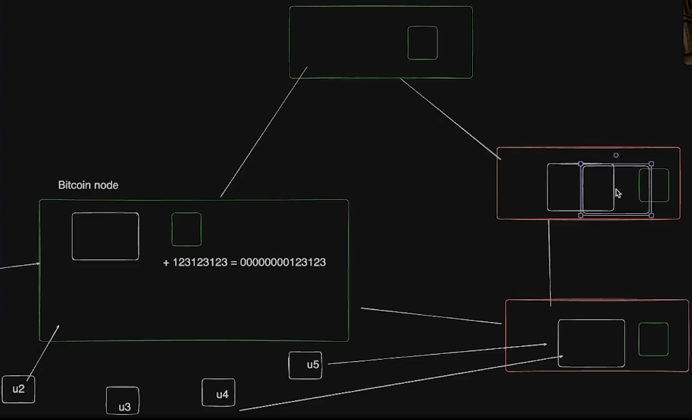

# Notes

## Why Blockchains?

### Inflating currencies


Printing money in large amounts leads to inflation, since money loses its value.

### Fractional Reserve Banking


### Bailouts


### INR Depreciation


## How to create a new currency?


## Intro to Hashing


Since the resulting strings of a hash function are finite (finite output space) and while the input string domain is infinite (infinite input space), there is a tiny possibility of collisions but highly improbable.


No. In this case, its not a hashing algorithm since the output string can be mapped in reverse to find out the input string. It is more closer to encryption. (Since, encryption is tw0-way)

**SHA-256 is a widely used hash function.**

Function to generate a sha-256 string given an input

```js
import crypto from "crypto";

const input = "hwllo";

const hash = crypto.createHash("sha-256").update(input).digest("hex"); // encoding the resulting hash into a 64 digit hex.

console.log(hash);
```


## Proof of Work


- Proof of Work is to find a string **nonce** such that, when the current block's transaction data along with previous block hash and this nonce are hashed together, the resulting hash would contain a particular number of leading zeroes. (More the leading zeroes, harder is the computation.)


- Including the prev block hash in calculating the current block hash is what secures the blockchain.

- Hence, when a bad miner tries to manipulate an older block, it makes the current nonce invalid, which also leads to a change in the resulting hash, thus making all the succeeding blocks invalid too.

- For the bad miner to make his changes to be the source of truth, they have to repeat the proof of work (mining) for all the succeeding blocks, which makes the effort to manipulate more expensive than to simply obey the current state. (since the correct state is already moving forward in this span of time causing the bad miner to run behind it. And all nodes only accept the longest chain existing.)

Simply put, the miner has more incentive in playing by the rules than to undermine the system.

- When two nodes calculate the nonce at the same time for different sets of transactions, it might create a fork in the blockchain (multiple branches). This competition is avoided by choosing the first fork that adds the next block to itself as the winner becoming the longest chain. In that case, the losing chain will obey the longest chain and omits it own blocks to replace with the blocks of the longest chain.



- To change the history and create the longer fork than the existing chain, by mining all the blocks, the miner should own more than 51% of the network.


- But if a miner, owns only a tiny fraction of nodes, all other nodes combined will always be faster than this bad miner, hence making it impossible to mine a longer fork.

- As computational power increases and block discovery becomes faster, the blockchain protocol increases the mining difficulty regularly (e.g., requiring hashes with more leading zeroes) to ensure that the target block time is maintained.

- The number of leading zeroes in the hash is a human-readable way to understand increased difficulty — but under the hood, it's about the numerical range of valid hashes shrinking, making it less probable to find a suitable hash from a stricter (smaller) subset of all possible hashes.

- Every transaction that happens is broadcasted to the network, such that the miners (who are waiting for transactions) receive them and they try to put multiple transactions in a block and start mining by solving the puzzle of finding the nonce.
