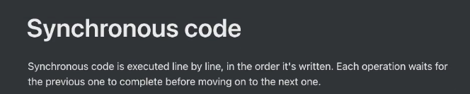
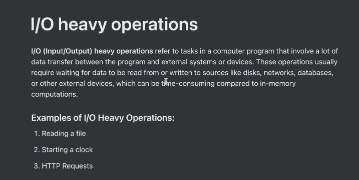
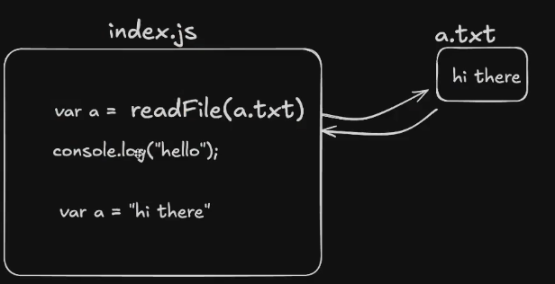
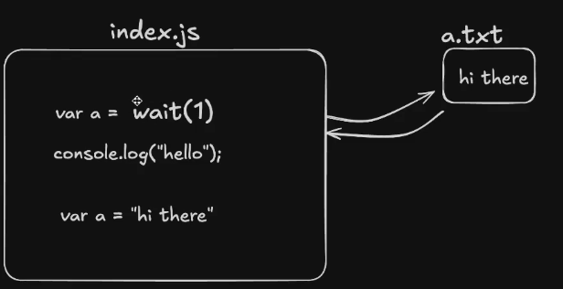
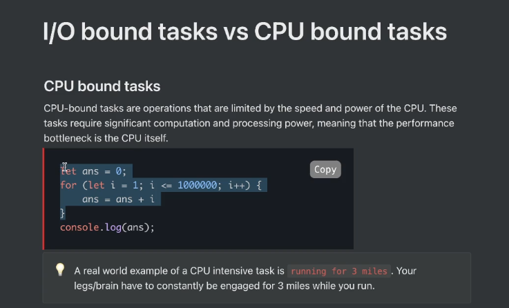
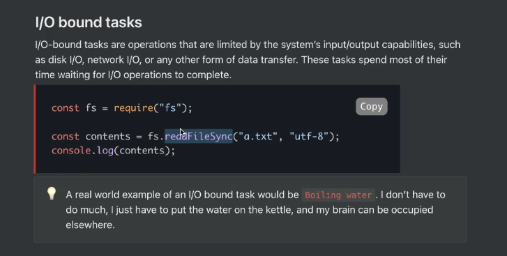
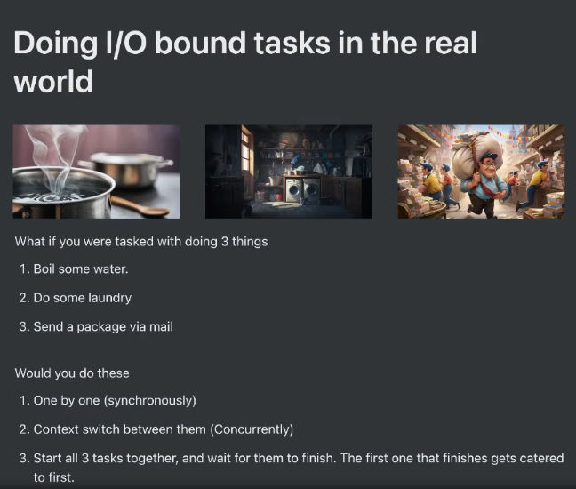
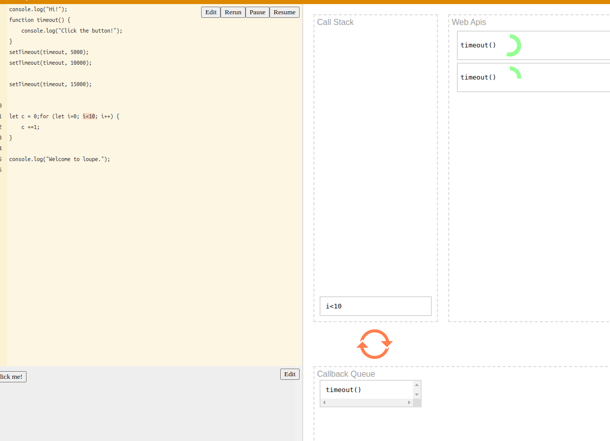
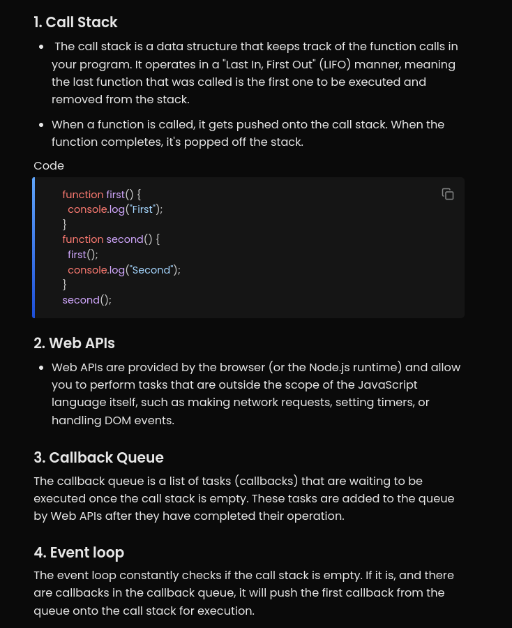

# NOTES

js follows the third method

In case of Callbacks, the function name is being passed as an argument instead of calling the function() since it is the same as passing the return value of the callback function.

The call stack contains the CPU bound tasks that are currently being executed.

The callback function of the asynchronous function waits in the callback queue after the completion of operation until the call stack is cleared since the thread isn't free.

