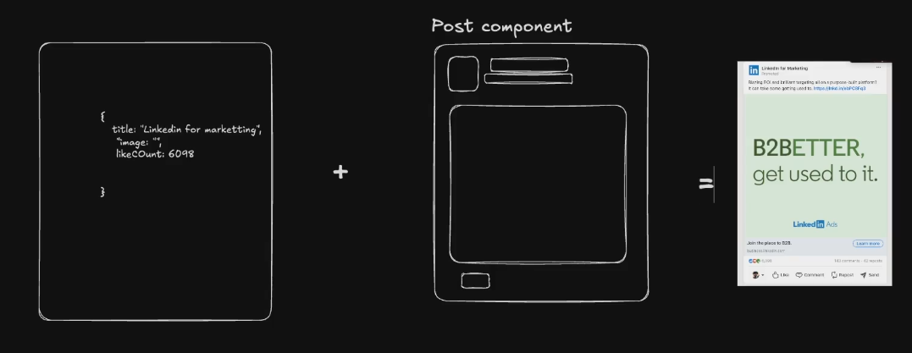
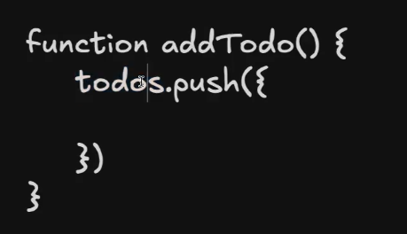
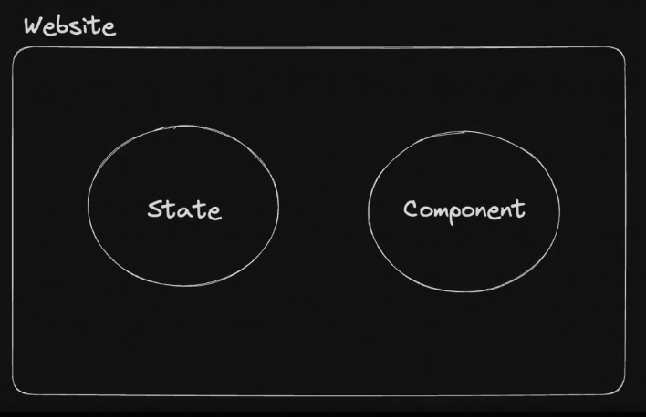
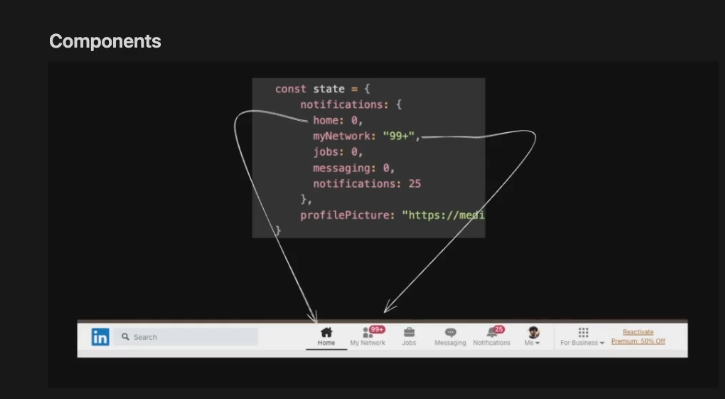
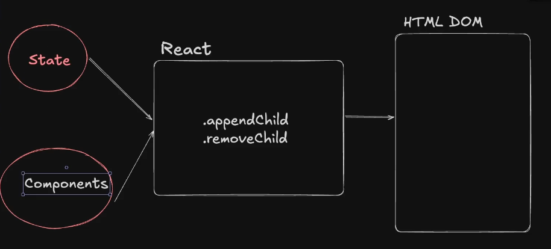
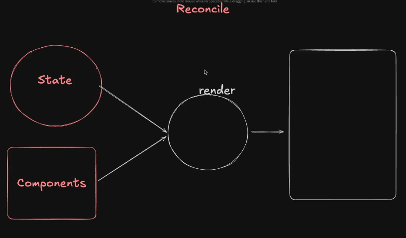

# Notes

## State Derived Frontends.

Instead of doing all the DOM Manipulation manually,
a framework can be designed to handle the DOM whereas
the developer is concerned only about the state and components.

1. State --> The variable parts of an application. (dynamic part)

2. Components ---> how to render a state on screen (static wireframe)

3. Rendering (Reconciliation)---> Taking the state and rendering it on the DOM based on the components.

---> same component could be used for multiple instances having different states (eg: social media posts)

Some frontend framework would update the DOM and does the rendering on the screen based on the state passed into this addTodo() function.

The state is updated constantly and the frontend is derived from it.

