# notes

## Runtime
Nodejs -->

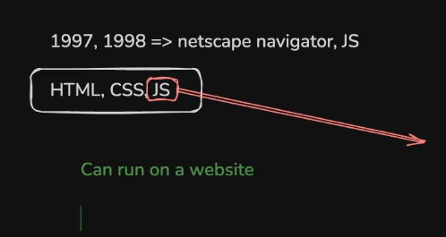

To run js, on the backend as well, these runtimes are introduced.

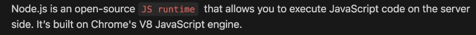

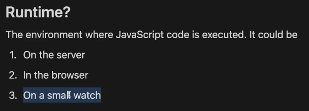

nodejs - backend server
chrome/brave - v8 engine

these js engines are responsible for interpreting the javascript codes and their functionalities.

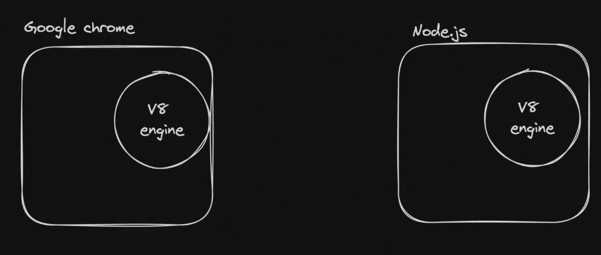
Both runtimes have few extra things on top the js engine (v8 in this case)

---> browser has DOM structure.  
---> nodejs runtime has libraries like fs which can be used to access the file system. (browser does not have fs for security reasons.)

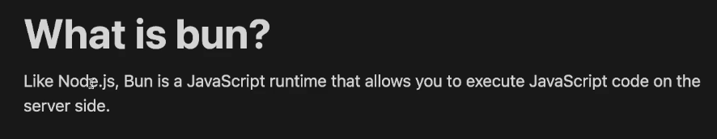
Bun is js runtime wrote from scratch (unlike nodejs) in zig language.  
(Bun is faster)  

ECMASCRIPT is the javascript standard that is followed by all the runtimes that interpret and compile js.  

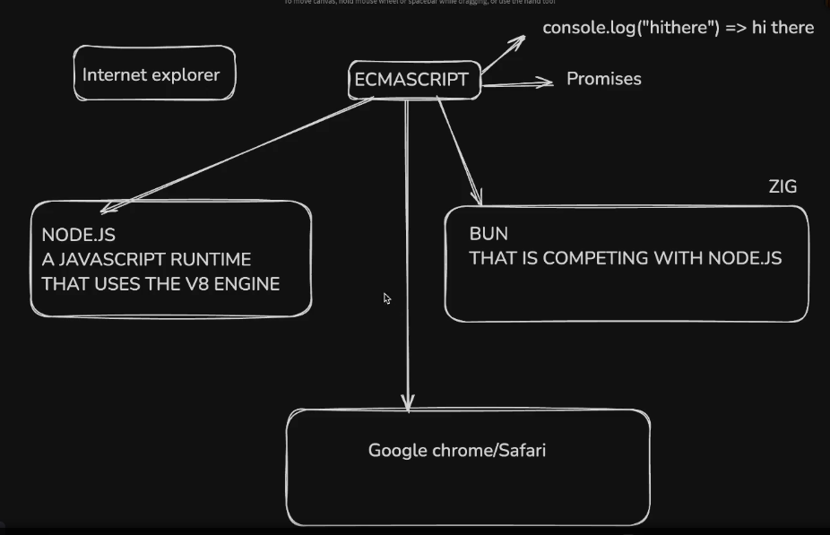

## npm

npm init -y --> initialises a new nodejs project, by creating a package.json ---> configuration file.  

rust --> cargo.toml

package.json
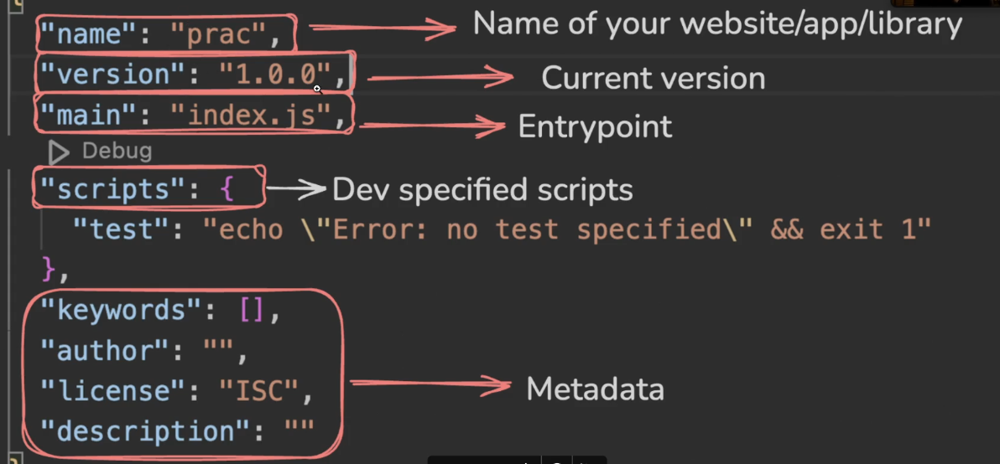

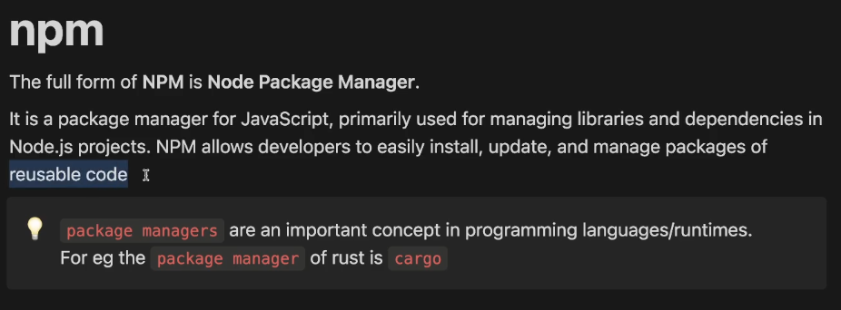  

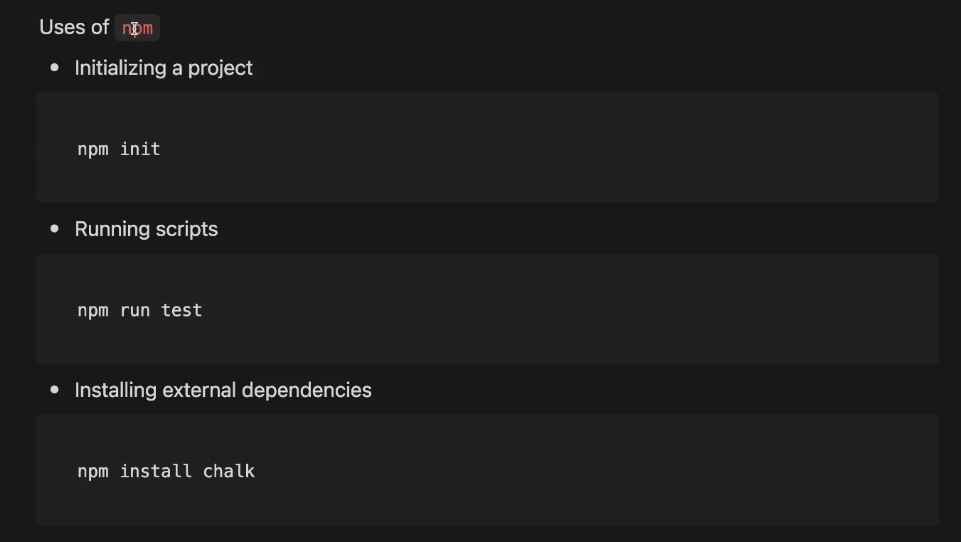

dependencies --> reusable code written by other developers, being brought into the codebase.

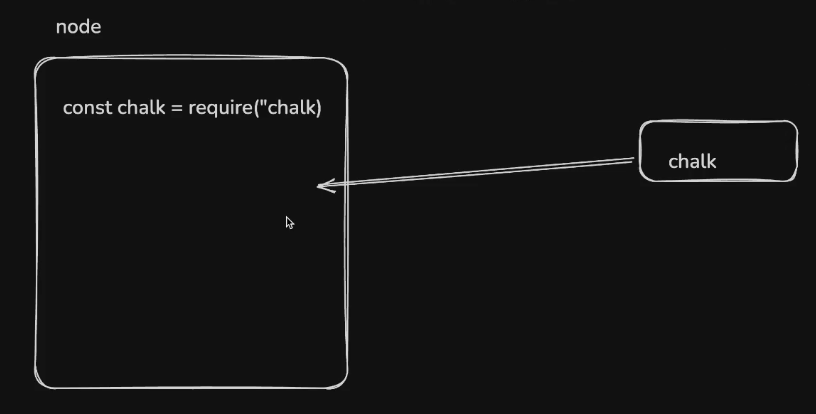

The dependency itself has its own package.json inside the node modules.  

## Internal packages

the packages that the runtime environment provides.  
eg: fs  

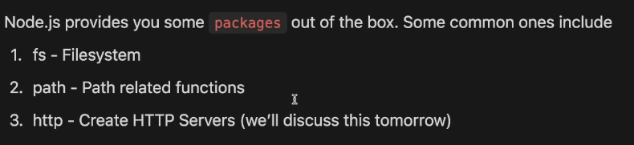

path --> internal package used to join multiple parts of a path.  

## External packages

when a external dependency is added to the codebase, it is added in the dependency section in the package.json  

one external dependency can depend on many other external dependency, hence, all of those packages are installed.  

 --> express needs 64 other packages whose details are stored in its corresponding packages.json in the node modules.  

Since node modules are soo heavy, they are not pushed onto the remote repo.  

all those packages could be installed while cloning the codebase by referencing the dependencies section in the package.json with "npm install" command.  

The versions of the packages are updated as their codebase and functionality gets updated.  

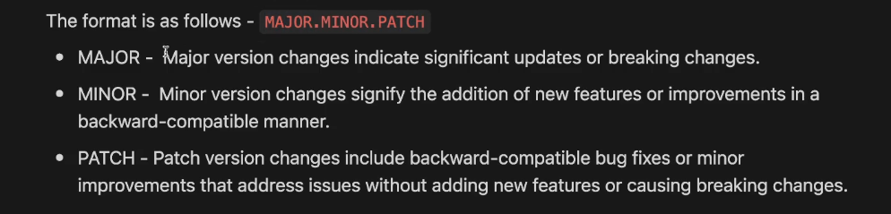

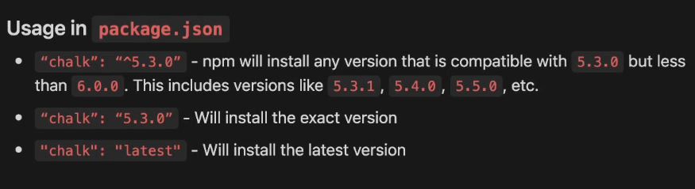

backward compatability -- ability of the newer package to be able run with the code written for its older versions.

The problem in case of installing packages with ^ (carrot) is different developers operating on the code might end up installing different versions of the package and write code according to it.

To solve this problem, package-lock.json is generated when the external dependencies are installed. This package-lock.json pins a version for each package, so that all the users who install the packages based on the package.json, will install the same version of the package.  

Hence, both package.json and package-lock.json are pushed into the remote repo.

## Creating a Command Line Interface

"node -h" --> provides helper text.
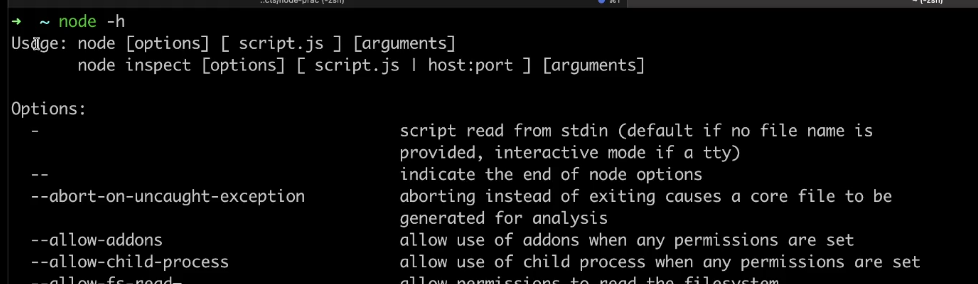
