# Notes

external libraries let us create http servers in our backend.

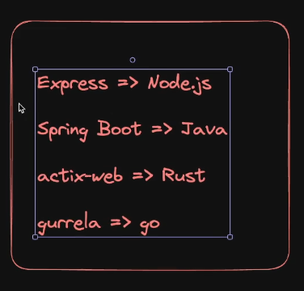

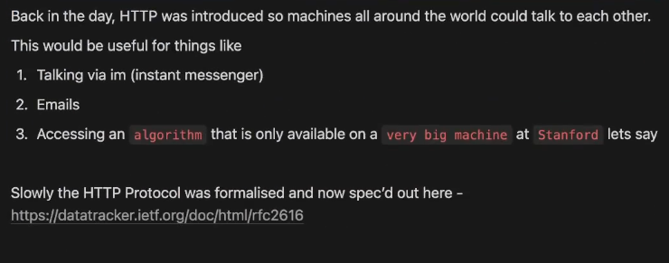

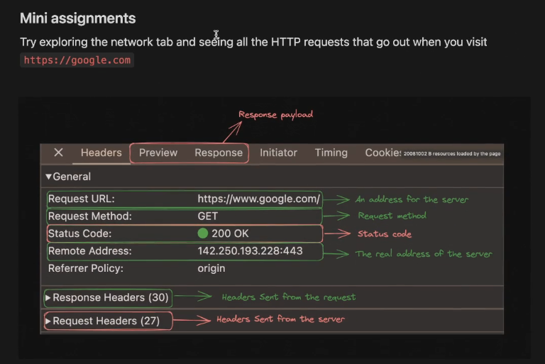

This model of the client communicating with the server is called the request-response model.

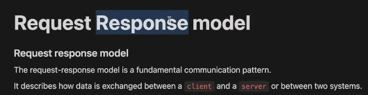

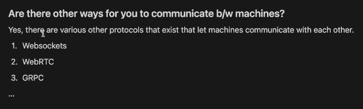

## Domain Name/ IP

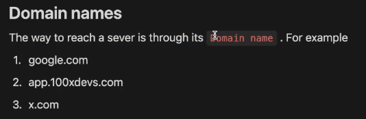

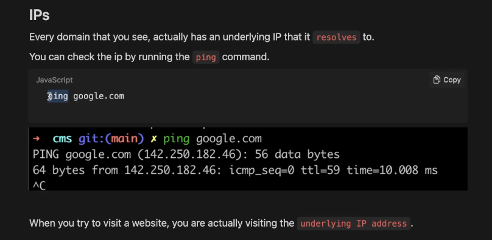

google.com could resolve to different ip addresses for different people based on their location.

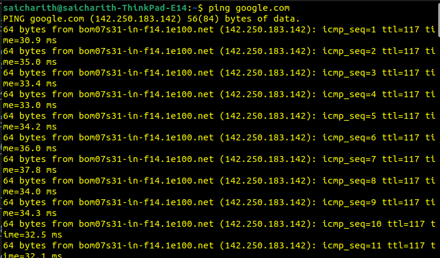

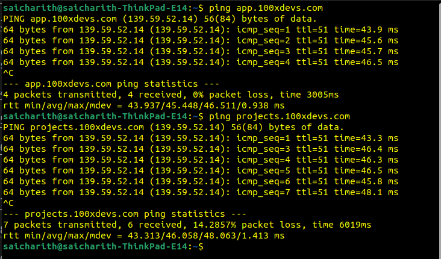
---> hosted on the same machine (same ip addresses)

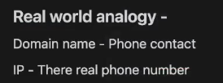

to deploy a website:

1. rent a server (aws) ---> gives the ip address

2. Buy a Domain (Godaddy) ---> www.website_name.com

3. Point the domain name to the server ip address.

## Ports

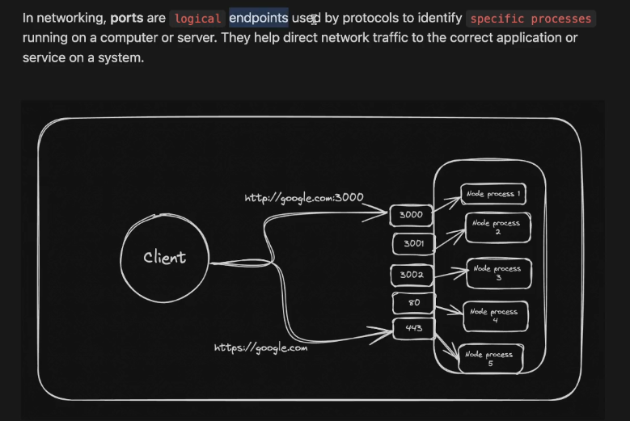

By using ports, multiple websites could be run on the same server.

Reverse proxies (implemented using nginx) can be used to direct requests for different processes to the same port of an IP address and then route those requests to the appropriate processes internally.

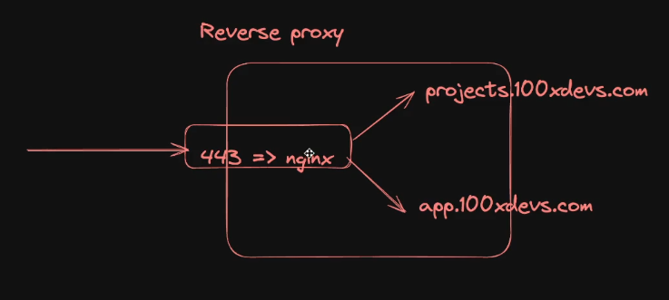

Generally websites are deployed on port 443. (HTTPS)

port 80 for (HTTP)

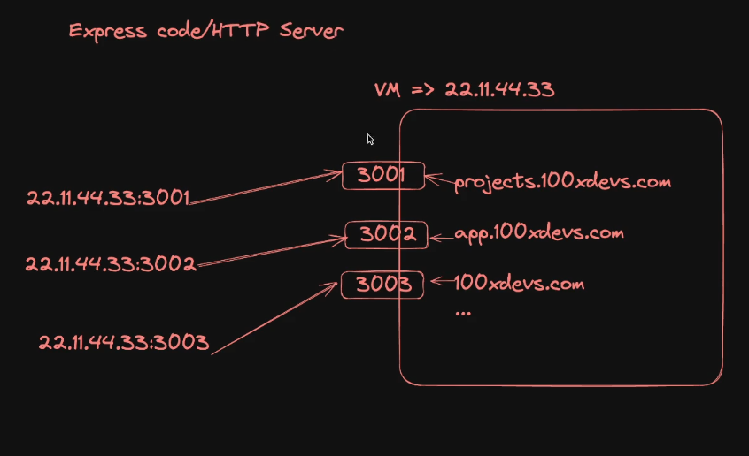

## Methods

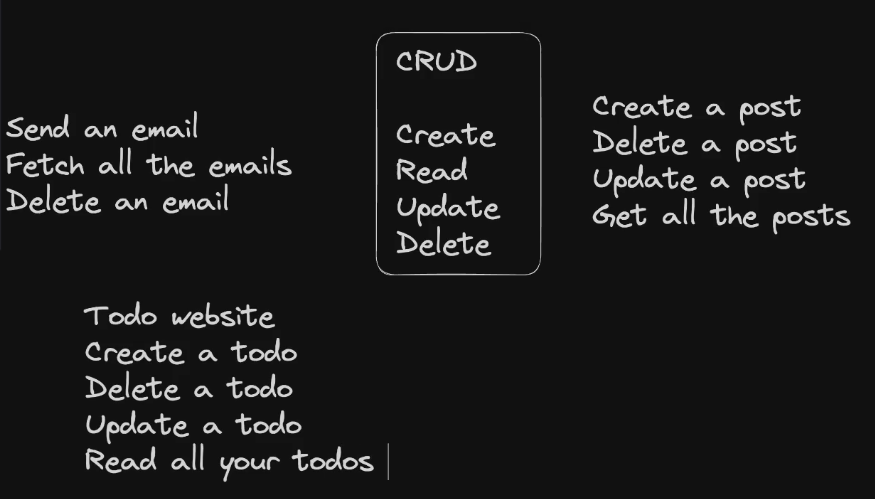

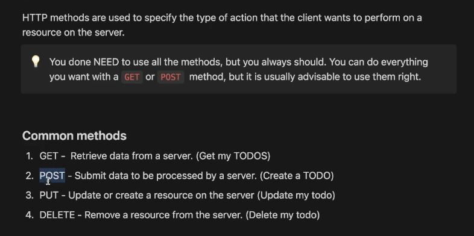

Handlers are written for each type of request method, if a request handler is not found for a particular method, it returns an error.

## Response

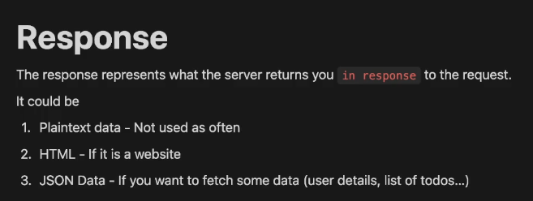

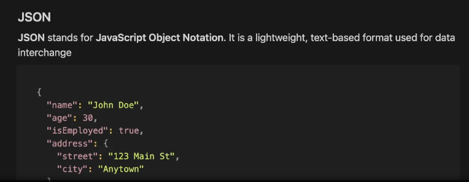

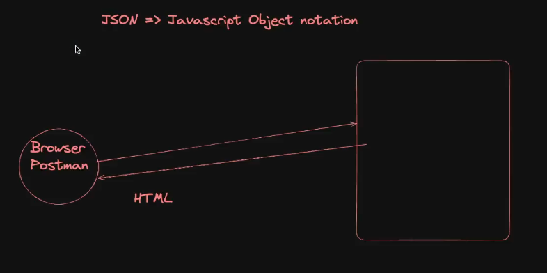

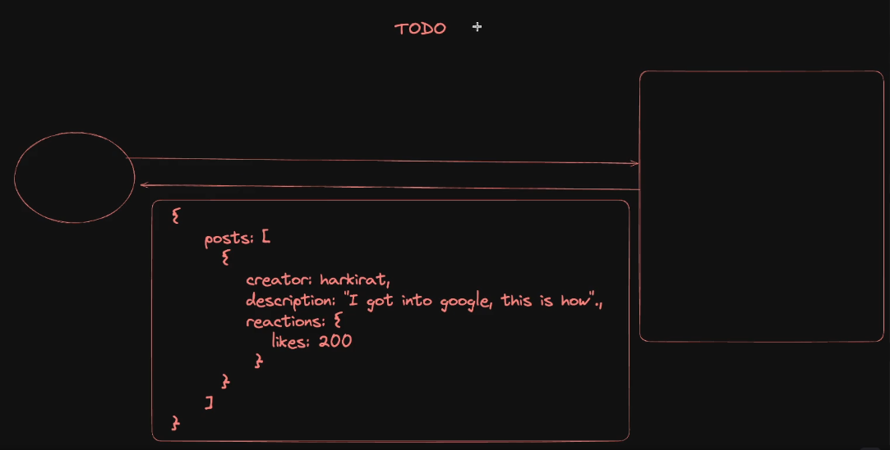

## Status Codes

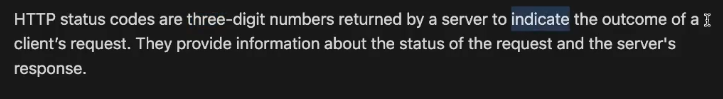

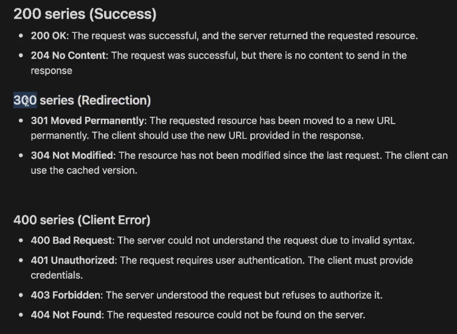

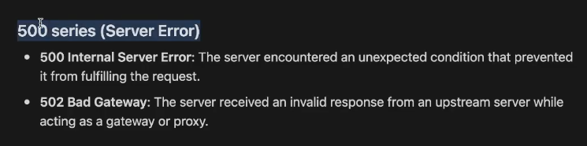

## Body

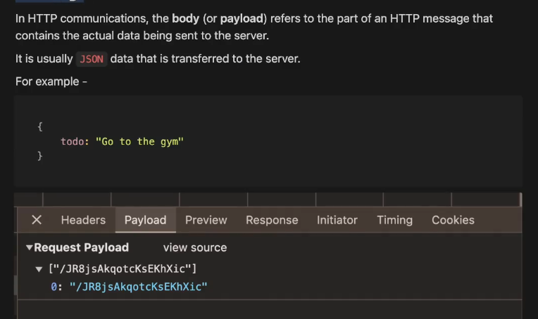

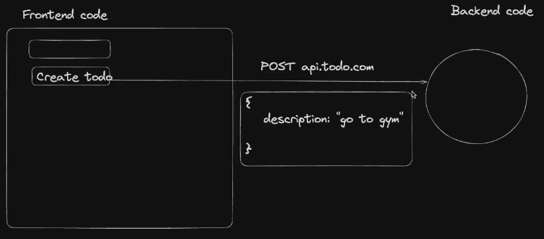

## Routes

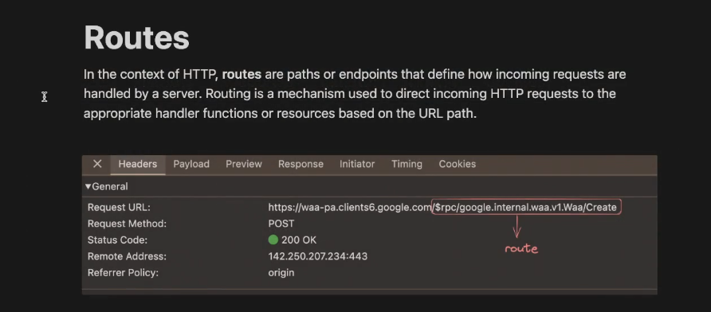

a http server can be created by using the already existing library like expressjs. (underneath it, the http protocol is already implemented, we can used its library functions to create the server.)

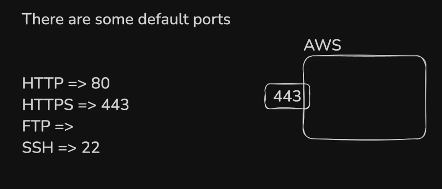
browsers by default forward the requests to their default ports.

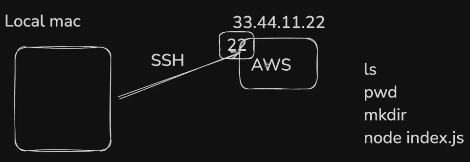
