# Notes

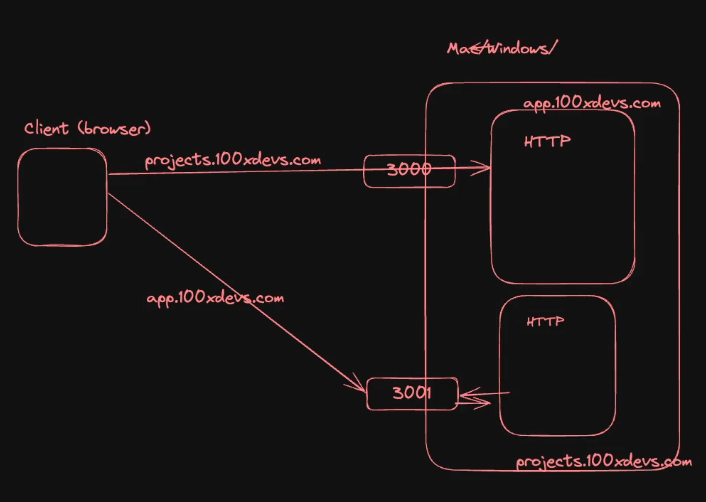

ports are just logical, they don't exist physically.  

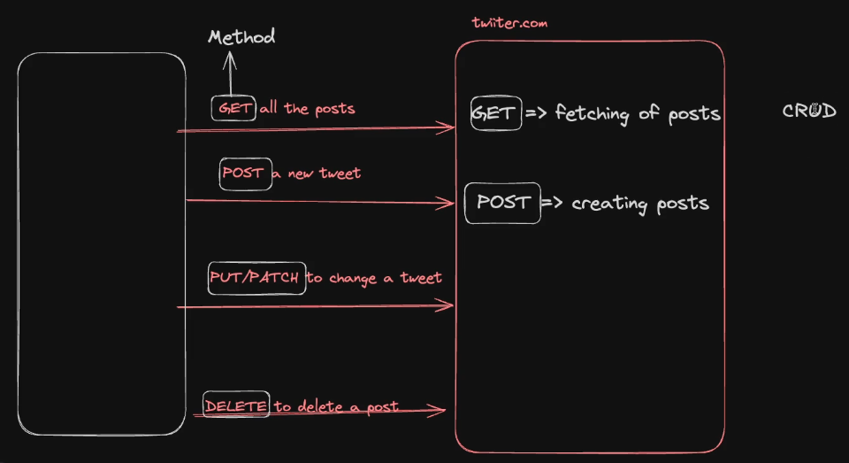

The type of method for a request is mentioned on both client side and server side. (its a two side thing ;)

## Headers

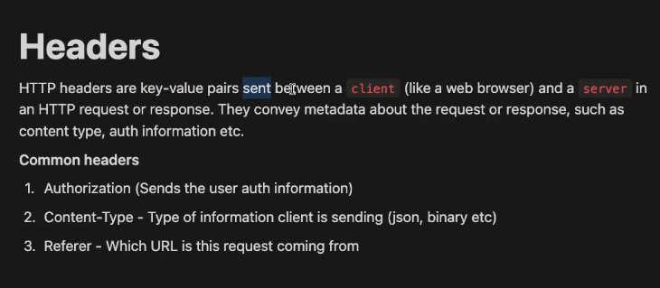

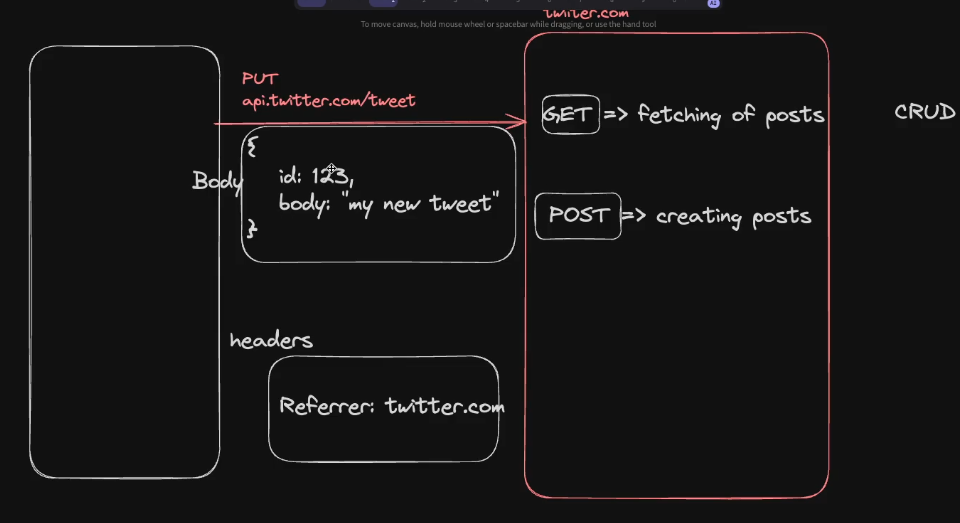  
 
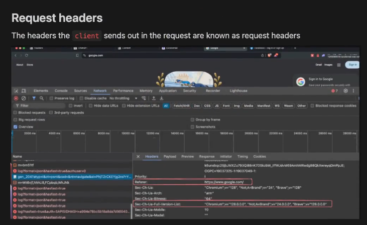

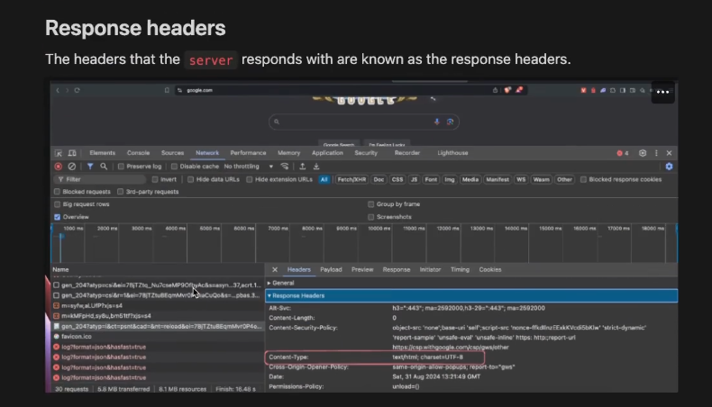

---

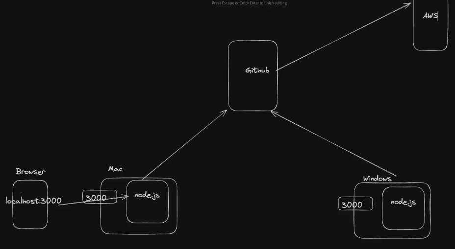

during local development, the server listens at the mentioned port (3000 in this case) of the local machine itself.

## Fetch API

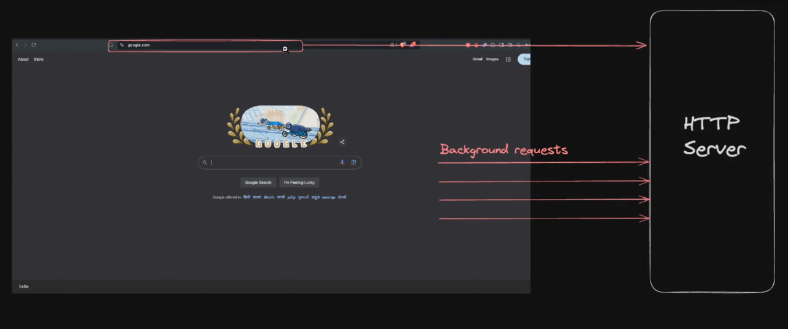

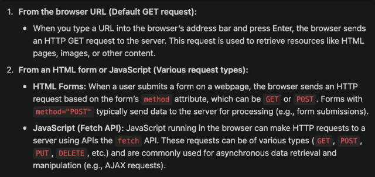

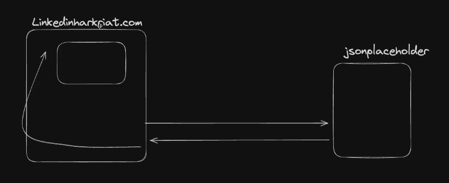

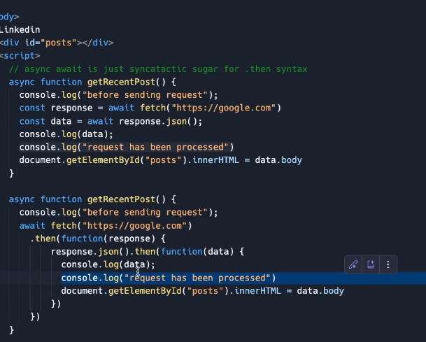

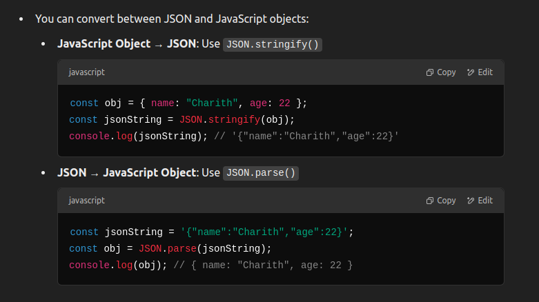

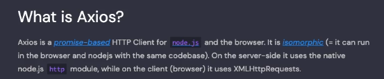

While an external dependency like axios could be installed in a nodejs project using npm,

In html, its source code could be imported as a script from its CDN inside a script tag in its head.

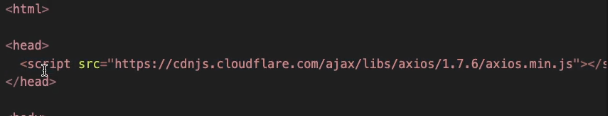

Axios automatically parses the JSON response into a js object unlike fetch where parsing needs to be manually done.

----> The get http method's request object does not have a body,  

Hence,  
query params or path params could be used to send data for get requests.

query params(/?a=1&b=2) could be caught with req.query

path params (/a/b)  
are defined in the endpoint itself /:param1/:param2
caught using req.params   ---> dynamic endpoints

---> data can be sent through a request in many ways:
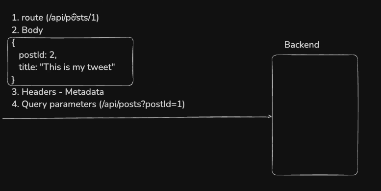
