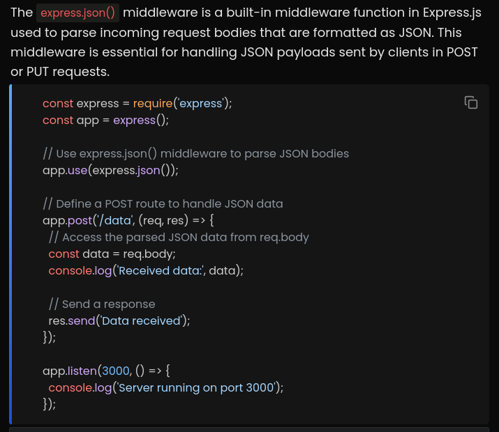
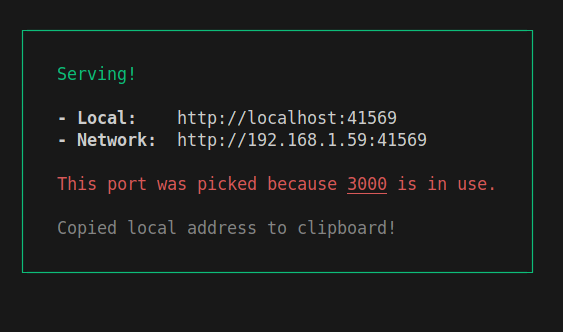

# Notes

## request-response cycle

## Middlewares

We can say that a route handler executes a sequence of middleware functions, where the last middleware is the actual route handler.

While all the intermediate middlewares have access to req body, res body and next() function, the last middleware that actually handles the request only has access to the req and res body.  

next() -->  calls the next function in the sequence of middlewares.

If next() is not called at the end of the middleware (with no response sent back), the control would never go to next middleware in line ( the request is hung there, thus loading endlessly.). Hence, the middleware should either call next() or send a response based on given conditions.

Using app.use() for middlewares ensures that each and every request to the server passes through this middleware,  
whereas explicitly passing the middleware in an endpoint ensures that only the requests to those specific endpoints will be passing through that middleware.  

The app.use() middleware takes in the requests that are coming only to the endpoints that are defined below it in the code.

## Commonly used middlewares (external)

### express.json

  

under the hood, express also uses body-parser library to parse the request bodies formatted in JSON.  

### cors - Cross origin resource sharing

The express server by default blocks the fetch (background) requests coming from an origin (referrer field from the request header) different from the server itself, throwing a cors error.  

To give the access to specific origins (DIFFERENT FROM BACKEND ORIGIN) where the frontend is hosted so that they are abled to send fetch requests to the backend server, cors middleware can be used.

##

serve package can be used to serve static files over http.

cors errors occur for the background requests across different domains.  

If both frontend and backend are deployed on the same domain, 
since both are of the same origin, there won't be any cross origin resource sharing, hence cors library is not needed.

For cors requests, the browser first sends a preflight request to the server and based on the headers in the response it gets, it confirms if it can send a particular request to the server.

