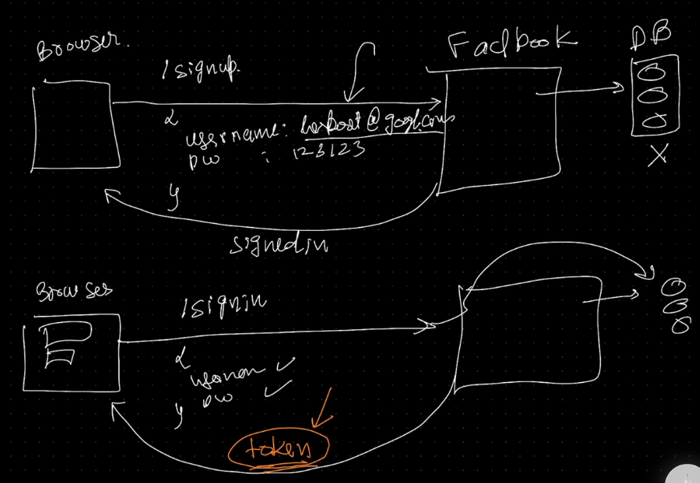
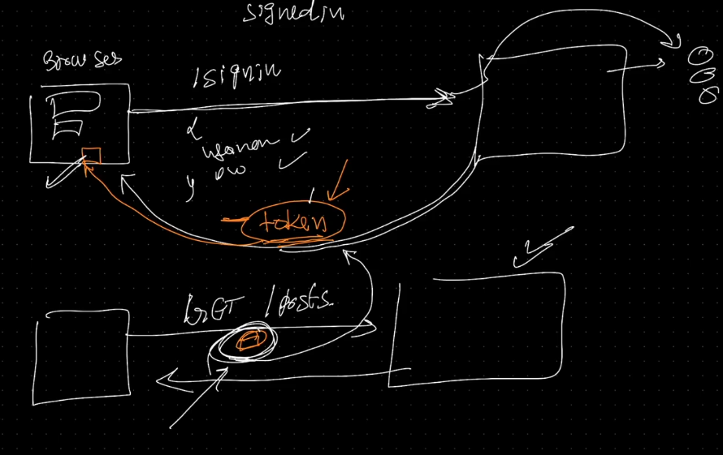
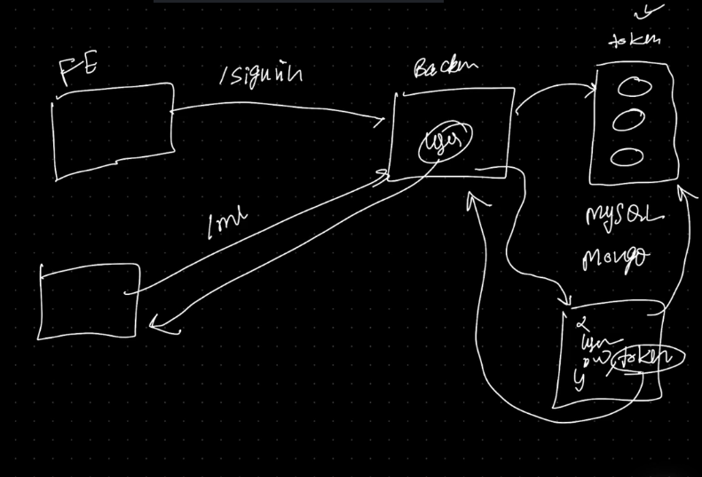
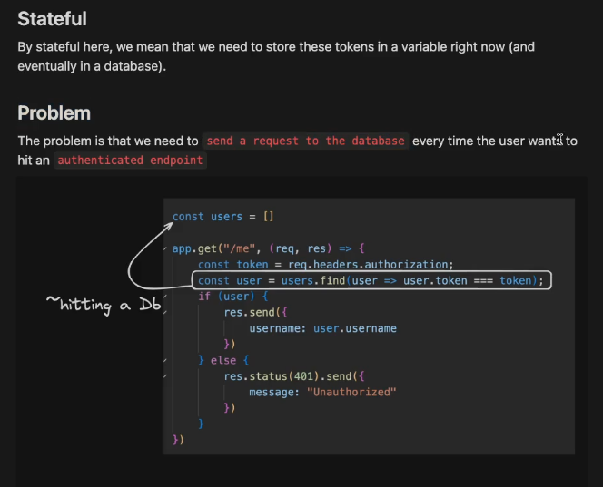
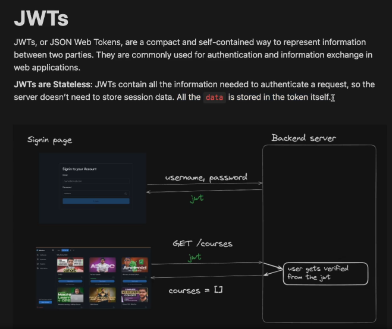
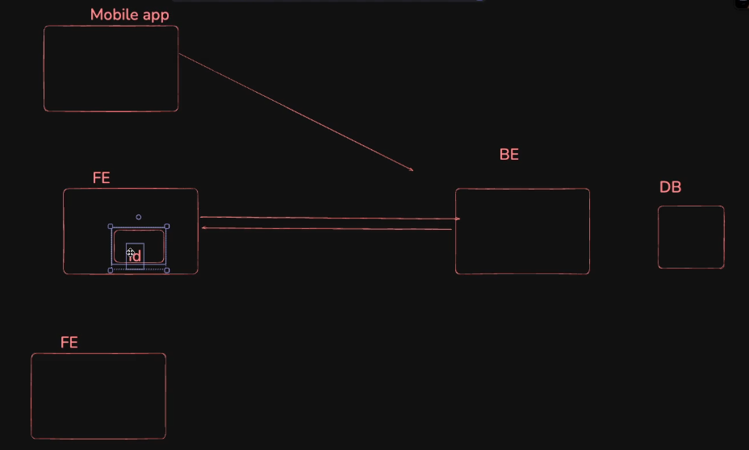
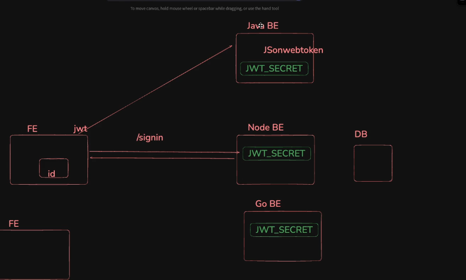

# Authentication

For every sign up/Sign in, each user is assigned with a token,  
and for every future request, this token is included in the request header, such that the server authenticates the user based on this token.

## Auth Workflow

All the users send request to the same endpoint, but the server identifies each user using their token and sends the response relevant to the user.

For authenticated endpoints, where the server fulfills the user's request only if they are authorized:  
generally, these auth tokens are stored in the request headers, in authorization or cookies, so that the request handlers in the server authenticates by parsing the token from the request headers and performs their specific action.

## Tokens vs JWTs

### stateful tokens

for every authenticated request, the server looks up the database to check if the token in the request header matches any token in the database

### JWTs

create tokens based on the user credentials and send them to the user after sign in,
and while handling the authenticated requests,the jwt token that is parsed form the request headers is used to authenticate the user based on the data stored in the jwt.

Since JWT is stateless and the data required to authenticate is what produces the jwt, the server just needs the jwt it created and assigned to authenticate the user and it saves one round trip b/w the server and database while handling an authenticated request. (jwt would not contain passwords.)

The JWTs could be stored both inside a authorization header, or cookies.

a JWT secret variable is used as key to create or sign a jwt and later to verify and decode it to get authentication data from it.

jwts vs cookies

 