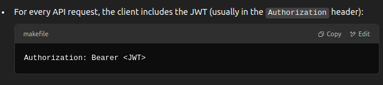

# Notes

JWTs are note created by encrypting the data,  
For encrypted tokens, the same key previously used to encrypt is needed again to decrypt the token.  

JWTs are created by encoding the data with a secret key, such that they could still be decoded even without the secret key, but can only be verified using the secret key.

the verification of jwts mean, the backend server checks whether the jwt was created by it or not.

  

But if someone steals a jwt, they can also make requests to the server.

