# Notes

## Databases
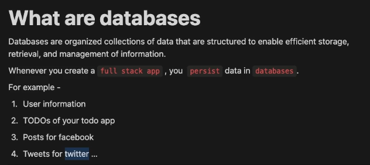

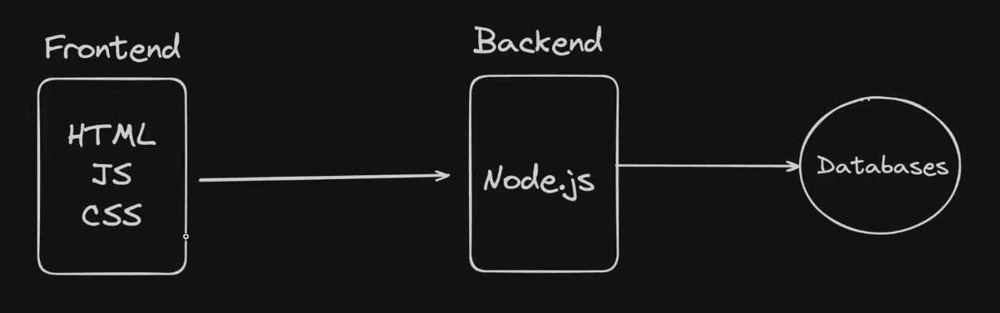

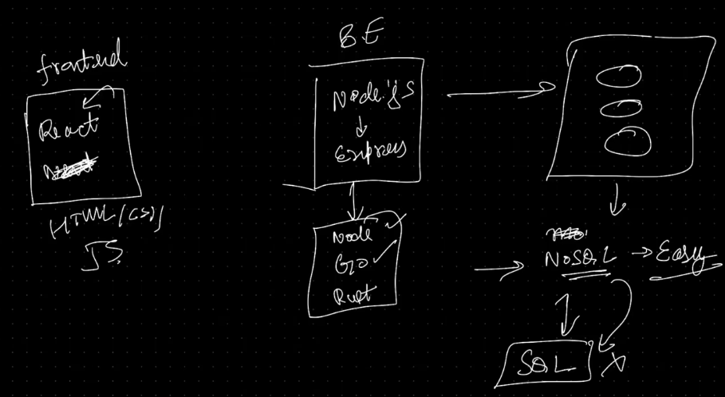

Backend servers are stateless, the data doesn't persist on them.
The database server is where the data is persisted.  
(Database servers could also be down, but their resiliance could be ensured by maintaining replicas of the data chunks on multiple servers.)  

Even if all the backend servers are down, the application could up whenever new servers are arranged, but if all the database servers are lost, everything is goneeeeeee........  

## MongoDB and NoSQL Databases

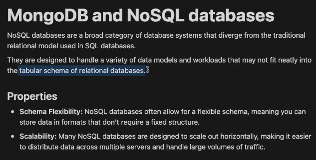  

For nested data (like in case of fetching one folder inside another folder inside another folder),
NoSQL databases are better suited than noSQL databases.  

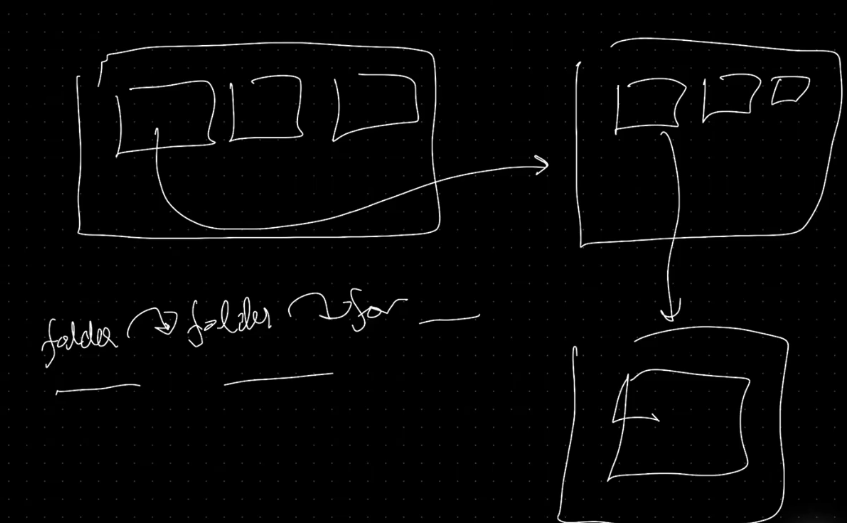

But for most of the cases SQL databases are better suitable.  

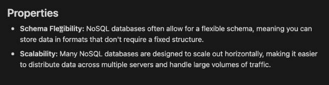

schema ---> structure of the database

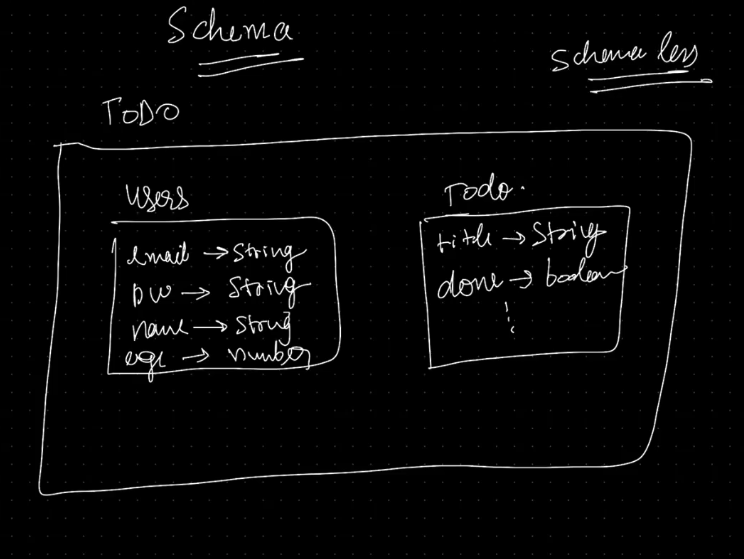

MongoDB here is schemaless.

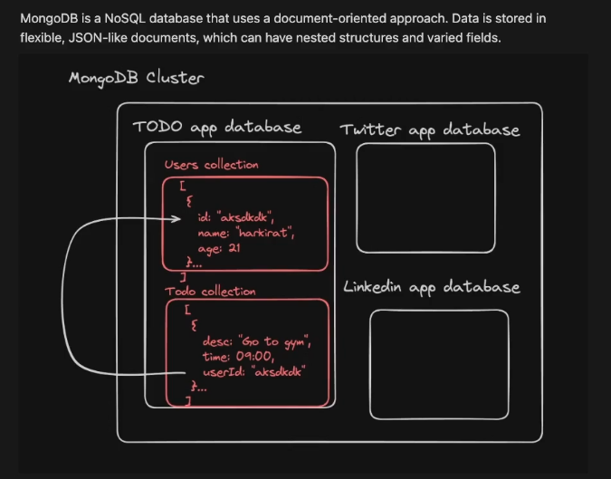

MongoDB connection string to connect the cluster in the cloud.

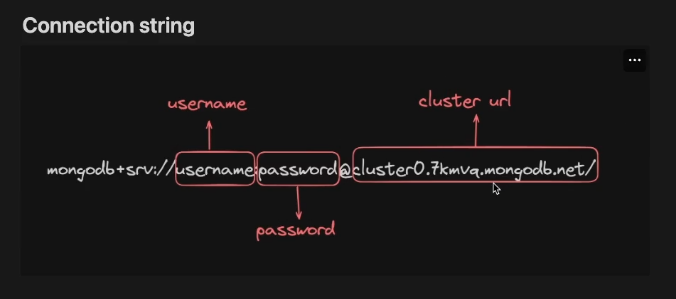

## CRUD

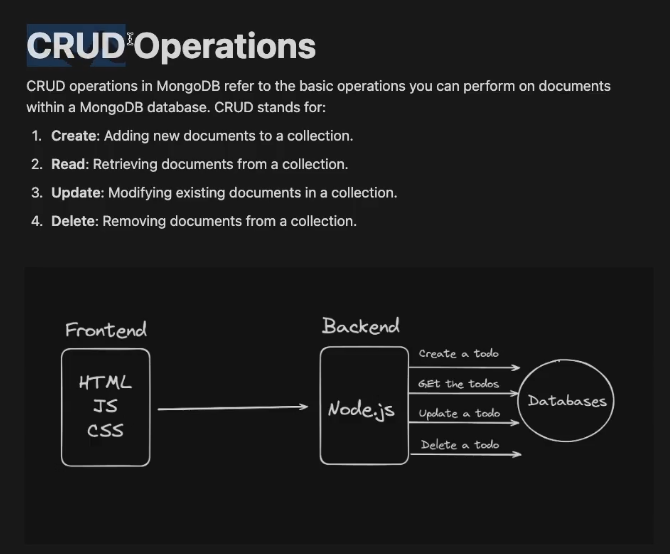

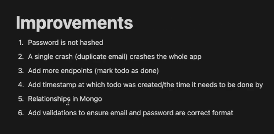
