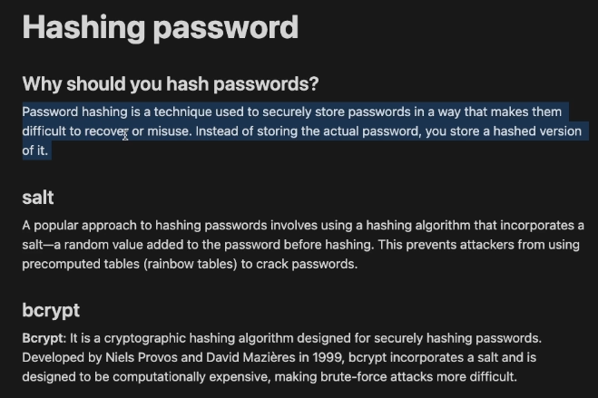
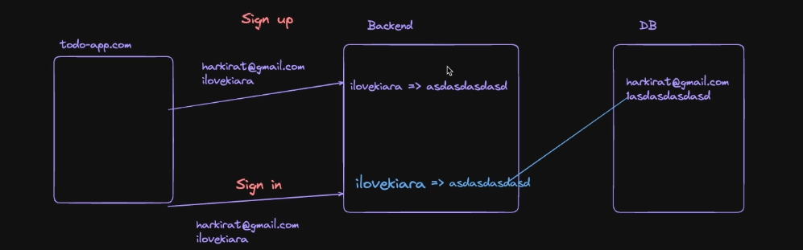
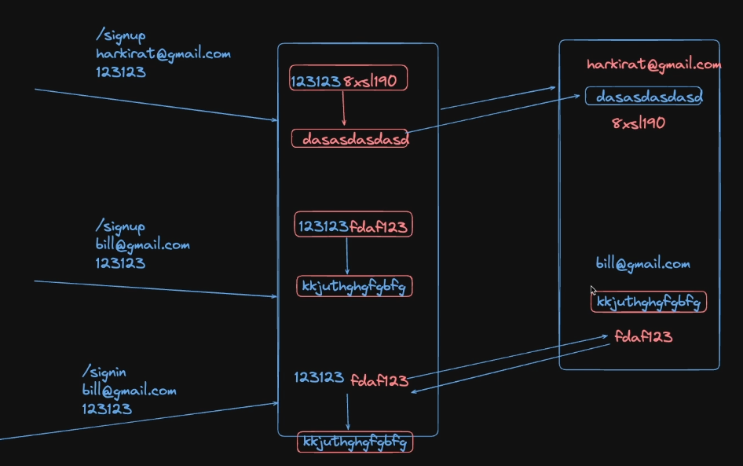
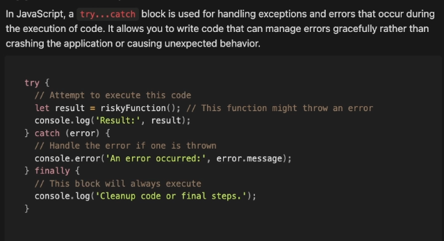
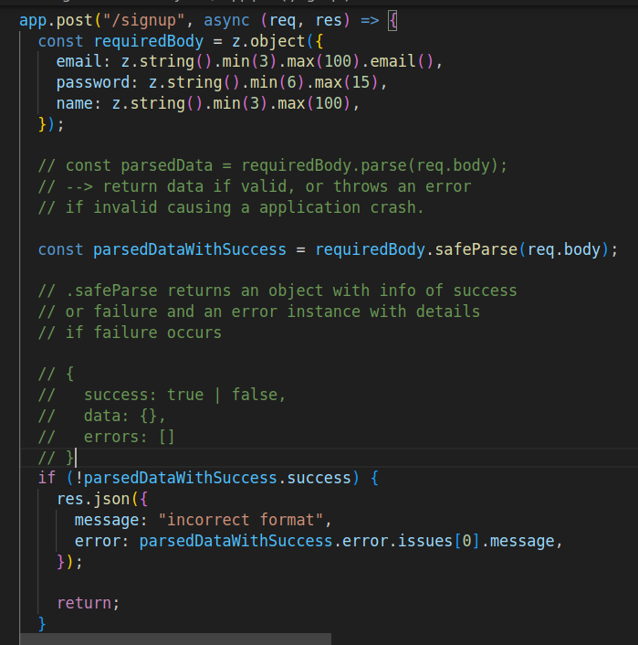
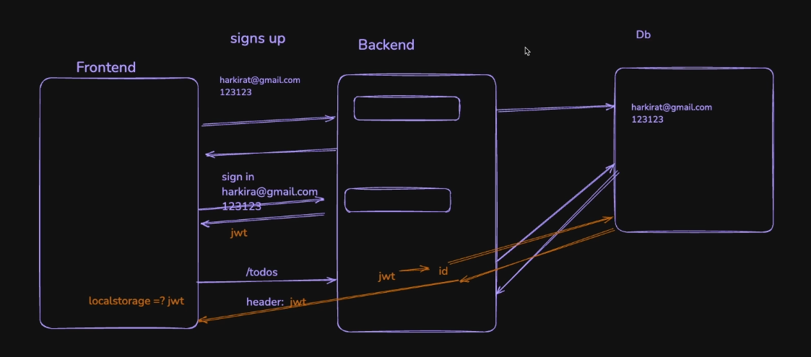

# Notes

## Databases

Backend servers are stateless, the data doesn't persist on them.
The database server is where the data is persisted.  
(Database servers could also be down, but their resiliance could be ensured by maintaining replicas of the data chunks on multiple servers.)

Even if all the backend servers are down, the application could up whenever new servers are arranged, but if all the database servers are lost, everything is goneeeeeee........

## MongoDB and NoSQL Databases

For nested data (like in case of fetching one folder inside another folder inside another folder),
NoSQL databases are better suited than noSQL databases.

But for most of the cases SQL databases are better suitable.

schema ---> structure of the database

MongoDB here is schemaless.

MongoDB connection string to connect the cluster in the cloud.

## CRUD

## Hashing Password

Passwords are not safe to be stored explicitly on a database. Hence, they are hashed at the backend before storing them in the database.

Since, hashing is irreversible (computationally expensive) unlike encryption,
the password that the user enters at the sign in time is hashed again with the same hash function used before, if the resulting hash matches with the one in the database records, the user is authenticated, else rejected as unauthorized user.

But the problem that arises with this hashing method is, since the hash functions are deterministic, if passwords of two users are same, their resulting hashes will also be same, thus creating a vulnerability where if they find out that there are multiple matching hashes and get to know the password from one of those users, all other users could also be exploited.

Hence to get the resultant hashes to be different even with same passwords, SALTING method is implemented. In Salting method, the passwords are hashed along with random string called "salt" and the salt is also stored in the database, such that during signin the user entered password is hashed along with the salt stored in the database, and checked if the hashes match.

Instead of this process of manual salting, bcrypt hashing algorithm could be used to hash the passwords directly.

bcrypt stores the no.of salt rounds and the salt in the first few characters of the hashed password itself, making it not necessary to store the salt separately in the database.

bcrypt.hash(password, saltrounds) ---> hash the password
bcrypt.compare(password, hashedpassword) ---> check if the passwords match.

## Error Handling

When functions throw errors and if they aren't handled, it might cause the server to crash.

To avoid that we use the try catch block.

## Input Validation

If a user sends a request with body containing data in invalid format and different from the schema defined in the database, it might also lead to the server crashing. Hence, input validation is implemented and in case of any exceptions, they are handled by sending suitable responses.

input validation using Zod:

## high level flow of authentication

