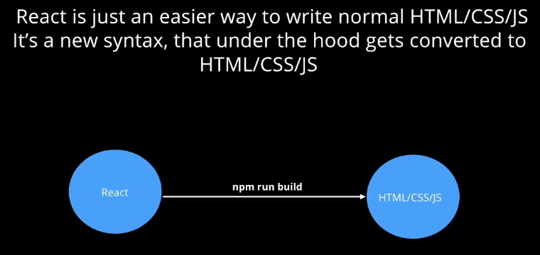
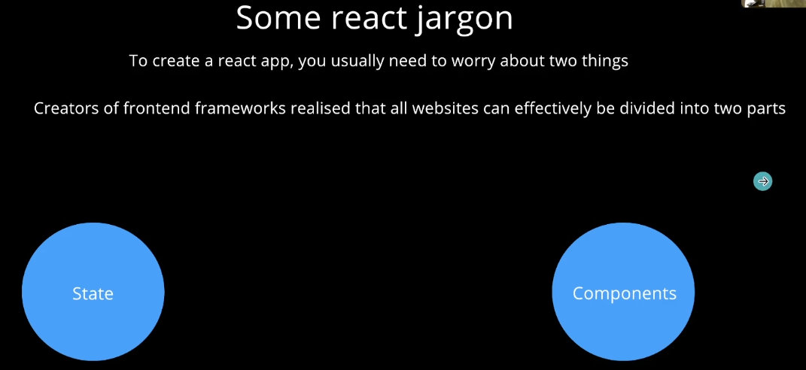
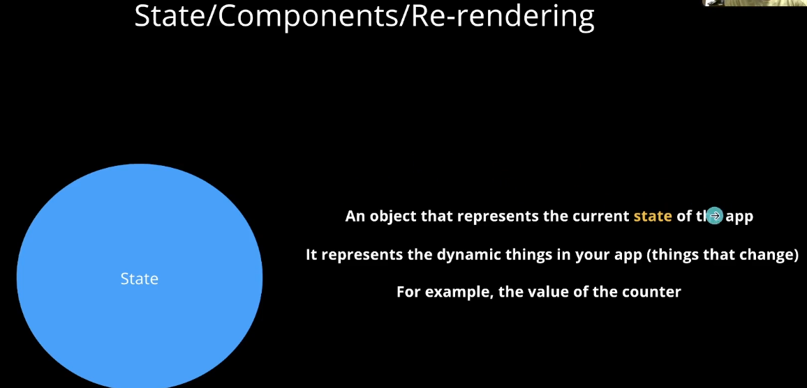
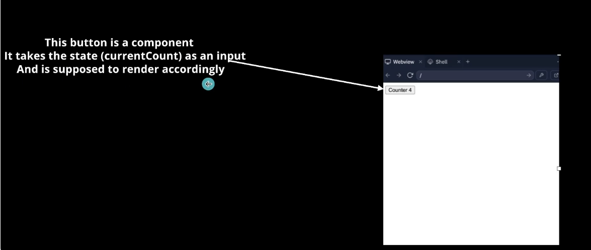
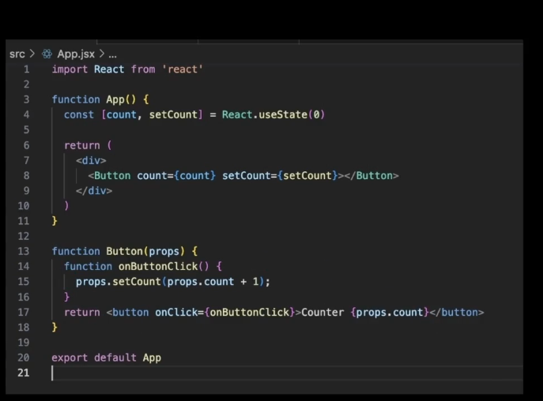

# Notes

JSX
class vs className
static vs dynamic websites,
state,
components
re-rendering

Why do you need React? For static websites, you don't! But as time progressed, websites became more dynamic (HTML changes as the website is surfed) and user interactive, hence creating a purpose for react.

React is not used for static or less interactive websites in order to reduce the javascript bundle size.

The browser doesn't understand the react syntax, instead during deployment its converted into html/css/js. 

A state change triggers a rerender. A re-render represents a change being taken place in the DOM as the state changes.

## React

The react components return xml (not html).

In react, the DOM manipulation is not carried out manually, it is handled by the state management itself.
