# React

## Starting a react project locally using Vite

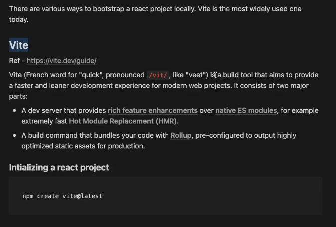

Hot module replacemnent is the changes made in DOM when the code is changed while testing a react app.

Module bundlers like rollup compile the small pieces of code from different files in the react project into a large and complex file.

React does diffing i.e. checks for the changes b/w old version and new version of the virtual DOM.

1. Structure the application into components
2. Defining a state for the application.

## Components

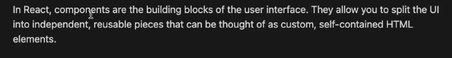

## Props

Props could be passed into the components to reuse them and display different instances with different info in their bodies.

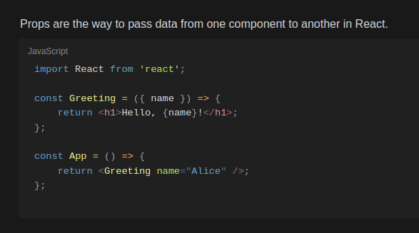

## Conditional Rendering

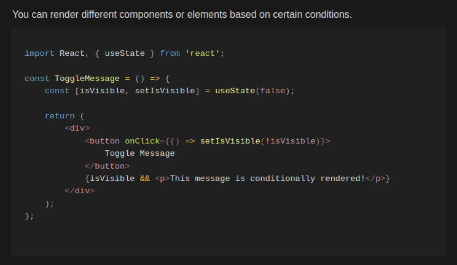

## useState

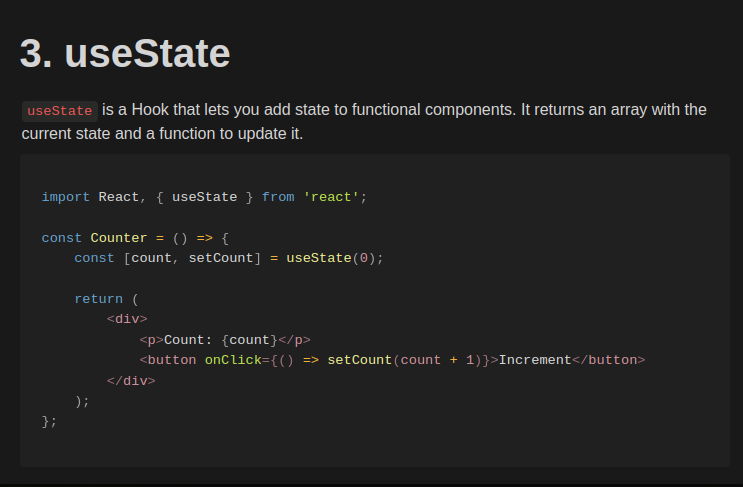

When the value of a state variable changes, the component that uses the state variable re-renders.

React is a dynamic website framework only if you are using state variables that are provided through useState hook.

Hence, any component that needs to be dynamically rerendered should be made of state variables created using useState hook.

## useEffect

useEffect is used to manage sideEffects.

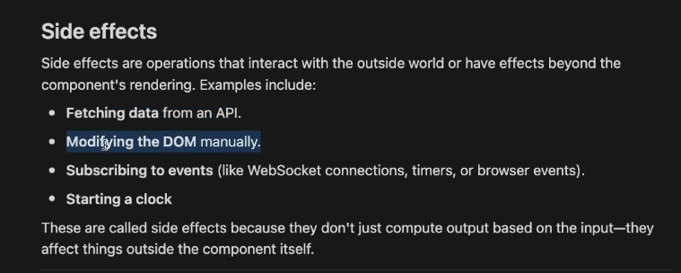

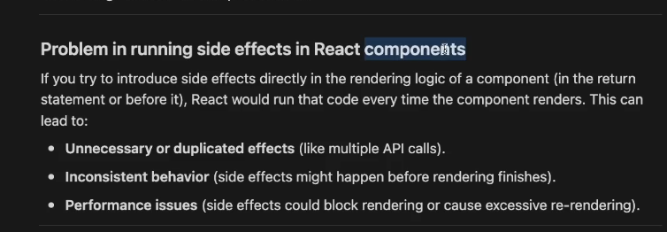

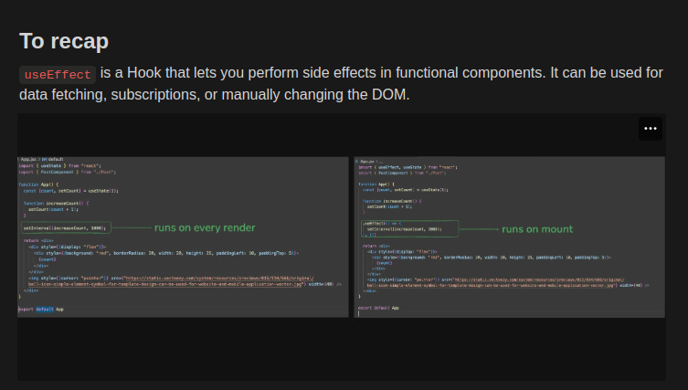

The callback inside the useEffect() runs during the first render that is when the component mounts and then runs whenever the variables mentioned in the dependency array change.

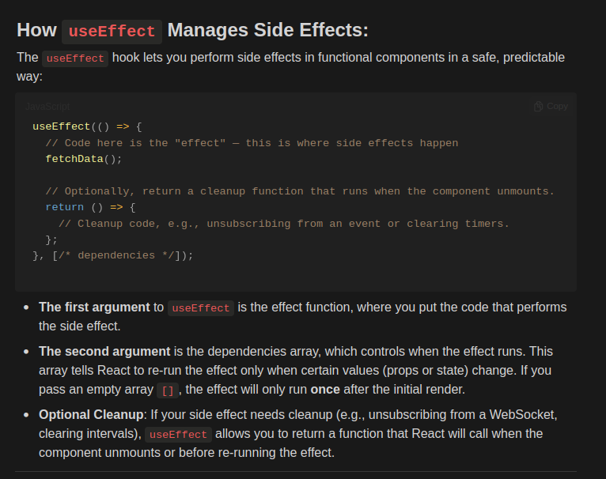

### Wrong implementation of setInterval inside useEffect

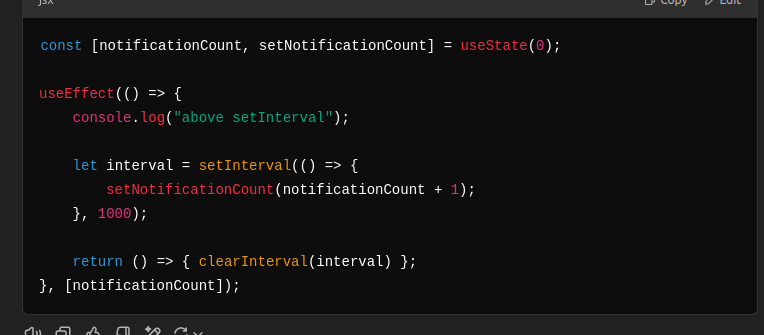

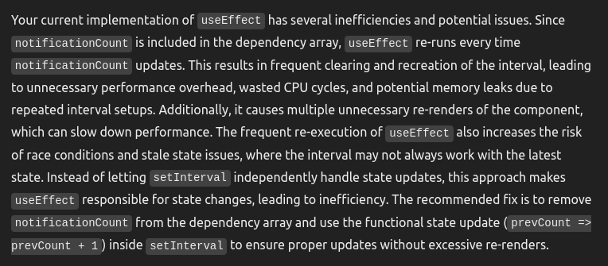
