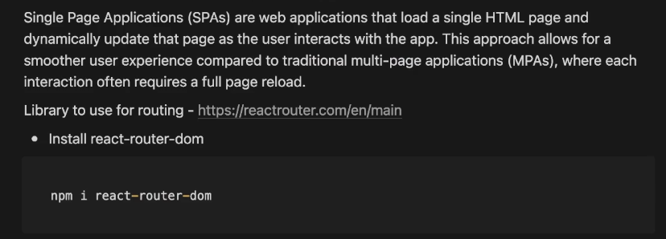
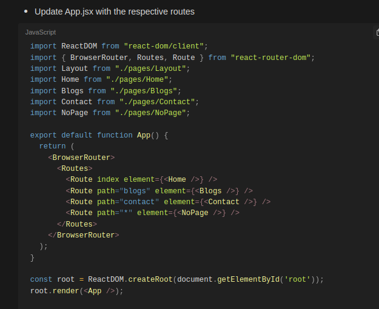
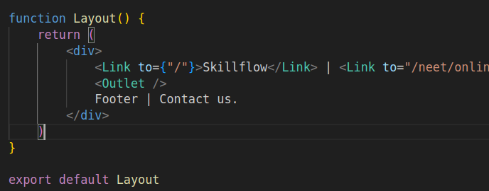
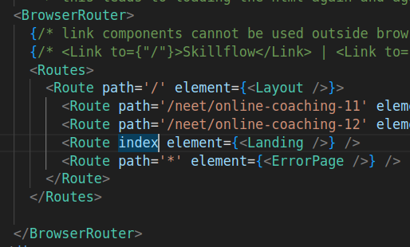
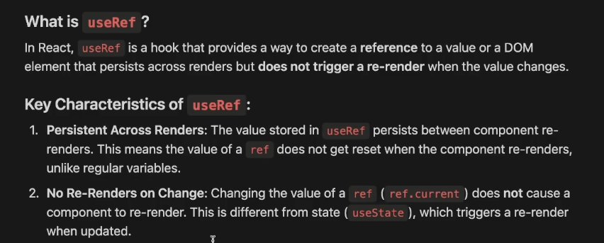
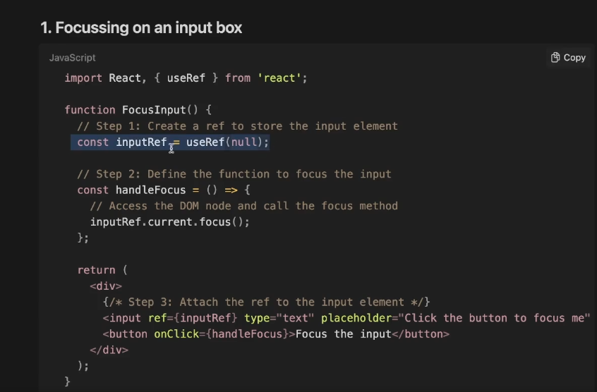

# Notes

## Single Page Applications and Routing

## Layouts

Layouts let you wrap every route inside a certain component (think headers and footers)

Layout can be treated as a parent route having multiple child routes.

Inside the layout, the Outlet component is replaced with the matching child route.

The default child route can be declared with the path of the parent route or simply with "index" attribute.

## useRef

One use case of useRef is to reference a dom element that persists across rerenders

Other than focussing, the dom elements can be referenced with useRef to scroll to top or bottom on dependency change.

Another use case is To reference a value that does not trigger a rerender when it's changed.
