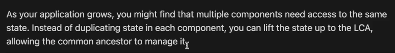
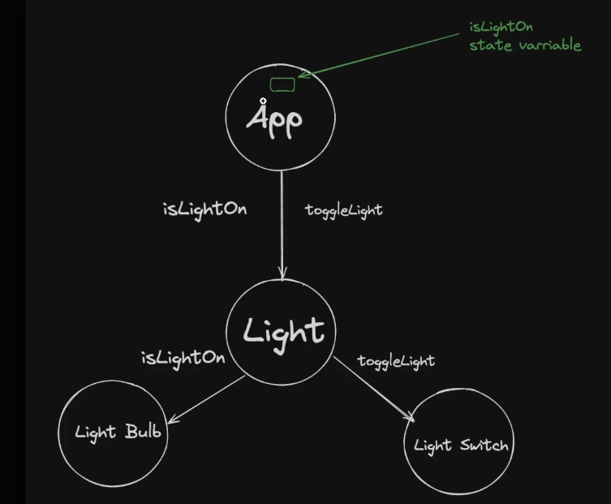
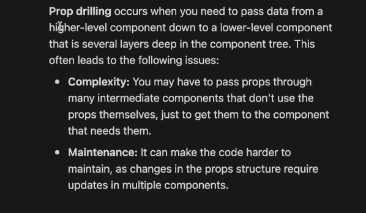
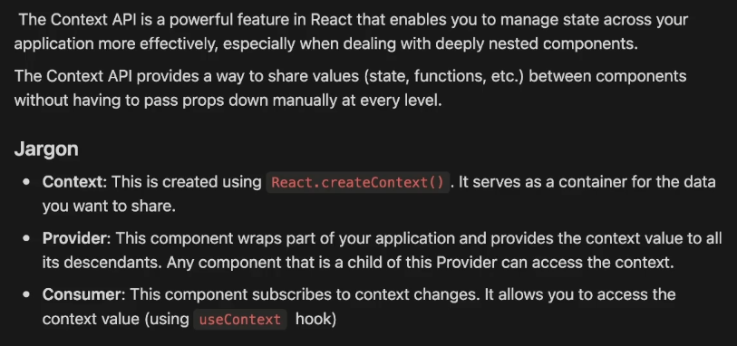
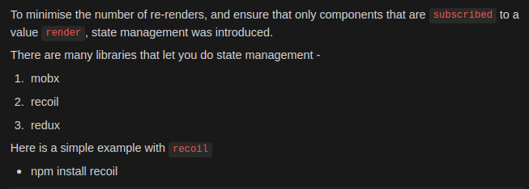

# Notes

## Rolling up the state, unoptimal re-renders

## Prop Drilling

In case of Prop drilling, the middle children of the component tree might not use the props that are being passed, rather they just pass them down further.

Hence, state management must be done in such a way that

1. Prop drilling does not occur and
2. The state should be stored at one place but still be accessible to read and manipulate from different levels of the component tree.

## Context API

In this way Context API eliminates prop drilling.

However, the Context API does not optimise the no.of re-renders to increase performance of the application, which can be possible with state management libraries like redux, recoil or zustand etc.

## Introducing Recoil

