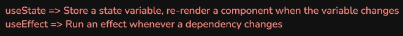
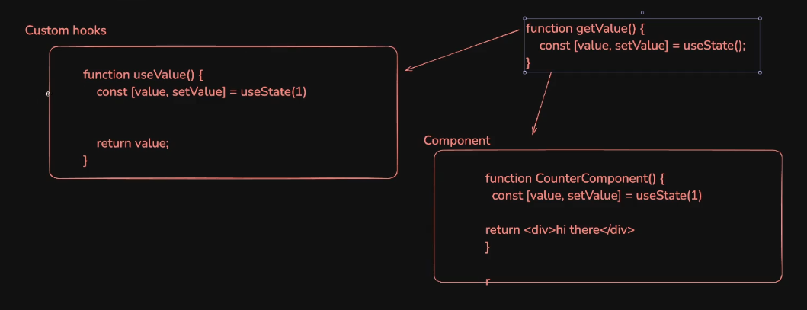
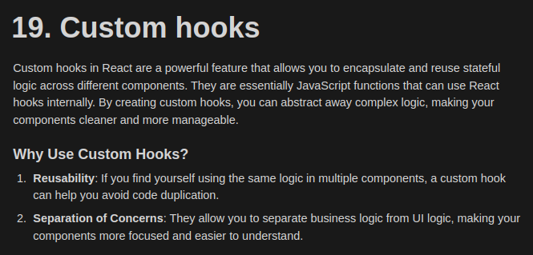
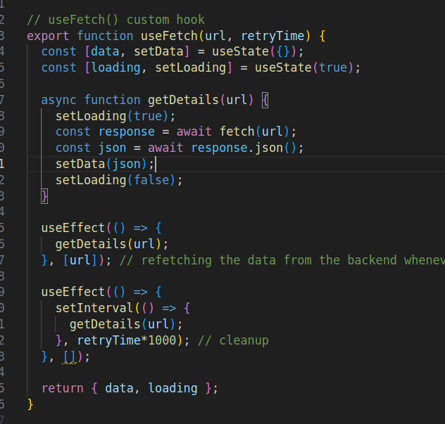
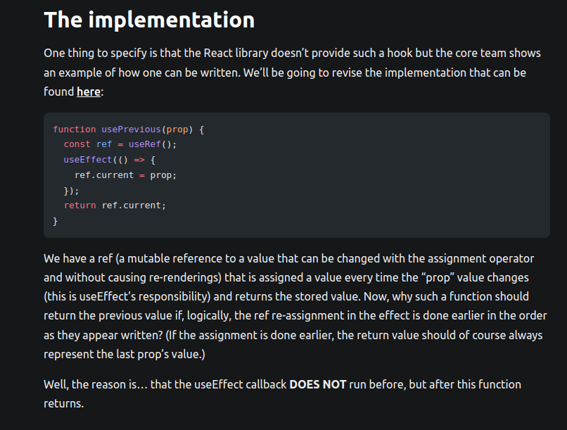
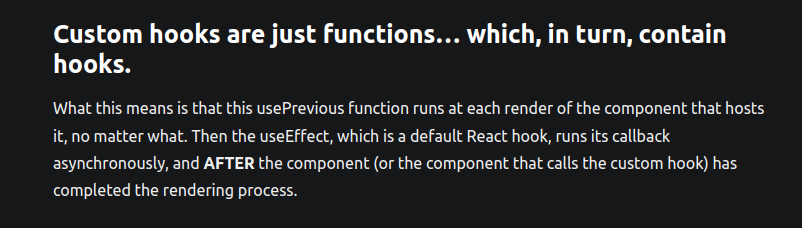
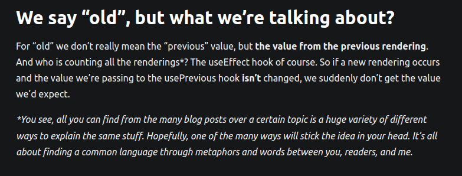
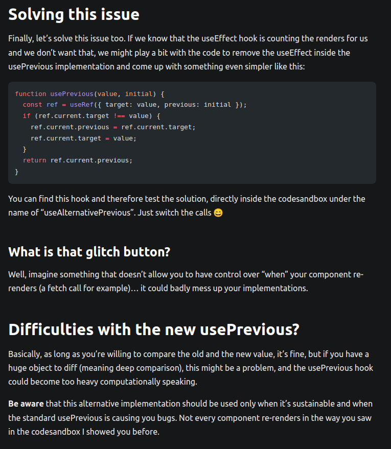

# Notes

## Custom Hooks

One thing that makes any function a hook is it starting with "use".
And ideally it should also be using another hook under the hood.

Creating a native function just to use a hook inside is not a good practice.

Whereas using hooks inside a functional component is the usual approach.

## useFetch

to fetch data using APIs.

## usePrev

to fetch the prior value of a state.

One important property of React is:

"It returns and renders first and the Effect gets called later."

But there is an issue in this implementation of useRef.

## useDebounce

**Debouncing** in programming is a technique that delays the execution of a function until after a specified period of inactivity, ensuring that it's not called repeatedly when an event occurs frequently.

For eg, **Debouncing in a search bar** delays API calls until the user stops typing for a set time (e.g., 300ms), reducing unnecessary requests. This improves performance when fetching real-time recommendations by ensuring only the final input triggers the API. Implemented using setTimeout in JavaScript or useEffect in React.
