# Notes

## Memoization

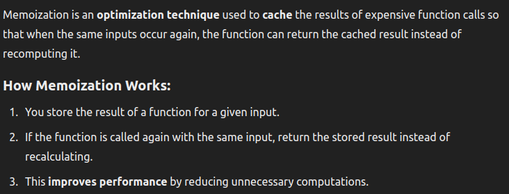

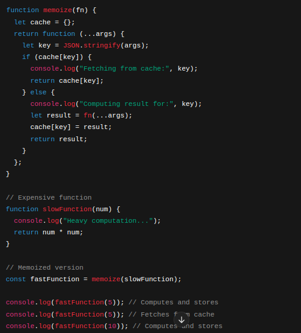

### Memoization in React

Uses useMemo and useCallBack

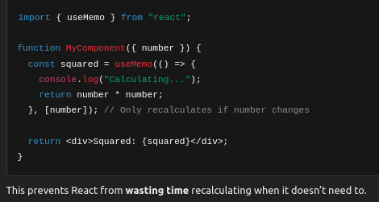

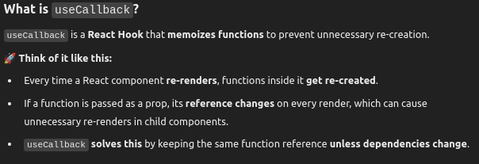

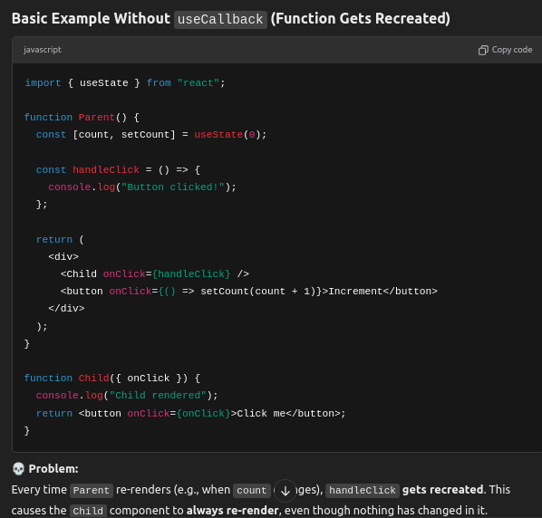

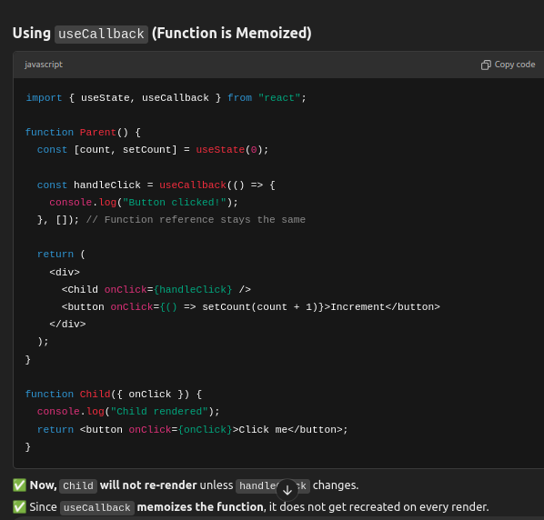

## Jotai

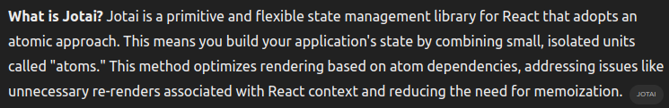

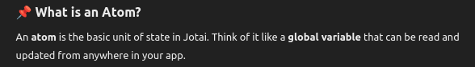

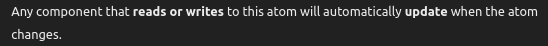

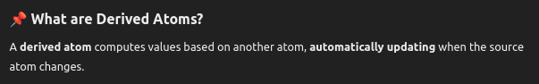

### Async Atoms

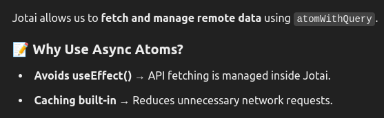

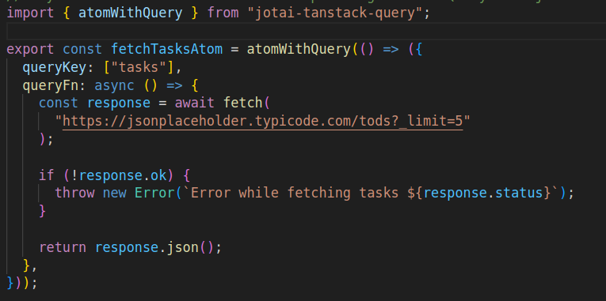

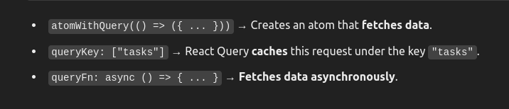

### Reducers

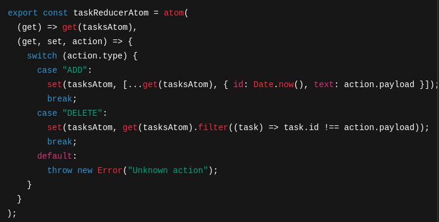

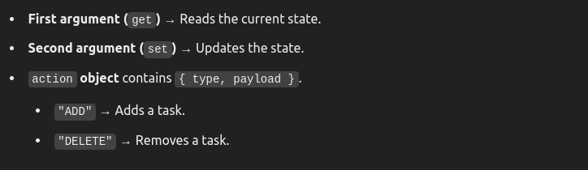

### Persisting State using local storage

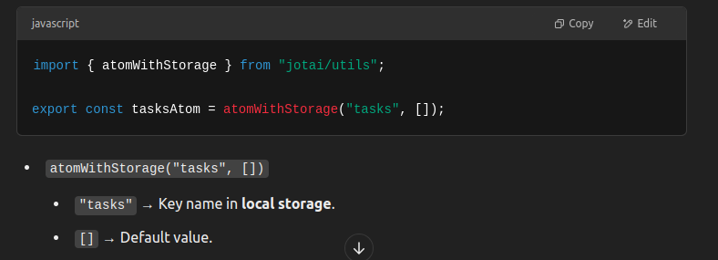

### Using Jotai with React Context for Large Apps

Jotai provides a Provider component for better scalability.

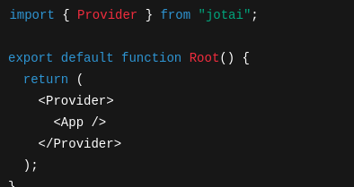

Wraps the app to share Jotai atoms globally.
