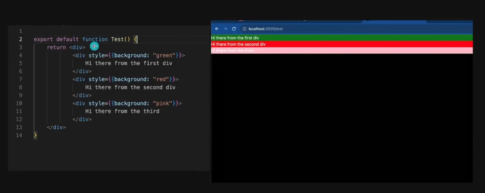
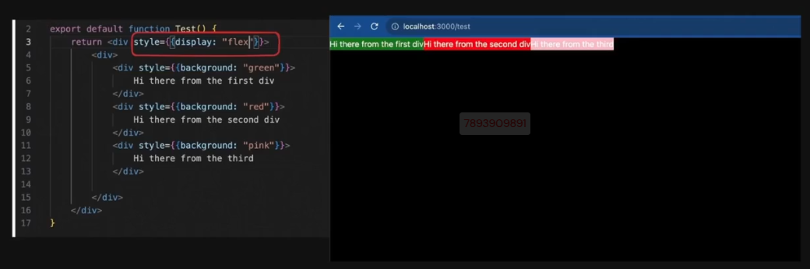
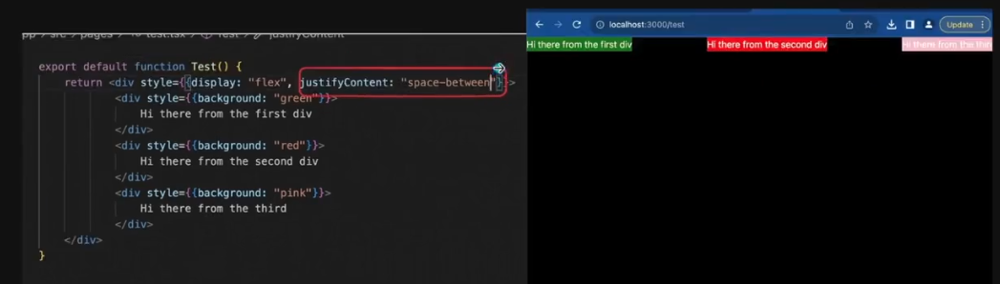
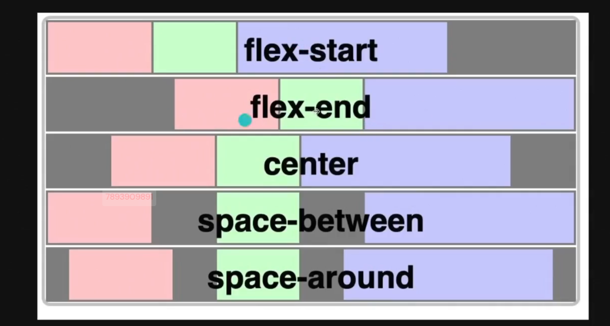
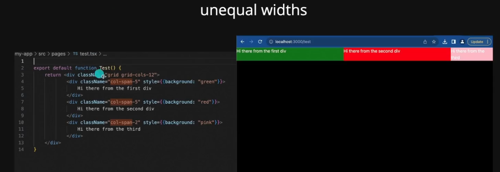
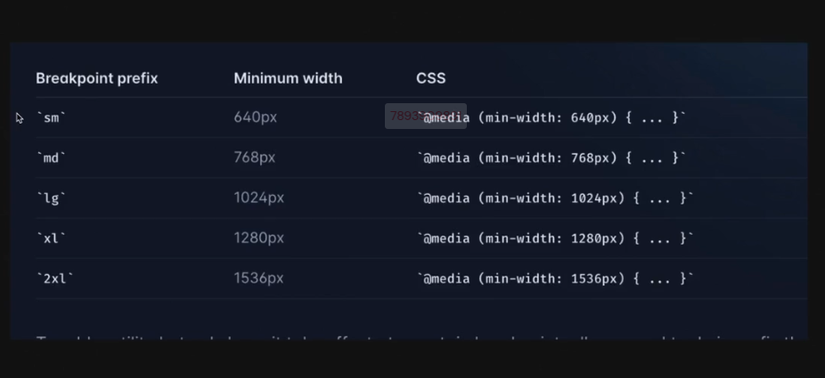

# Tailwind CSS

Tailwind CSS is not opinionated unlike other libraries which restrict from working with the implementation of their components.

## Prerequisites

### Flex

### Grid

### Responsivenes

- prefixed utilities appear at and above the breaking point's screen size mentioned.
- unprefixed utilities appear for all screen sizes.
