# Typescript

## Compiled vs Interpreted Languages

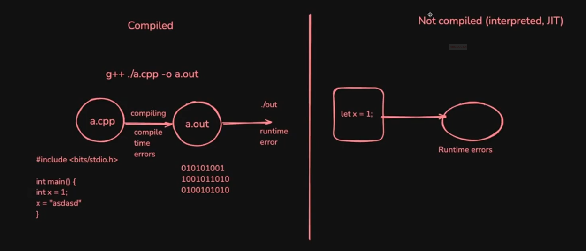

## Strongly typed and loosely typed Languages

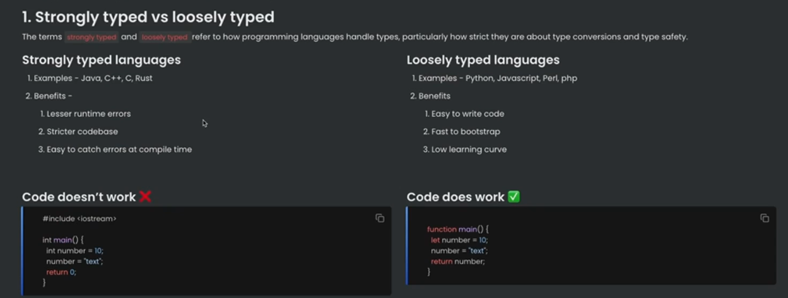

People realised that javascript is a very powerful language, but lacks types.

**Typescript** was introduced as a new language to add _types_ on top of javascript.

## What is Typescript?


## Where/How does typescript code run?

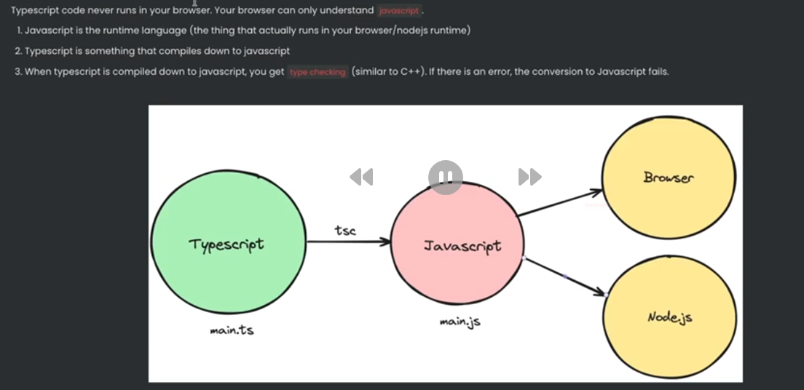

## Typescript Compiler

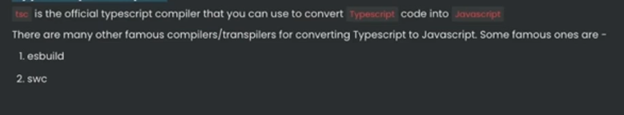

## The `tsc` compiler

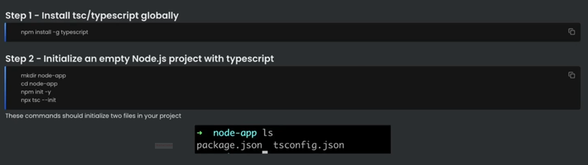

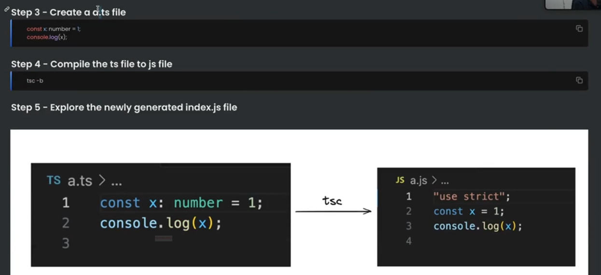

Notice how there is no typescript code in the javascript file. It's plain old js file with no types.

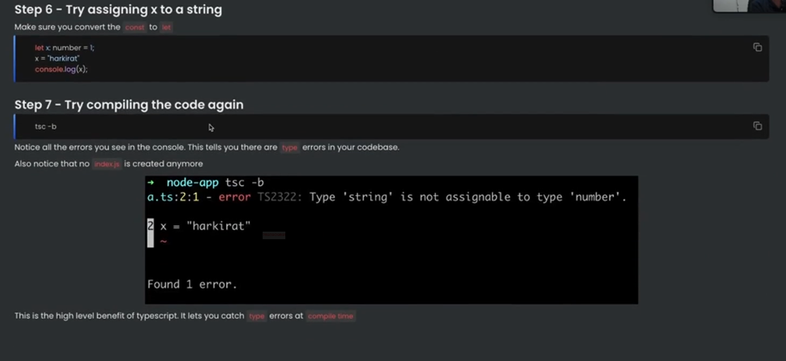

## Basic Types in Typescript

Typescript provides some basic types:

**_number_**, **_string_**, **_boolean_**, **_null_**, **_undefined_**.

**any**: if no type is declared for a variable, implicity it is considered "any"

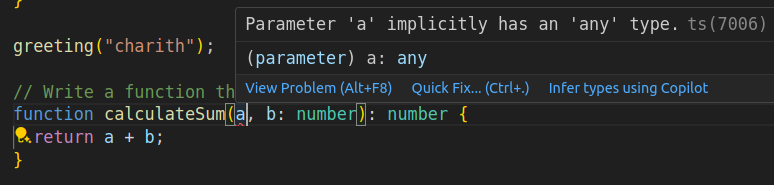

But the tsc compiler doesn't accept implicit declaration of "any", hence the variable must be explicitly declared with "any".

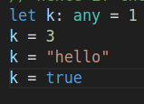

- But it is best practice to never use **any**. Since it defeats the purpose of typescript.
- Multiple types can be declared for a variable using OR operator like:
  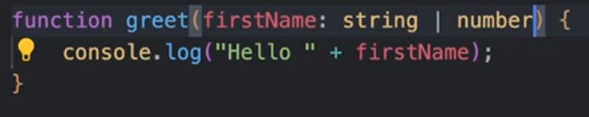

## The `tsconfig` file

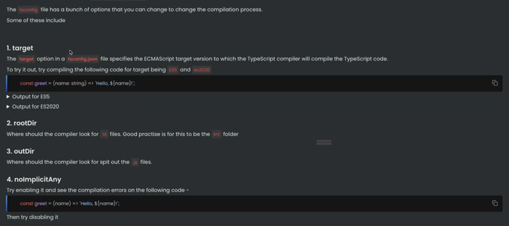

## Interfaces

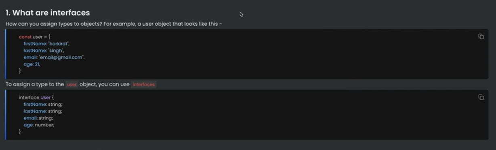

## Implementing Intefaces

**Creating a new class that implements the interface.**

this new class follows the given interface

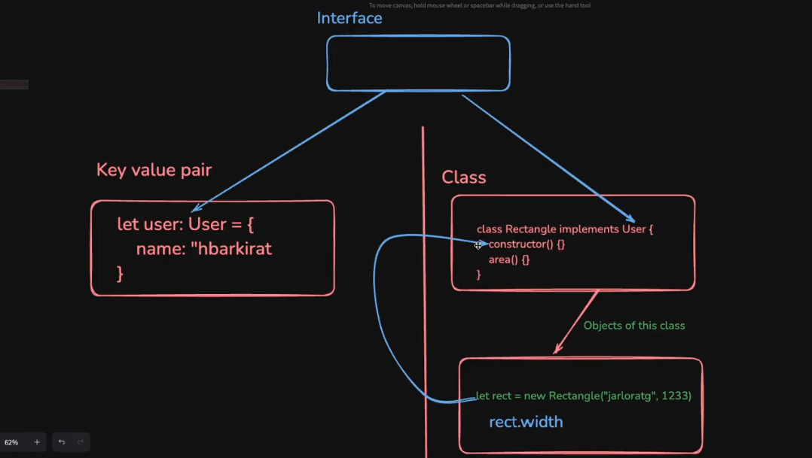

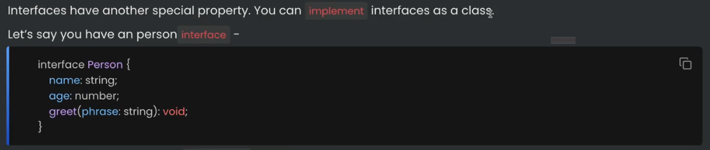

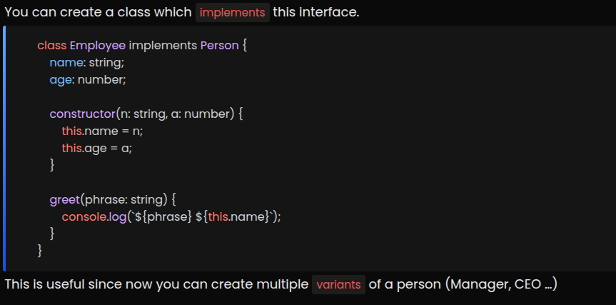

**Extending a Class is different from implementing an interface.**

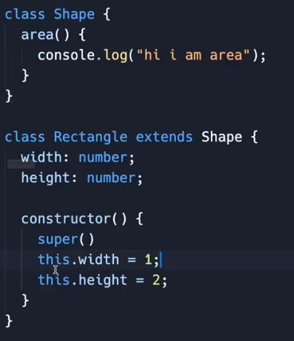

super() calls the constructor of the parent class.

## Abstract Classes

```Typescript
abstract class User {
  name: string;
  constructor(name: string) {
    this.name = name;
  }

  abstract greet: () => string;

  hello() {
    console.log("hi there")
  }
}
```

- Abstract classes are the same as interfaces that the classes can implement on.

**But what is the point of an abstract class if a class can implement on interfaces?**

- Interfaces cannot have default function implementations inside it unlike abstract classes.

- Since the interfaces are not even present in the final .js files that contains the main logic. (Hence interfaces can't carry any logic.)

```Typescript
// _Interfaces can also be extended using another interface

interface User {
  name: string
}

interface Admin extends User {
  age: number
}

```

```Typescript
// The Intersection behaviour of types can be emulated in interfaces by extending them.

type A = {
  name: string
}

type B = {
  age: number
}

interface X extends A, B { // extending multiple types

}

let user: X = {
  name: "charith",
  age: 21
}
```

## Types

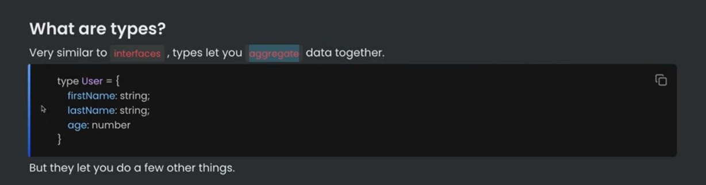

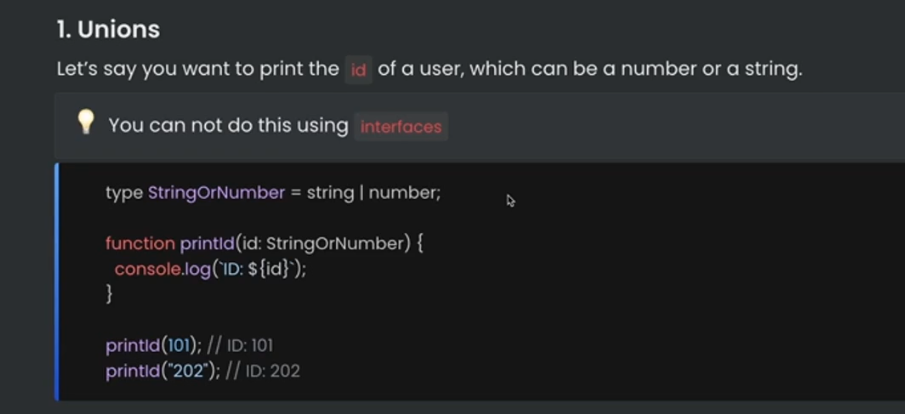


> Unions -> can contain the fields of either of them or both of them.  
> **Typescript at present doesn't support operations b/w operands of union types.**

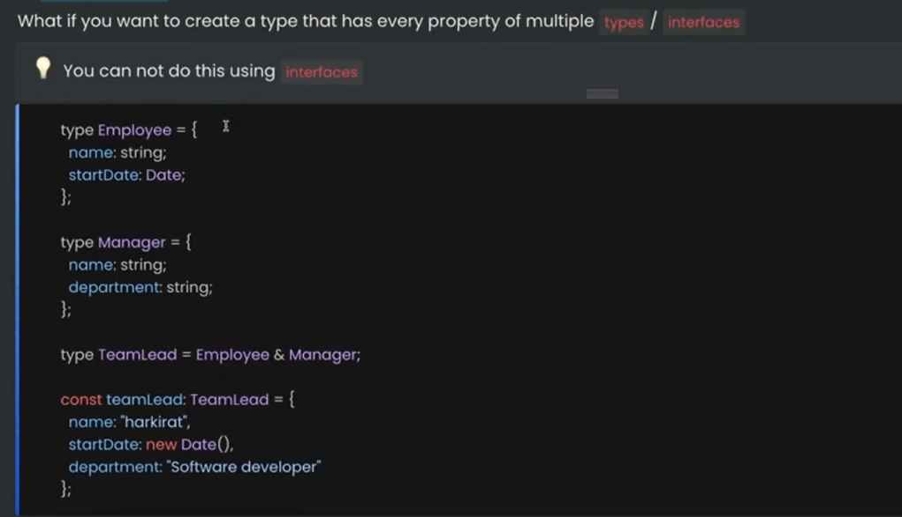

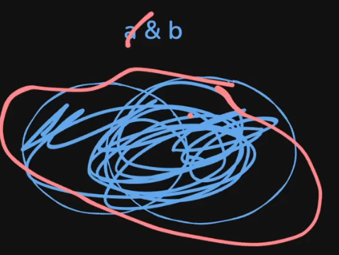

> Intersection -> must contain both of their fields.

[Demystifying Union and Intersection Types in Typescript](https://www.reddit.com/r/typescript/comments/1e61bla/demystifying_intersection_and_union_types_in/)

- Typescript types must be considered as set of possible values instead of just a custom type object with properties.
- Typescript has open types rather than sealed types.

In case of Intersection in types: Its not the union b/w properties, instead it is the intersection of the possible values.

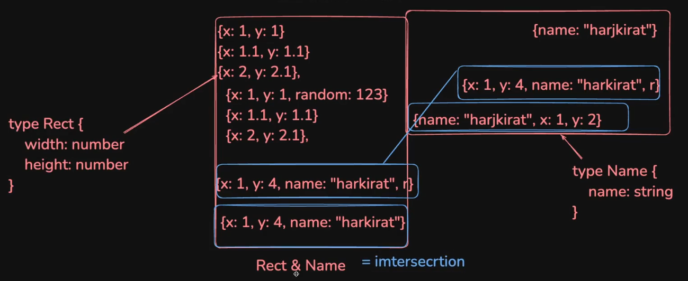

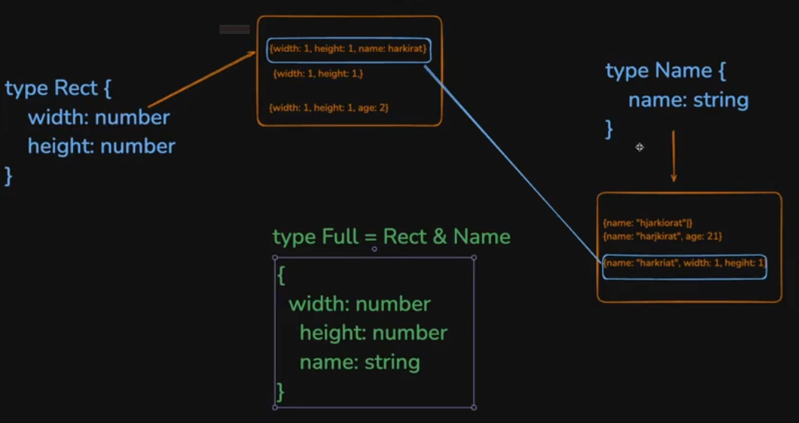

In case of Union: Its the union of all possible values.

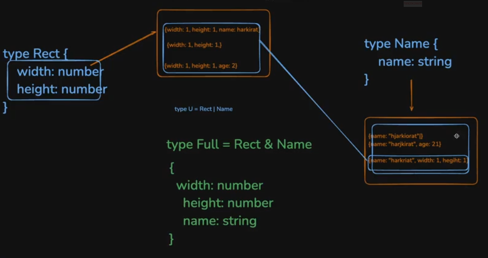

Hence, Even though Interfaces and Types mostly serve the same purpose aggregating different primitive types, they are different because,

- **Interfaces** can be implemented as classes but that's not possible in case of **Types**.

- **Types** can be used to create types with **_union_** or **_intersection_** of multiple primitive types on top level itself. But unions and intersections could be created inside an interface (to their field types.)

> A Union or Intersection can be made between two interfaces, but the resulting type must be a **Type**. (not an interface.)

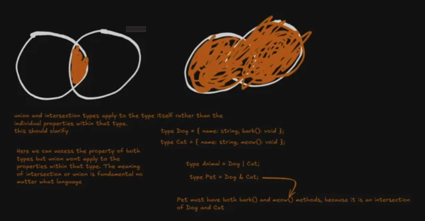

## Arrays in TS

If you want to access arrays in typescript, it's as simple as adding a [] annotation next to the type.

## Enums

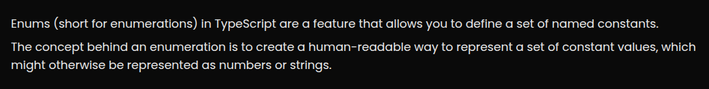

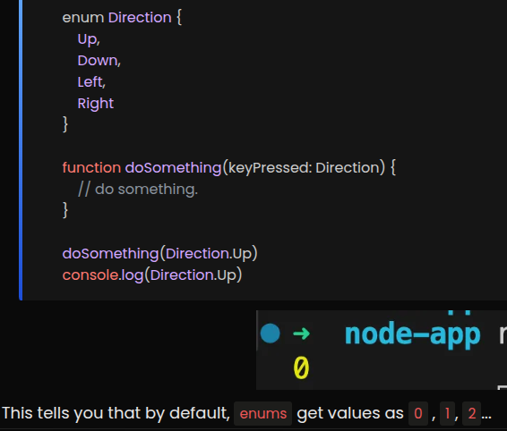

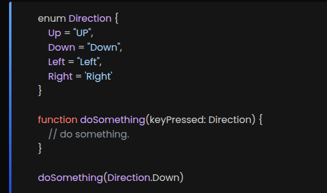

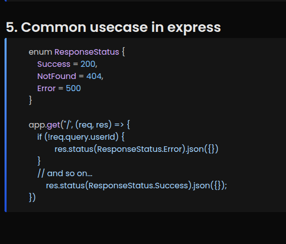

## Generics

Generics are used for writing reusable type-safe code without redundancy.

Generics in general are **Type placeholders** such that we can write a reusable function, class or component that works with _any_ type, still retaining typescript's strong typing.

```Typescript
function firstElement(arr: any[]): any{
  return arr[0]
}
```

In this example, for the function to accept different types we used _any_ as the functions input type, but losing all the type safety in the process.

That's where Generics come into the picture.

```Typescript
function identity<T>(arg: T): T {
  return arg
}
```

**T** here is the generic parameter (can be named anything like **ArgType** or something else)

In this case, whatever type is passed in we get the same type back.

```Typescript
const result = identity<string>("Charith")
const numResult = identity(42)
```

**TS can infer the type by itself.**

### Examples

#### With Arrays

``` Typescript
function firstElement<T>(arr: T[]): T {
  return arr[0]
}
```

Works for string[], number[], CustomType[] etc...

```Typescript
const name = firstElement(["Charith", "Caspir"])
const first = firstElement([true, false])
```

#### With Interfaces or Types

```Typescript
interface ApiResponse<T> {
  data: T;
  success: boolean;
}

const response: ApiResponse<string> = {
  data: "You got this!",
  success: true
}

// Super useful for REST APIs where the shape of the data can constantly vary.
```

#### Generic Constraints

```Typescript
function getLength<T extends {length: number}>(item: T): number {
  return item.length;
}
```

In this case, the generic parameter T must contain the length property when the function is being called.

#### Generics in Classes

```Typescript
class Box<T> {
  content: T;
  constructor(value: T) {
    this.content = value;
  }
}

const stringBox = new Box<string>("Charith")
```

In this case, the class can be reusable any type of input.

#### Generic Functions with Multiple Types

```Typescript
function merge<T, U>(a: T, b: U): T & U {
  return {...a, ...b}
}

const result = merge({name: "Charith"}, {dev: true});
// result type here is {name: string; dev: boolean}
```

Merging two different types into one.

#### When not to use generics

- If the type is known and fixed.
- If it makes the code unnecessarily complex.
