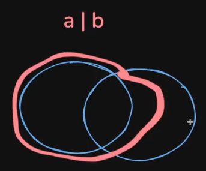

# Typescript

## Compiled vs Interpreted Languages


## Strongly typed and loosely typed Languages


People realised that javascript is a very powerful language, but lacks types.

**Typescript** was introduced as a new language to add _types_ on top of javascript.

## What is Typescript?


## Where/How does typescript code run?


## Typescript Compiler


## The `tsc` compiler


Notice how there is no typescript code in the javascript file. It's plain old js file with no types.


## Basic Types in Typescript

Typescript provides some basic types:

**_number_**, **_string_**, **_boolean_**, **_null_**, **_undefined_**.

**any**: if no type is declared for a variable, implicity it is considered "any"


But the tsc compiler doesn't accept implicit declaration of "any", hence the variable must be explicitly declared with "any".


- But it is best practice to never use **any**. Since it defeats the purpose of typescript.
- Multiple types can be declared for a variable using OR operator like:
  

## The `tsconfig` file


## Interfaces


## Implementing Intefaces

**Creating a new class that implements the interface.**

this new class follows the given interface


**Extending a Class is different from implementing an interface.**


super() calls the constructor of the parent class.

## Abstract Classes

```Typescript
abstract class User {
  name: string;
  constructor(name: string) {
    this.name = name;
  }

  abstract greet: () => string;

  hello() {
    console.log("hi there")
  }
}
```

- Abstract classes are the same as interfaces that the classes can implement on.

**But what is the point of an abstract class if a class can implement on interfaces?**

- Interfaces cannot have default function implementations inside it unlike abstract classes.

- Since the interfaces are not even present in the final .js files that contains the main logic. (Hence interfaces can't carry any logic.)

```Typescript
// _Interfaces can also be extended using another interface

interface User {
  name: string
}

interface Admin extends User {
  age: number
}

```

```Typescript
// The Intersection behaviour of types can be emulated in interfaces by extending them.

type A = {
  name: string
}

type B = {
  age: number
}

interface X extends A, B { // extending multiple types

}

let user: X = {
  name: "charith",
  age: 21
}
```

## Types




> Unions -> can contain the fields of either of them or both of them.  
> **Typescript at present doesn't support operations b/w operands of union types.**


> Intersection -> must contain both of their fields.

[Demystifying Union and Intersection Types in Typescript](https://www.reddit.com/r/typescript/comments/1e61bla/demystifying_intersection_and_union_types_in/)

- Typescript types must be considered as set of possible values instead of just a custom type object with properties.
- Typescript has open types rather than sealed types.

In case of Intersection in types: Its not the union b/w properties, instead it is the intersection of the possible values.


In case of Union: Its the union of all possible values.


Hence, Even though Interfaces and Types mostly serve the same purpose aggregating different primitive types, they are different because,

- **Interfaces** can be implemented as classes but that's not possible in case of **Types**.

- **Types** can be used to create types with **_union_** or **_intersection_** of multiple primitive types on top level itself. But unions and intersections could be created inside an interface (to their field types.)

> A Union or Intersection can be made between two interfaces, but the resulting type must be a **Type**. (not an interface.)


## Arrays in TS

If you want to access arrays in typescript, it's as simple as adding a [] annotation next to the type.
