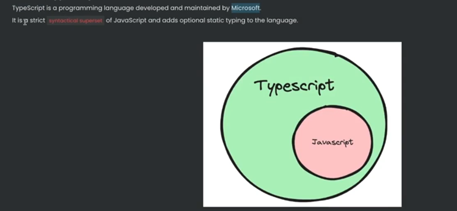

# Typescript

## Compiled vs Interpreted Languages

## Strongly typed and loosely typed Languages

People realised that javascript is a very powerful language, but lacks types.

**Typescript** was introduced as a new language to add _types_ on top of javascript.

## What is Typescript?

## Where/How does typescript code run?

## Typescript Compiler

## The `tsc` compiler

Notice how there is no typescript code in the javascript file. It's plain old js file with no types.

## Basic Types in Typescript

Typescript provides some basic types:

**_number_**, **_string_**, **_boolean_**, **_null_**, **_undefined_**.

**any**: if no type is declared for a variable, implicity it is considered "any"

But the tsc compiler doesn't accept implicit declaration of "any", hence the variable must be explicitly declared with "any".

- But it is best practice to never use **any**. Since it defeats the purpose of typescript.
- Multiple types can be declared for a variable using OR operator like:
  

## The `tsconfig` file

