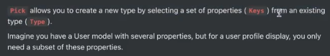
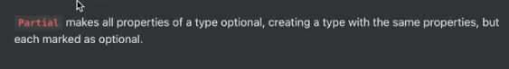
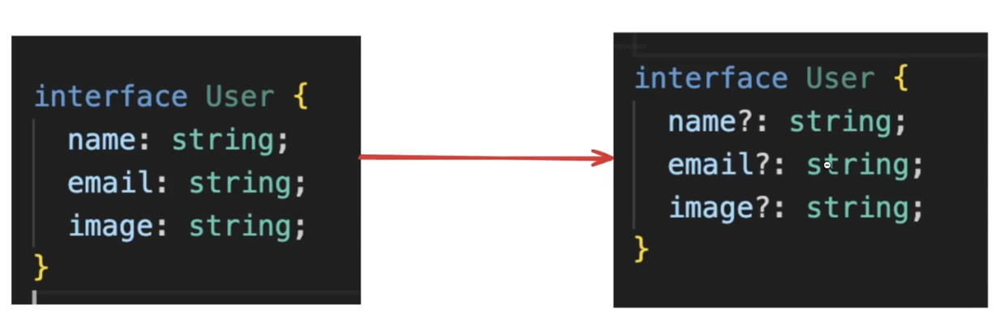
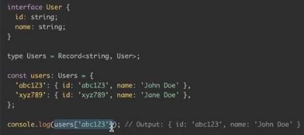
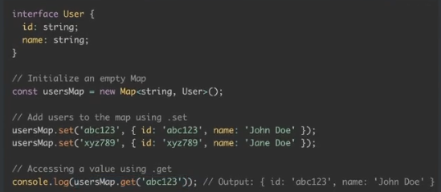
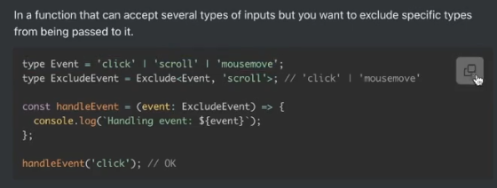

# Notes

## Typescript Advance APIs

### Pick



```Typescript
interface User {
    id: number,
    name: string,
    email: string,
    createdAt: Date
}

type UserProfile = Pick<User, "name" | "email">

const displayUserProfile = (user: UserProfile) => {
    console.log(`Name: ${user.name}, Email: ${user.email}`)
}
```

### Partial





### Readonly


```Typescript
interface Config {
    readonly endpoint: string;
    readonly apiKey: string;
}

const config: Readonly<Config> = {
    endpoint: 'https://api.example.com',
    apiKey: 'abcdef123456'
};

// config.apiKey = 'newkey' --> Error: Cannot assign to 'name' because it is a read-only property.
```

### `Record` and Map

`Record` lets you give a cleaner type to objects



`Map` gives you an even fancier way to deal with objects. Very similar to Maps in C++



### Exclude



## Type inference in Zod

When using Zod, we're doing runtime validation.

For example, the following code makes sure that the user is sending the right inputs to update their profile information.

```Typescript
import { z } from 'zod';
import express from "express";

const app = express();

// Define the schema for profile update
const userProfileSchema = z.object({
  name: z.string().min(1, { message: "Name cannot be empty" }),
  email: z.string().email({ message: "Invalid email format" }),
  age: z.number().min(18, { message: "You must be at least 18 years old" }).optional(),
});

// infer Zod Schema Type 
type userProfileZodType = z.infer<typeof userProfileSchema>

app.put("/user", (req, res) => {
  const { success } = userProfileSchema.safeParse(req.body);
  const updateBody : userProfileZodType = req.body; // how to assign a type to updateBody?

  if (!success) {
    res.status(411).json({});
    return
  }
  // update database here
  res.json({
    message: "User updated"
  })
});

app.listen(3000);
```
