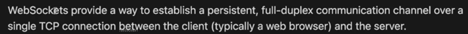
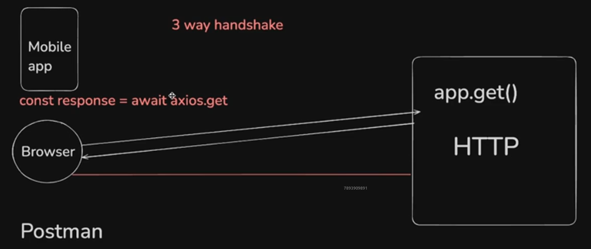
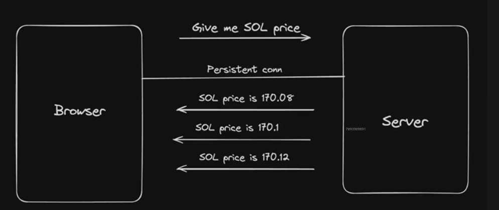
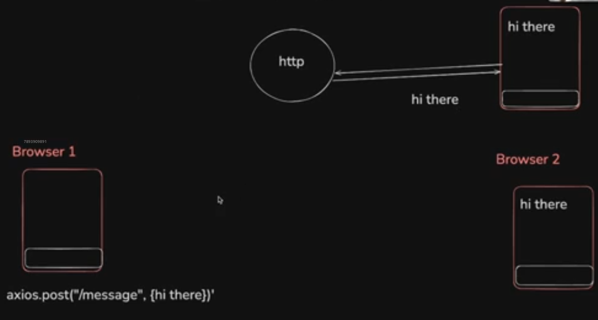
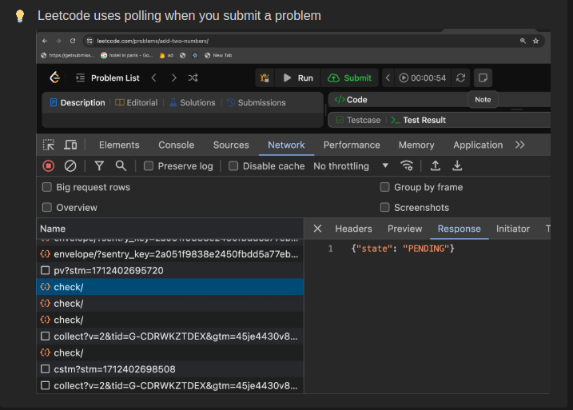
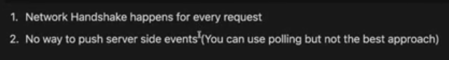

# Notes

## Websockets

**Persistence** - the connection b/w the client
and the server remains open, such that multiple requests can be
sent during a single TCP connection.
(Once the connection is made, it stays there,
allowing to send multiple requests over that connection)

HTTP request is not the same with persistence becuz, there's a 3-way handshake
(syn, syn-ack, ack) happening b/w the client and server,
everytime a request needs to be sent.
(and the 3-way handshake closes when a response is returned.)
(The HTTP protocol is written in such a way that, a 3-way handshake happens
everytime a request is made.)

Hence, we use protocols like Websockets and WebRTC for persistent connections
b/w two parties.

There is a 3-way handshake in case of websockets too, but the connection with
the backend remains persistent, until the client is closed or server crashes.
In this case:

- The data can be sent incrementally over and over.

**Full-Duplex Communication Channel** - messages can be sent both ways
(both the client and server in the form of request and response pairs) multiple times over this single TCP connection.

**TCP Connection** - (Transmission Control Protocol) - Websockets and HTTP servers under the hood use TCP protocol.

- WebRTC uses both UDP and TCP protocols.

**Websockets** are mainly used for Real time communication.

- In applications that need real time updates (sometimes in milliseconds) on the client side,
data fetching and updation could not be possible by just sending the HTTP requests frequently.

- In this case a websocket server can be established, which serves the real time updates continuously.

- In case of a chat application in real time, without a persistent connection and solely with user driven events,
its difficult to pass on a message sent by one user to the user one the other side, since there is no two-way communication.
(For suppose, when a user sends a message through a HTTP request, its not received by the other user due to absence of
tcp connection b/w the server and that user during this time, since the server itself can't push the message in this case.)

- Whereas in case of a websocket server, due to persistent connection of users with the server,
both user events and server-side events can be made, hence making it possible for the other side user to receive the message.
(server triggers an event when a message needs to be sent from one user to the other.)

- Hence, in presence of a websocket server, while multiple users are connected to it,
a message can be sent by any of them to the server and also among each other.

### Can this real-time communication be set up using solely a HTTP server?

Its possible with **Polling**, where the end users
frequently send requests to the server in short bursts of time
in order check if any messages are sent to them by the other users.
(in absence of persistent connection with server and server-side triggered events)

But the disadvantages in this case are:

1. **Inefficient Resource Usage** - Long polling keeps sending repeated HTTP requests and holds them open, wasting server memory, threads, and network bandwidth (resource intensive).

2. **High Latency Gaps** - There's always a delay between responses and new requests, making it unsuitable for true real-time use cases.

3. **Poor Scalability** - Managing thousands of open HTTP connections becomes a bottleneck, making it hard to scale across users or servers.

Hence it is best to use **web sockets**, since they maintain a single, persistent, bi-directional connection that enables low-latency, real-time data flow with minimal overhead
especially in a use case that needs frequent updates in real time.

- But, the fact is scaling a websocket server is even harder.

- There is also a way called **Long Polling** where the client sends the request that remains open, and whenever the event happens, the message is sent as a response.

### WebRTC  vs Websockrts

- WebRTC that supports UDP is generally used in cases where even lossy transmission is acceptable (to keep things flowing even if a packet drops inbetween) in order to provide real time experience.

Whereas

- Websockets over a TCP connection keeps track of each and every activity or message. (Data integrity matters)
