# Postgres and NoSQL Databases

## Types of Databases

### NoSQL Databases

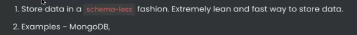

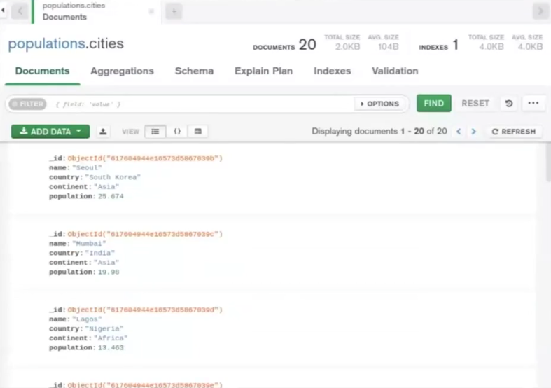

In Nodejs backends with MongoDB as database, we enforce a schema on data at the nodejs level using mongoose (to avoid putting wrong fields in the data i.e. safe data storage), but the data inside MongoDB is still schemaless.


### Graph Databases


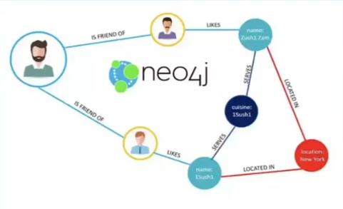

### Vector Databases

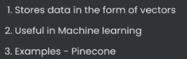

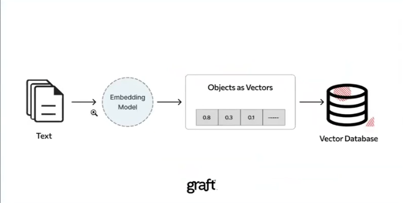

### SQL Databases

- The databases that can be queried using the Structured Query Language (SQL).

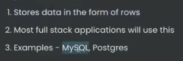

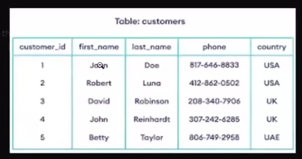

## Why not NoSQL?


### What is Schemaless?

Different rows can have different **schema** (keys/types).

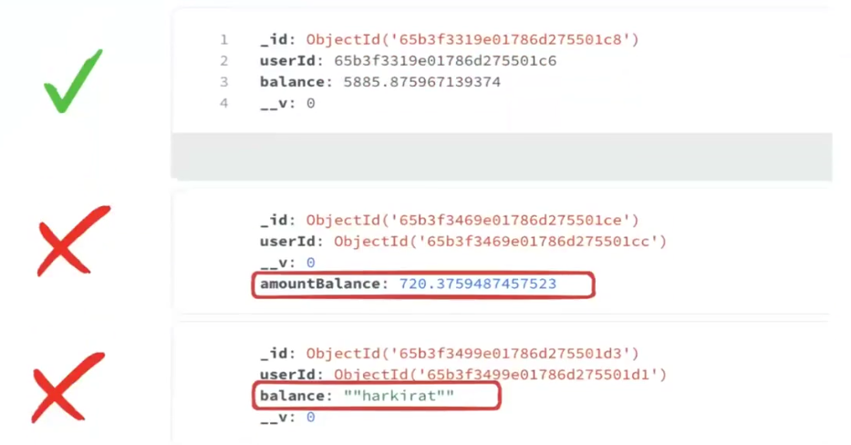


## Why SQL?

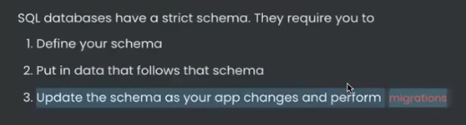

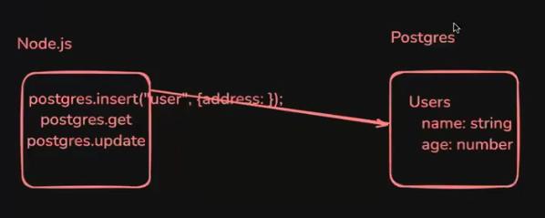

As the application grows, when the schema of the database needs to be changed, migrations need to be performed.

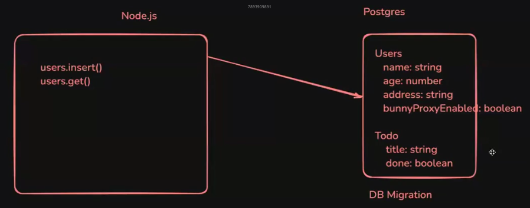

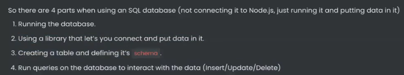

## Creating a Database

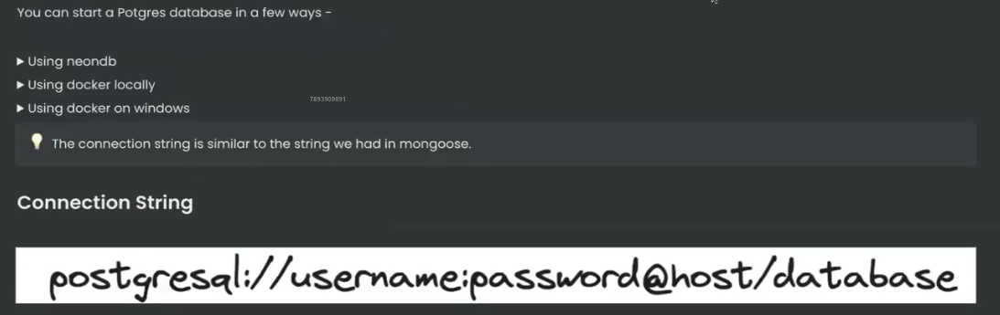

## Using a library that let's you connect and put data in it

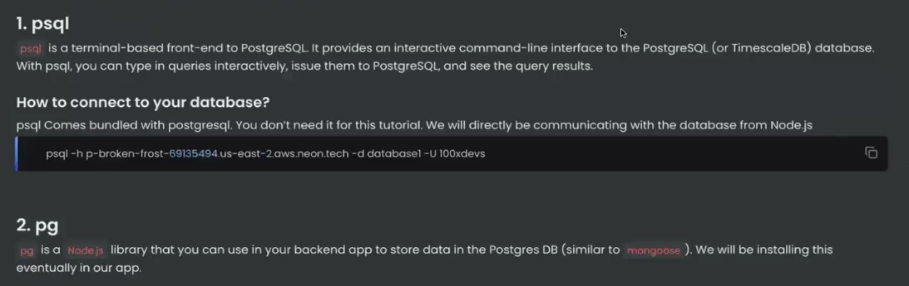

## Creating a table and defining it's schema

### Tables in SQL

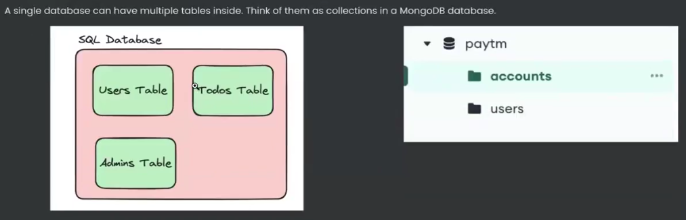

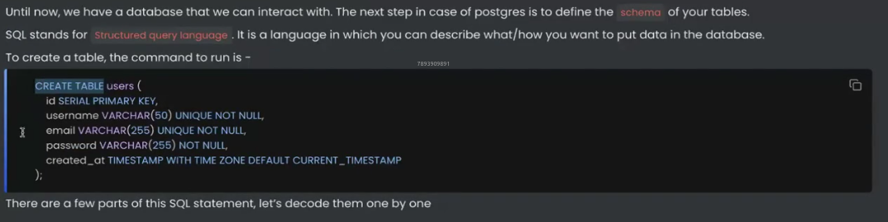

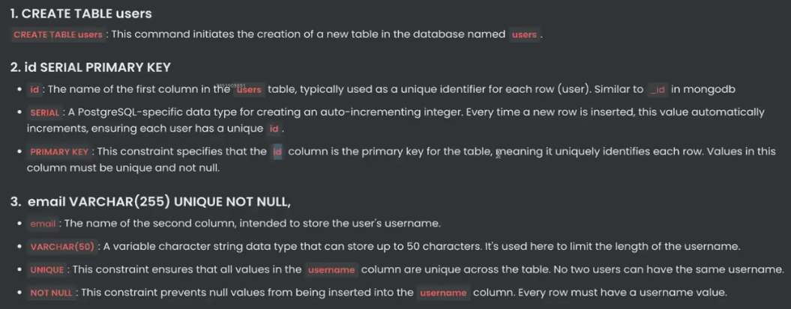

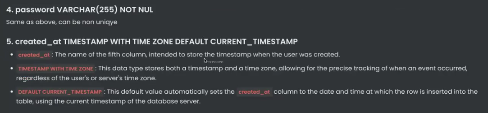

The below insertion doesn't work since, the data object is violating the predefined schema for the relation in the database. (username field missing.)

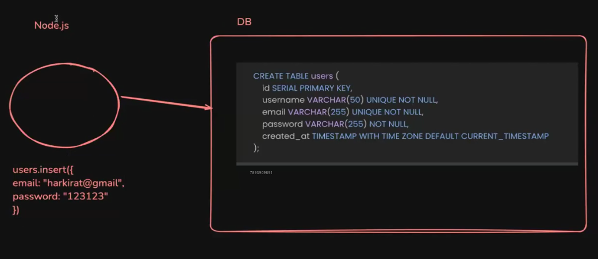

> In postgres, when an invalid is record is entered, despite of throwing a warning and not saving the record, the db still increments the "SERIAL" field, such that, there will be jump by one value in that field for the next valid record created.

## Interacting with the database

### 1. INSERT


### 2. UPDATE


### 3. DELETE


### 4. SELECT


## How to do queries from a Node.js app?

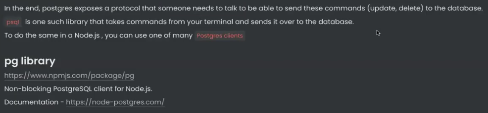


## SQL Injections

In SQL Injections, an attacker tries to insert their own SQL query snippet into the query parameters that are being loaded into the query of a request handler. Thus creating a whole new query, that might cause some unexpected changes at the database level. (potentially deleting all the data in the relations upon which the query is being executed on.)

This is highly possible **when the values are being appended to the SQL query string**.

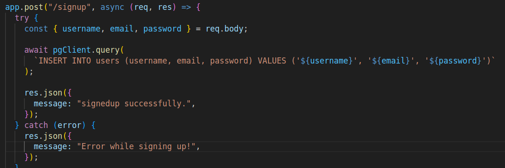

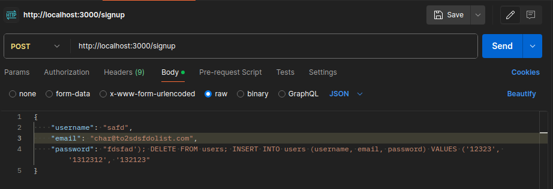

**To avoid SQL injections, the values can be passed as an array of arguments separately** so that, the postgres db will receive the query as is, and the db will be responsible for loading the values into the query while executing it exactly as it arrived. (the db will not change the query no matter how the values are formatted, thus treating them only as string values that need to be entered into the database)

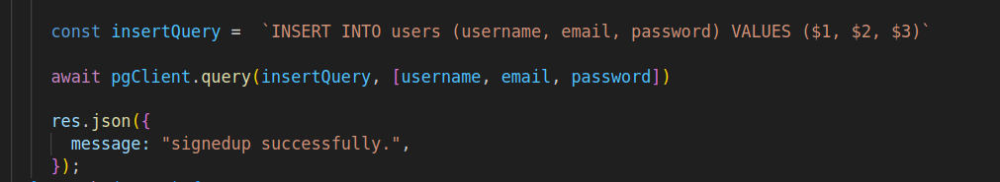

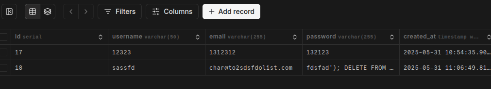

## Relationships

Relationships let you store data in different tables and relate them with each other.

### How relationships work in a NoSQL database like MongoDb?

Its possible to nest document objects in MongoDB without the need of defining relationships between different models.

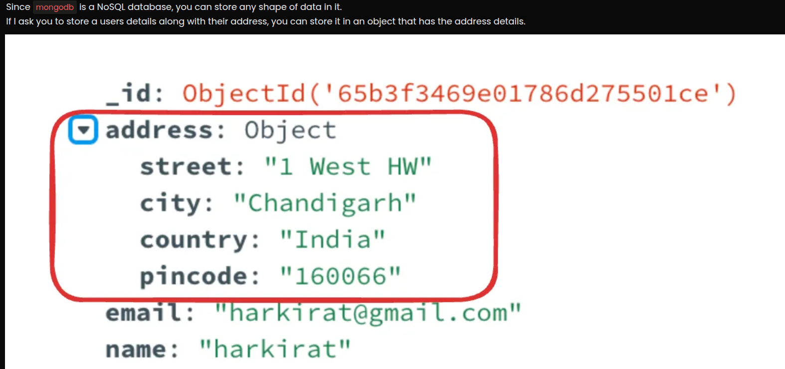

But in order to make the data objects be available to be read separately, we use relations in mongodb too.

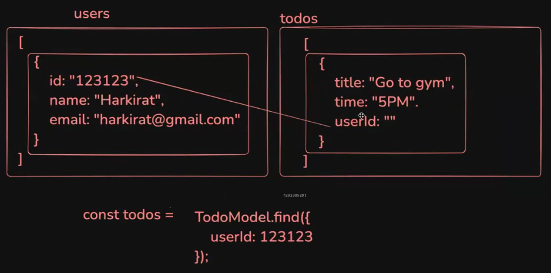

 > user id is being used to relate the users and todos model here.

### Relationships in SQL databases

JSON objects can be stored in SQL table too.


**But its not a good practice.**

Therefore, In SQL, to store data in different tables,the **primary key of one table** is used as the **foreign key of another table** in order to relate them.

In this case, one entry of a table can be related to multiple entries of a different table, thus making it possible to store multiple related records for a single entity.

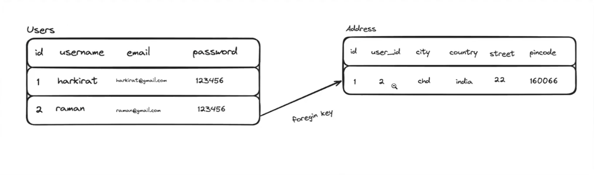

This is called a **relationship**, which means that the **Address** table is related to the **user** table.

When defining the table, the **relationship** needs to be defined with the **FOREIGN KEY** keyword.

<!-- user: id, username 50, email 255, password 255, created_at
addresses: id, user_id, city 100, country 100, street 255, pincode 20, created_at, foreign key
 -->

```SQL
CREATE TABLE users (
    id SERIAL PRIMARY KEY,
    username VARCHAR(50) UNIQUE NOT NULL,
    email VARCHAR(255) UNIQUE NOT NULL,
    password VARCHAR(255) NOT NULL,
    created_at TIMESTAMP WITH TIME ZONE DEFAULT CURRENT_TIMESTAMP
)

CREATE TABLE addresses (
    id SERIAL PRIMARY KEY,
    user_id INTEGER NOT NULL,
    city VARCHAR(100) NOT NULL,
    country VARCHAR(100) NOT NULL,
    street VARCHAR(255) NOT NULL,
    pincode VARCHAR(20) NOT NULL,
    created_at TIMESTAMP WITH TIME ZONE DEFAULT CURRENT_TIMESTAMP
    FOREIGN KEY (user_id) REFERENCES users(id) ON DELETE CASCADE
)
```

> To insert the address of a user:

```SQL
INSERT INTO addresses (user_id, city, country, street, pincode)
VALUES (1, 'New York', 'USA', '123 Broadway', '10001');
```

> Read the address of a user given their id:

```SQL
SELECT city, country, street, pincode
FROM addresses
WHERE user_id = 1
```

## Transactions

When two queries needs to be sent in a single request, What if one of the queries fails? the state won't be consistent.

This would require **Transactions** in SQL to ensure either both the user information and address goes in, or neither does.

If either one of them fails, the other one is reverted.

```SQL
-- sql query
BEGIN; -- start transaction

INSERT INTO users (username, email, password)
VALUES ('john_doe', 'john_doe1@example.com', 'securepassword123')

INSERT INTO addresses (user_id, city, country, street, pincode)
VALUES (currval('users_id_seq'), 'New York', 'USA', '123 Broadway St', '10001');

COMMIT;
```

## JOINS

To join data from two tables together.

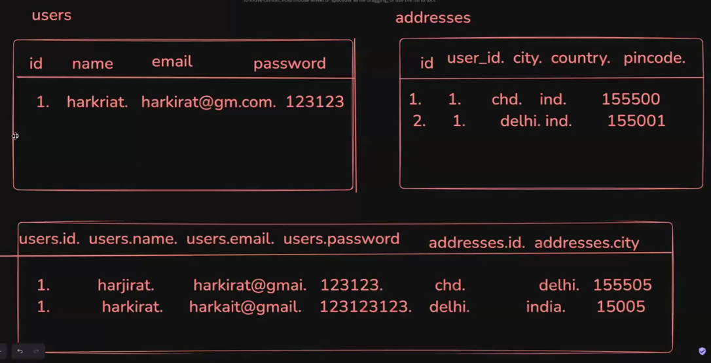

```SQL
-- selecting entries by joining two tables.

SELECT u.id, u.username, u.email, a.city, a.country, a.street, a.pincode
FROM users u JOIN addresses a ON u.id = a.user_id
WHERE u.id = <YOUR_USER_ID>;
```

> JOINs optimise the no.of database requests. But on large scale applications that contain millions of entries, JOINs can become expensive (n * m), thus making it reasonable to handle the request to the backend in multiple database calls.

## Types of JOINs

### INNER JOIN


### LEFT JOIN

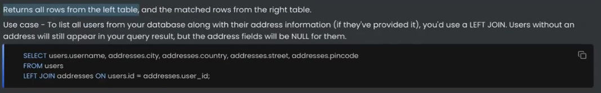

### RIGHT JOIN

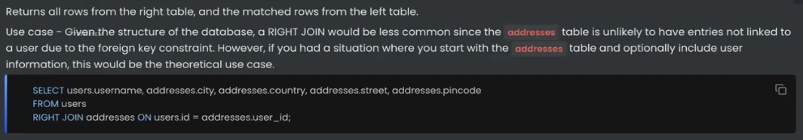

### FULL JOIN

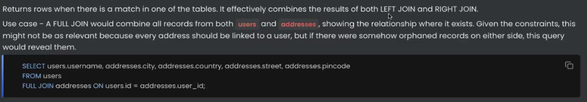