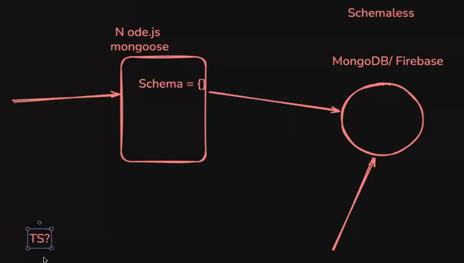
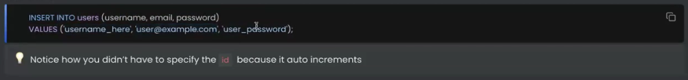
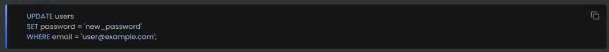
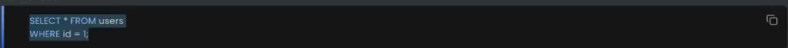

# Postgres and NoSQL Databases

## Types of Databases

### NoSQL Databases

In Nodejs backends with MongoDB as database, we enforce a schema on data at the nodejs level using mongoose (to avoid putting wrong fields in the data i.e. safe data storage), but the data inside MongoDB is still schemaless.

### Graph Databases

### Vector Databases

### SQL Databases

- The databases that can be queried using the Structured Query Language (SQL).

## Why not NoSQL?

### What is Schemaless?

Different rows can have different **schema** (keys/types).

## Why SQL?

As the application grows, when the schema of the database needs to be changed, migrations need to be performed.

## Creating a Database

## Using a library that let's you connect and put data in it

## Creating a table and defining it's schema

### Tables in SQL

The below insertion doesn't work since, the data object is violating the predefined schema for the relation in the database. (username field missing.)

> In postgres, when an invalid is record is entered, despite of throwing a warning and not saving the record, the db still increments the "SERIAL" field, such that, there will be jump by one value in that field for the next valid record created.

## Interacting with the database

### 1. INSERT

### 2. UPDATE

### 3. DELETE

### 4. SELECT

## How to do queries from a Node.js app?

## SQL Injections

In SQL Injections, an attacker tries to insert their own SQL query snippet into the query parameters that are being loaded into the query of a request handler. Thus creating a whole new query, that might cause some unexpected changes at the database level. (potentially deleting all the data in the relations upon which the query is being executed on.)

This is highly possible **when the values are being appended to the SQL query string**.

**To avoid SQL injections, the values can be passed as an array of arguments separately** so that, the postgres db will receive the query as is, and the db will be responsible for loading the values into the query while executing it exactly as it arrived. (the db will not change the query no matter how the values are formatted, thus treating them only as string values that need to be entered into the database)

