# Prisma and ORMs

## What are ORMs?

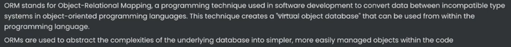


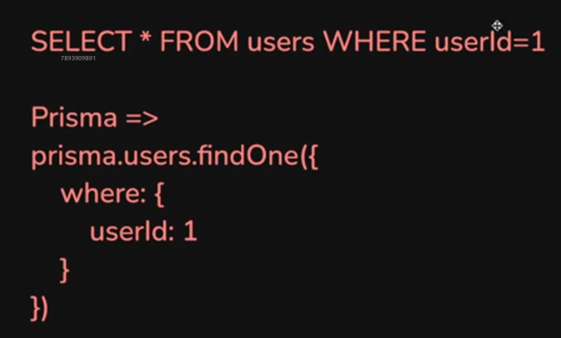

## Why ORMs?

- **Simpler Syntax**

Converts JS Objects into SQL queries under the hood.

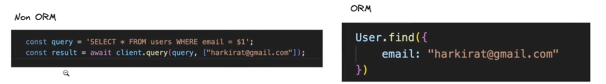

- **Abstraction** that lets you flip the database you are using. Unified API irrespective of the DB.

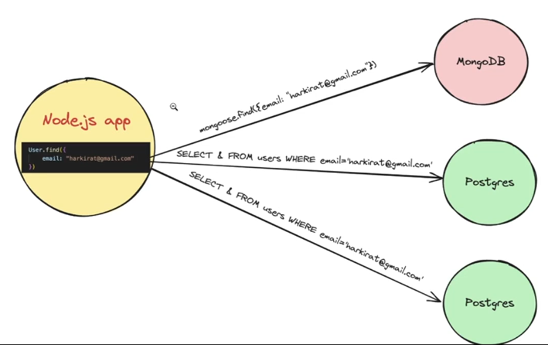

- **Type Safety/Auto Completion**

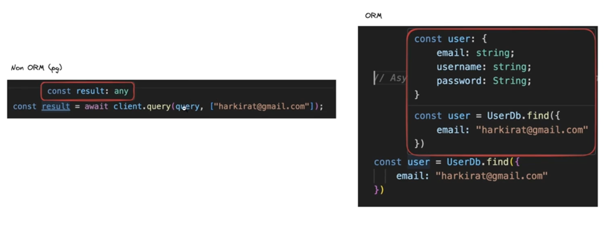

- **Automatic Migrations**

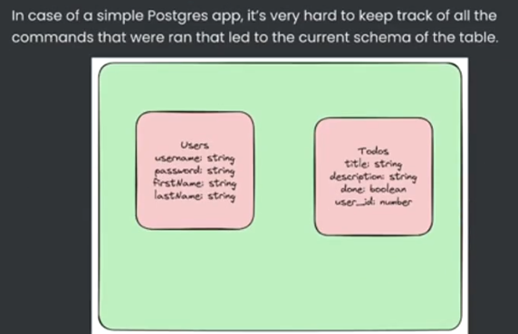

To keep track of the migrations (schema/relation changes in the db) and store in the codebase, making it easier to export the design of the database (all the queries needed to reach the current design of the db)

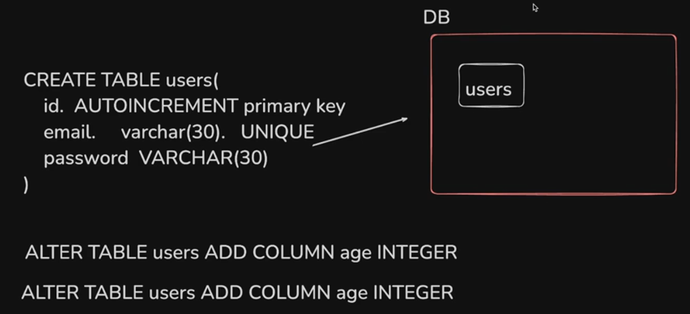

## What is Prisma?

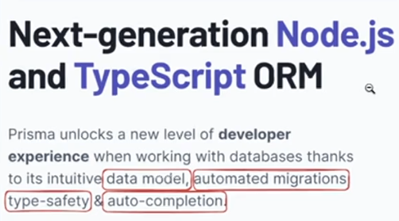

- **Data Model**


- **Automated Migrations**


- **Type Safety**

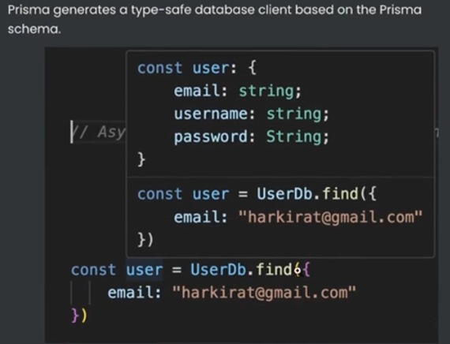

- **Auto Completion**

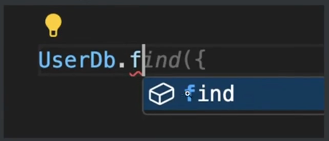

## Installing prisma in a node app

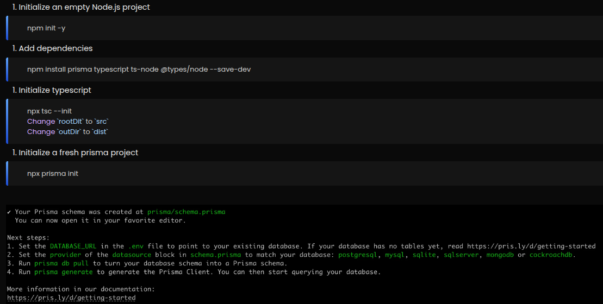

## Selecting your database

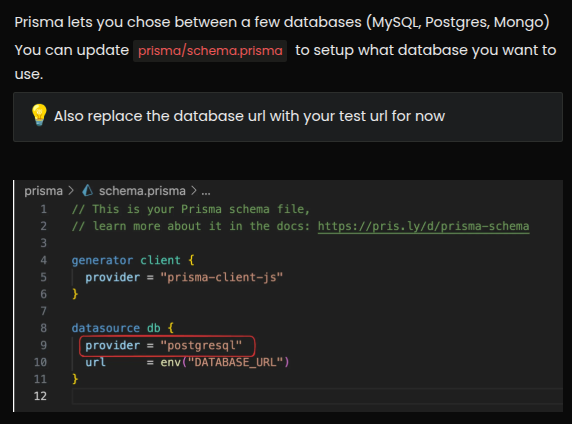

## Defining your data model

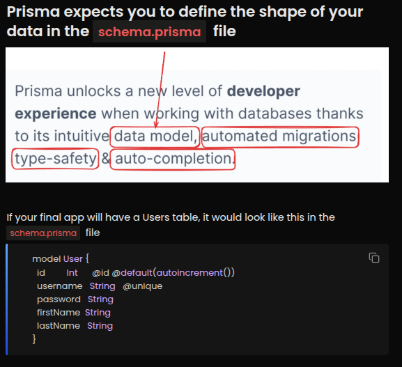

## Generate the client

Generate the client that can be used inside the node app to communicate with the db.

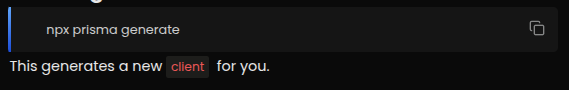

```typescript
import { PrismaClient } from "@prisma/client";

const prisma = new PrismaClient();

async function insertUser(
  username: string,
  password: string,
  firstName: string,
  lastName: string
) {
  const res = await prisma.user.create({
    data: {
      username,
      password,
      firstName,
      lastName,
    },
  });
  console.log(res);
}

insertUser("admin1", "123456", "harkirat", "singh");
```

## Relationships

Prisma lets you define **relationships** to relate tables with each other.

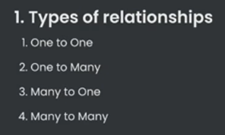

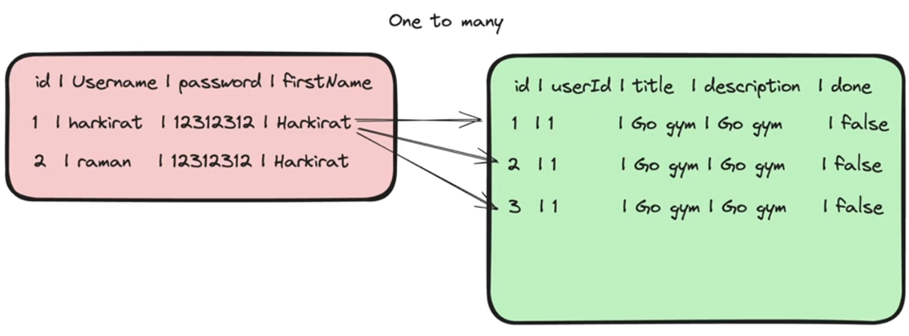

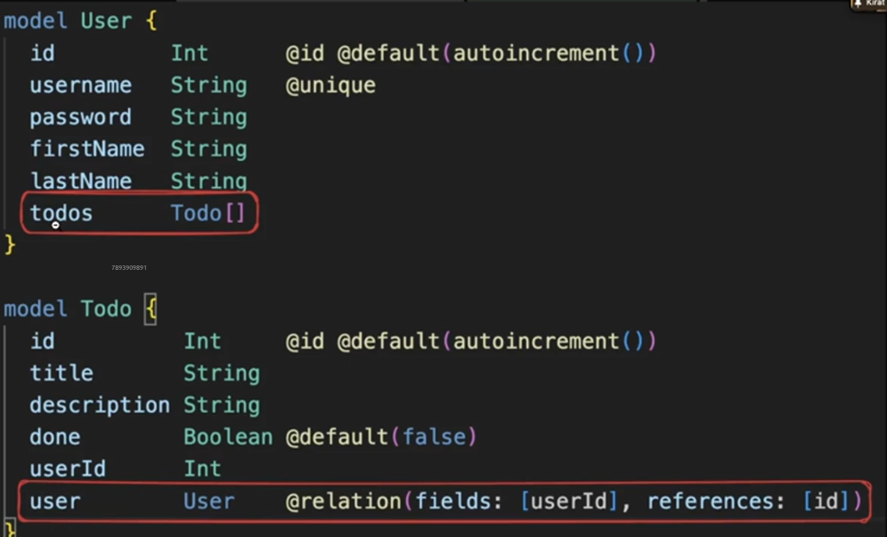
