# Server Side Rendering and Next.js

## NextJS intro

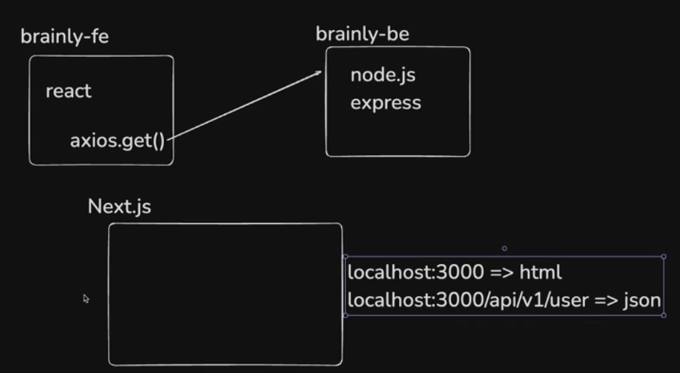

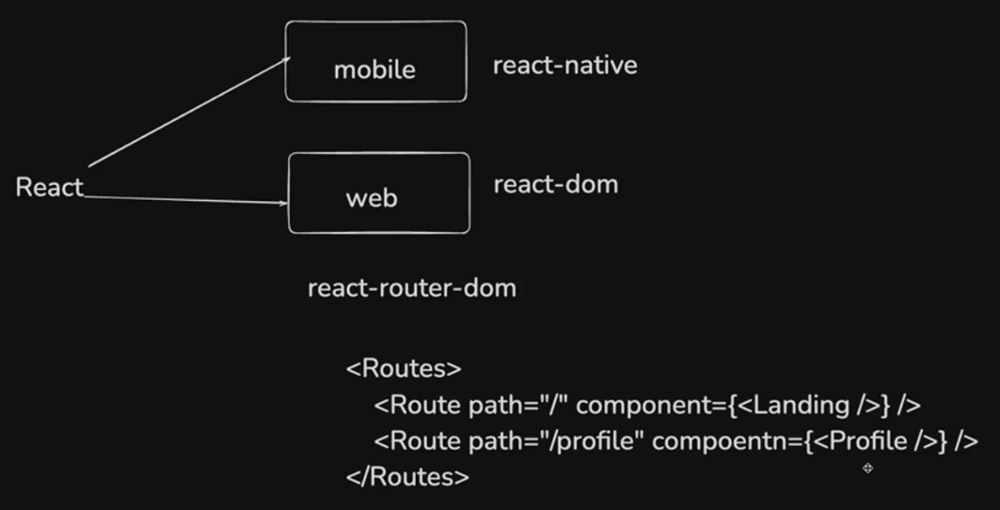

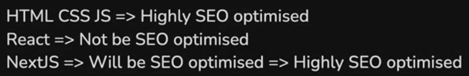

Hence, Generally React is not used to build the landing pages when the website needs to be highly SEO optimised.

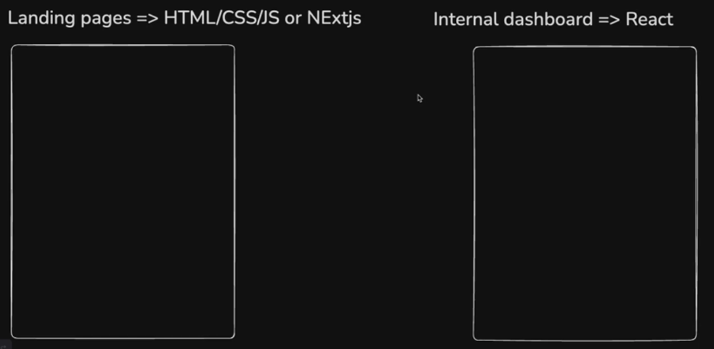

## SEO Optimization

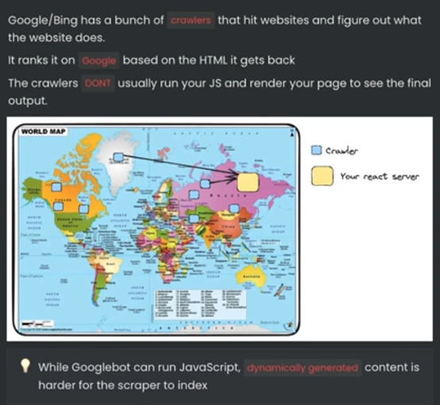

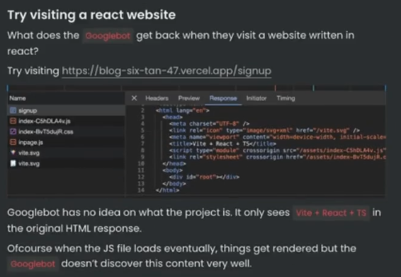

Since the google crawler can't read the content rendered by react, the website is not higly search engine optimized, Hence, won't have good ranking in the search results.

## Waterfalling problem

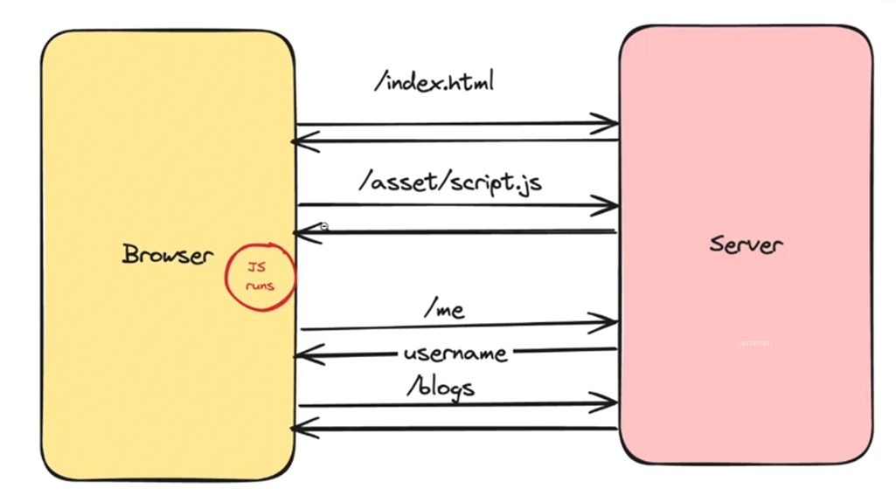

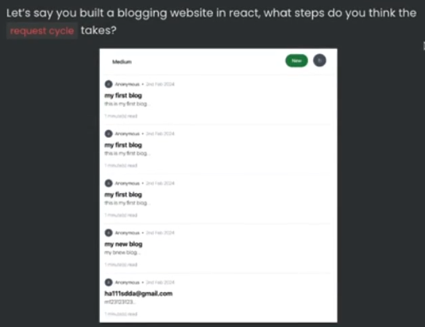

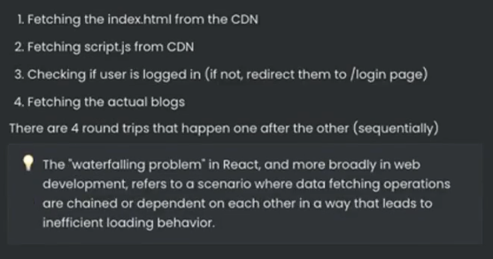

How Nextjs performs the same request:

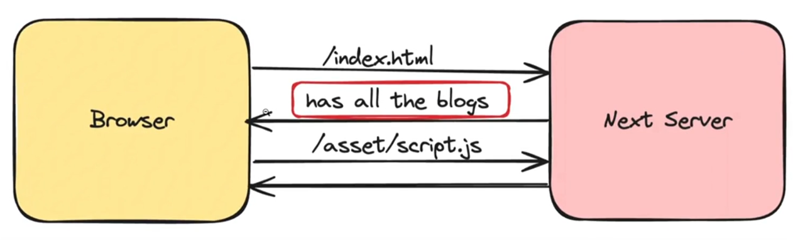

What **Client Side Rendering** looks like:

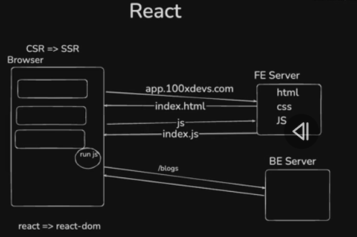

In React frontend, during production, the frontend is supplied in the form of bundles, i.e. the frontend server builds the code and creates a distribution folder. Hence, it acts more like a **Content Delivery network** that serves the html, css and js unlike a traditional http server. Hence, the React web apps can be scaled via CDNs and inexpensive to run in production.

Unlike React, NextJs does **Server Side Rendering:**

Given a seperate backend is being used instead of Nextjs offering,

The nextjs server fetches the data from the backend and renders the html in itself and sends it to the client.

Hence nextjs frontend server in production acts like a traditional server running somewhere by itself and listening to the incoming requests.

When nextjs itself is being used for backend too.
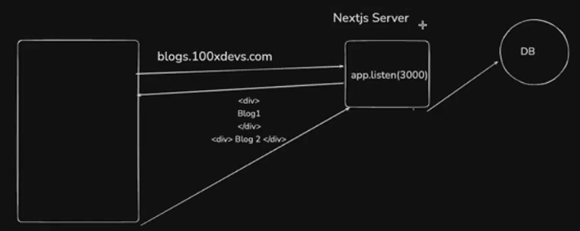

## NextJS Offerings

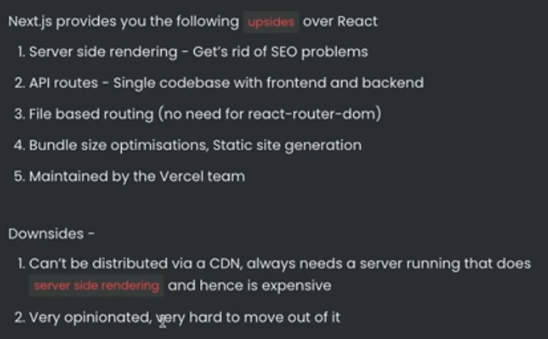

## Bootstrapping a NextJS App

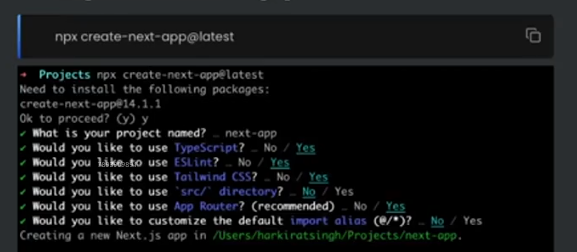

## NextJS Directory structure

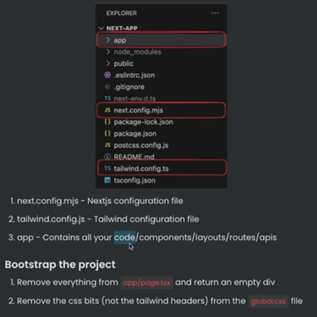

## Routing in nextjs

File based routing is implemented in nextjs.

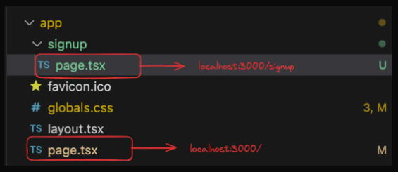

## Server side rendering

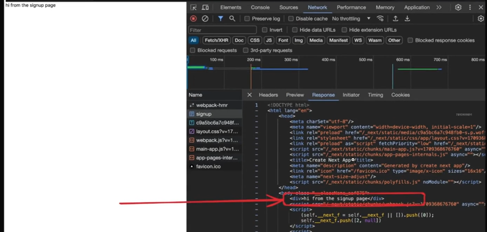

- If the data is being fetched in the **React** way using **useEffect**, the data won't render on the server side, returning html containing no data. And only after sometime, the changes inside useEffect render. Hence, we use **Client components**, for such pages.

## Layouts

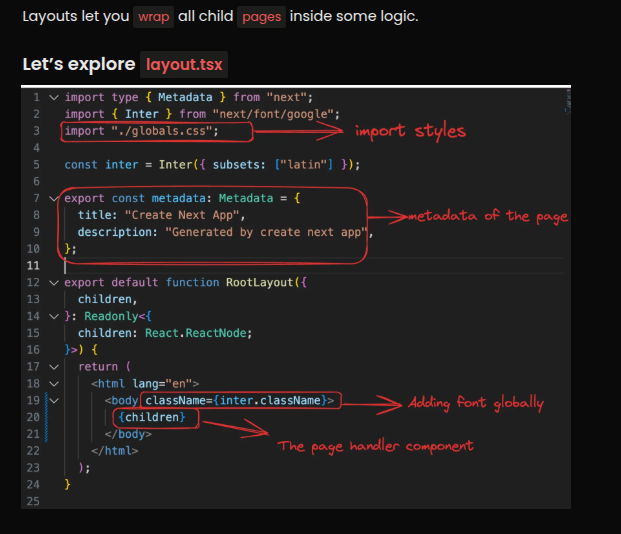
