# Backends in NextJS

We know that, both frontend and backend can be implemented inside a nextjs app, thus removing the dependency on express for creating a http server.

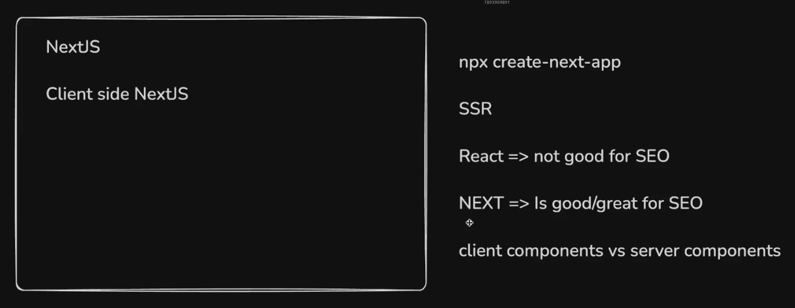

## NextJS is a Full Stack Framework

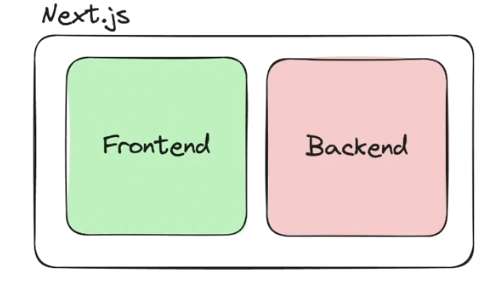

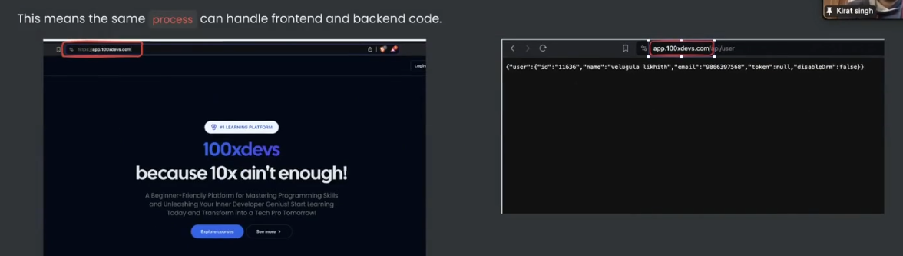

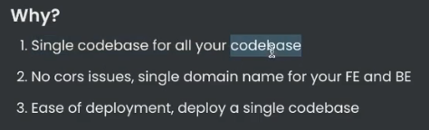

- **Deployment in case of MERN stack**

Two different deployment pipelines.

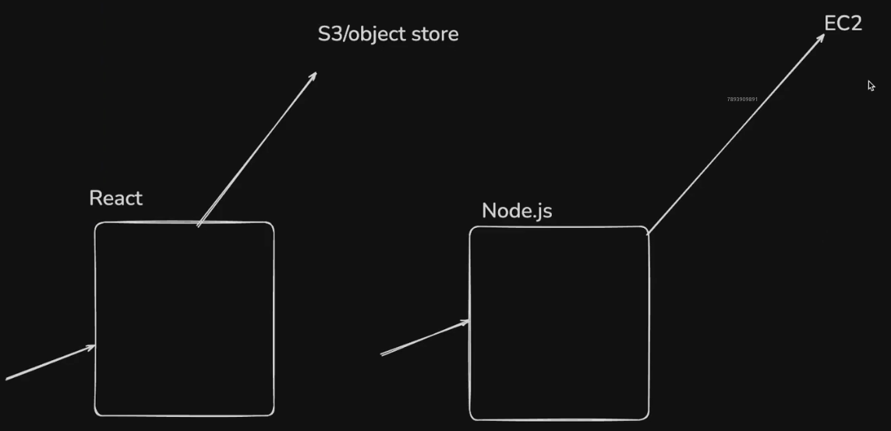

- **Deployment in case of NextJS**

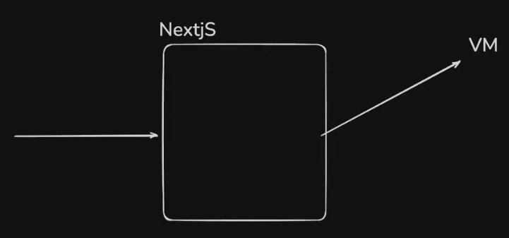

## Recap of Data Fetching in React

They follow **Water Falling Model**

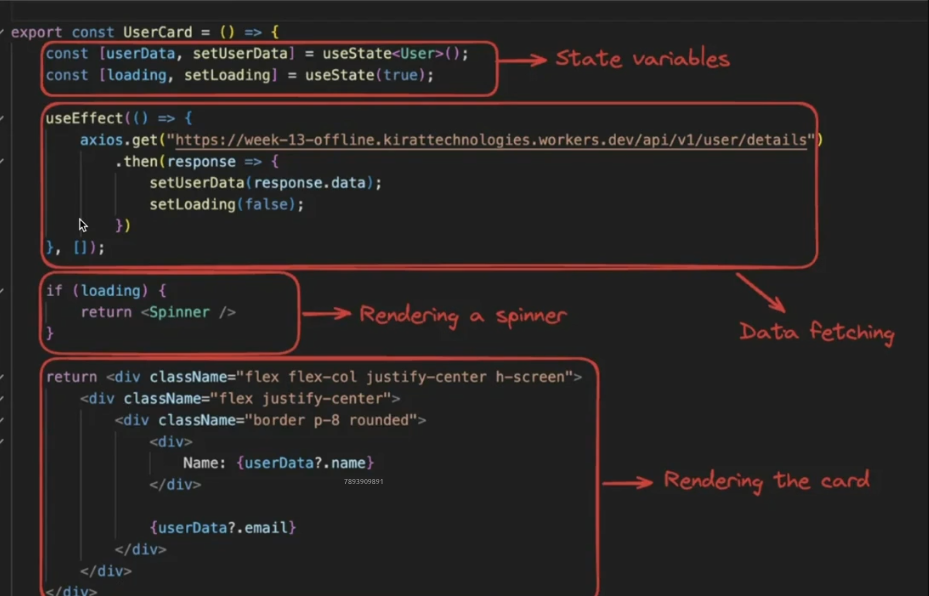

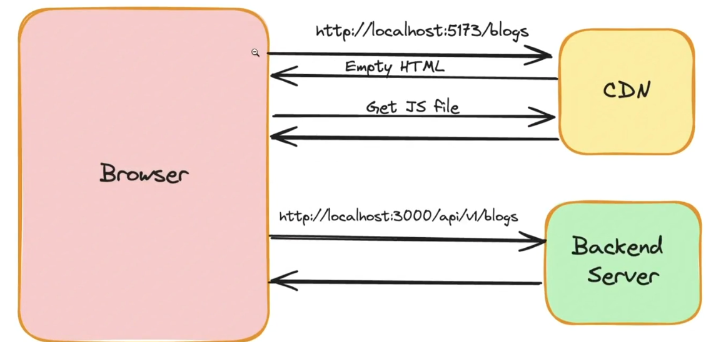

## Data Fetching in NextJS

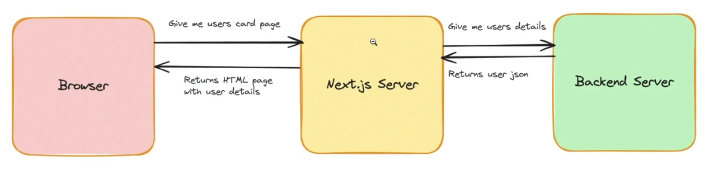

If client components are used in next with the useEffect and useState hooks, it still leads to the water falling problem,

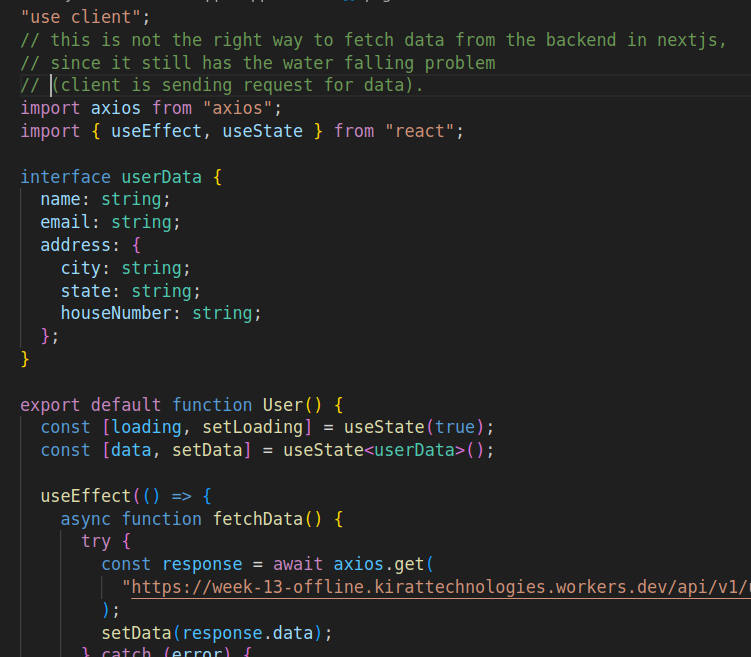

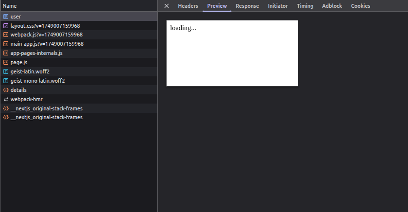

In this case, The Googlebot crawls this website only to find a loader, hence ranking it very low on the search results based on the html it reads.

This is the wrong way of using nextjs. Hence, we must do **server side rendering** with **server components** in order to get the benefits of nextjs:

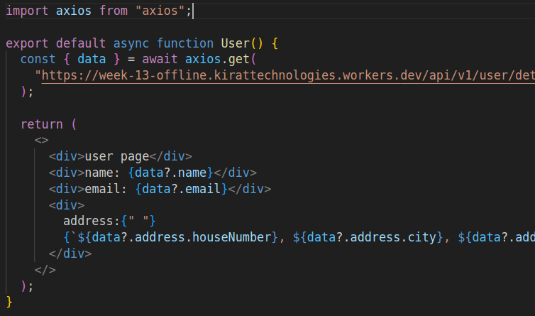

In this case, making the functional component **async** leads to the function to run on the nextjs server itself, hence responding with the final html with data in a single response.

## Loaders in NextJS

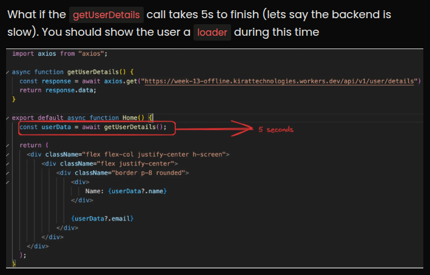

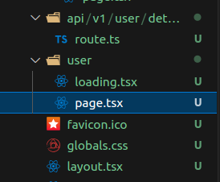

In next.js, a loader component can be created within in the route directory with the name "**loading.tsx**".

## API routes in NextJS

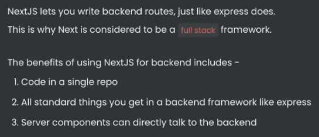

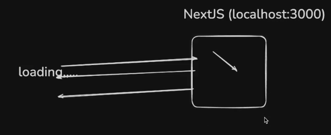

**File based routing for api endpoints**
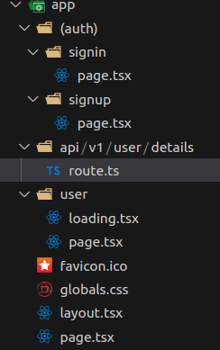

**defining handlers for different methods in the form functions inside route.ts**
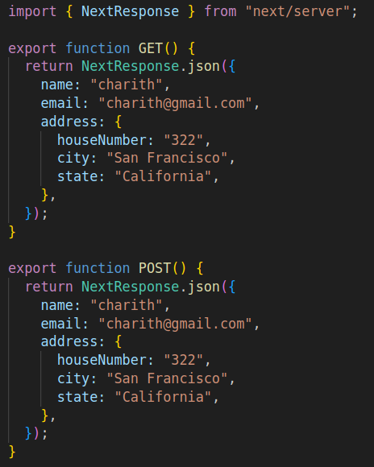

## Full Stack todo-app in Nextjs

[todo app repository](https://github.com/saicharith2012/todo-app-next/tree/main)

## Connecting Nextjs backends to Databases

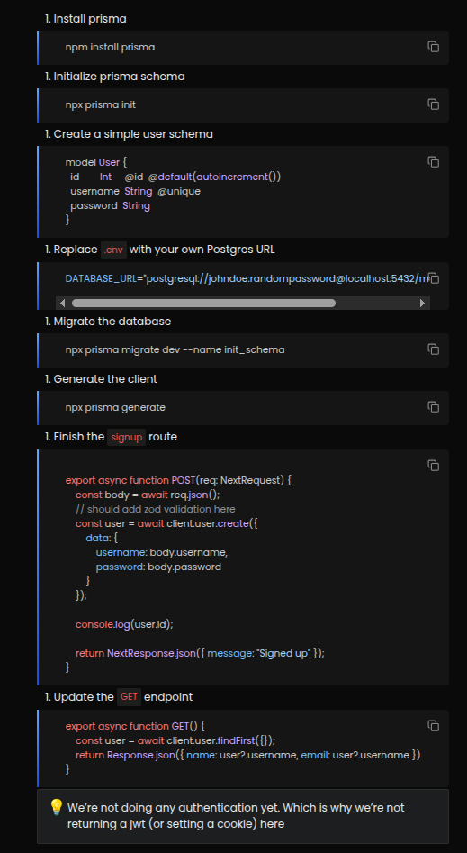

## Better fetches

Instead of sending a request from the server to hit the api endpoints within the same nextjs server, the database calls can be made directly from the functional components.

```Typescript
import { PrismaClient } from "@prisma/client";

const client = new PrismaClient();

async function getUserDetails() {
  try {
    const user = await client.user.findFirst({});
    return {
      name: user?.username,
      email: user?.username
    }
  }  catch(e) {
    console.log(e);
  }
}

export default async function Home() {
  const userData = await getUserDetails();

  return (
    <div className="flex flex-col justify-center h-screen">
        <div className="flex justify-center">
            <div className="border p-8 rounded">
                <div>
                    Name: {userData?.name}
                </div>

                {userData?.email}
            </div>
        </div>
    </div>
  );
}
```

This is possible and safe enough since the client side browser anyway can't access any of the function logic other than
the html and the data rendered inside it from the nextjs server.

> Writing seperate endpoints can be useful when the same endpoint is being used at multiple places within the same application or by different applications that exist on different platforms.

## Singleton Prisma client

During the development phase, when a cloud postgresql database is being used, since the hot reloading is enabled, the 
prisma client declaration is executed again and again, thus creating multiple clients and hence, multiple connections to the database in the background.

Hence, we create a **Singleton** that runs only on the first execution

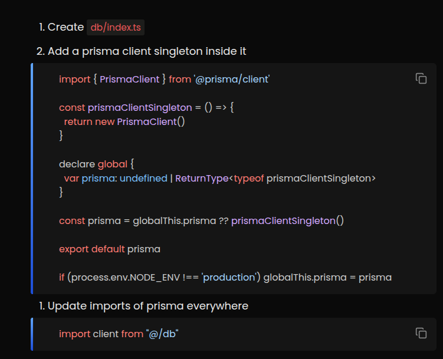
