# Nextjs

## Route Groups ()

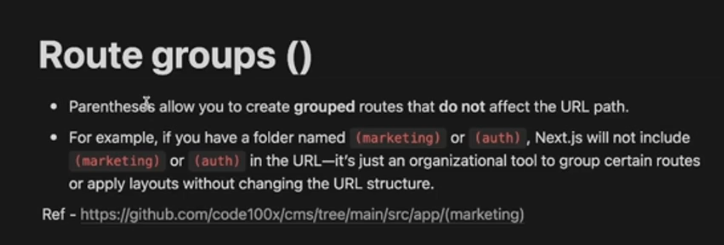

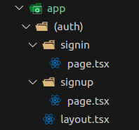


## Dynamic Routes []


## Catch-All Segment [...]

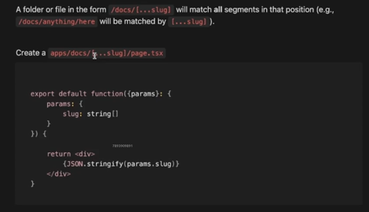

use case - **Recursive folders**.

All the subroutes in place of the catch-all segment will be caught
and the render the specific component of that route.

Inside the functional component, the catch-all segment is read as an **array containing all the subroute levels as individual elements**.

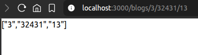

## Catch-All [[...slug]]

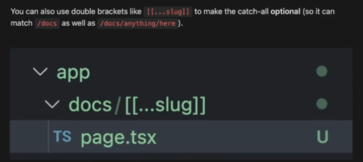

But, in general practice its better to create a seperate page for the main route.

## CSR vs SSR vs SSG

### Client-Side Rendering (CSR)

- **Where Rendering Happens:** In the browser
- **When Rendering Happens:** On every request after initial HTML load
- **Performance:**
  - Slower initial load
  - Faster navigation after load
- **Ideal Use Cases:**
  - Single Page Applications (SPAs)
  - Apps with lots of user interactions
- **SEO Considerations:** Not ideal unless pre-rendered or hydrated via JavaScript

---

### Server-Side Rendering (SSR)

- **Where Rendering Happens:** On the server
- **When Rendering Happens:** On every page request
- **Performance:**
  - Slower than SSG for initial load
  - Faster for dynamic, server-rendered content
- **Ideal Use Cases:**
  - Dynamic content that changes per request
  - Personalized dashboards or search results
- **SEO Considerations:** Excellent SEO support out of the box

---

### Static Site Generation (SSG)

- **Where Rendering Happens:** At build time
- **When Rendering Happens:** Once, during the build process
- **Performance:**
  - Fastest initial load
  - No server dependency for content
- **Ideal Use Cases:**
  - Blogs, marketing sites, docs
  - Content that doesn't change often
- **SEO Considerations:** Great SEO since HTML is pre-generated

---

> ⚠️ Choose based on _what kind of content you’re serving_, _how often it changes_, and _how important performance or SEO is for your use case_.

## Static Site Generation

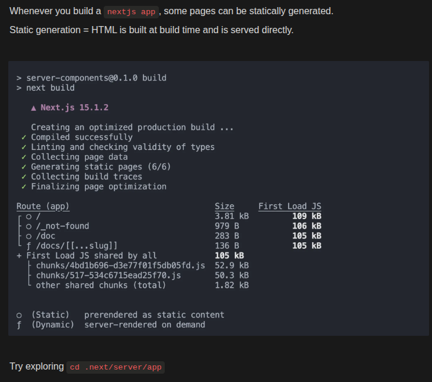

**Static Sites** are the pages that don't have any user interactivity, and **they are automatically identified and generated at build time by Nextjs.**

## Server Components and Client Components

Few components or pages don't change ever (**server components**), and few other components (**client components**) can change over time with user interactivity.

Client components are not necessarily rendered completely on client side, rather they are also rendered on the server itself.

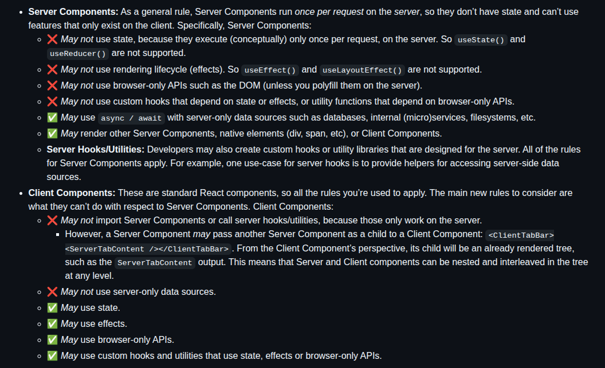

We try to maximize the usage of server components by placing the client components at the leaf levels of the DOM tree.


Since, during a request, the server needs to send **only the html in case of** **server components** unlike **client components which might need javascript bundles too** for the sake of _state updates_, _rerendering_ etc.

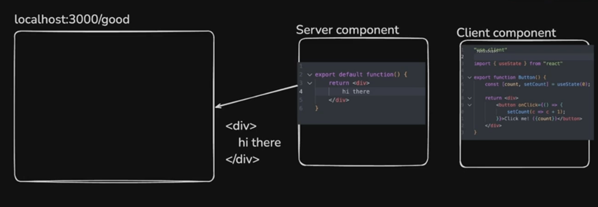

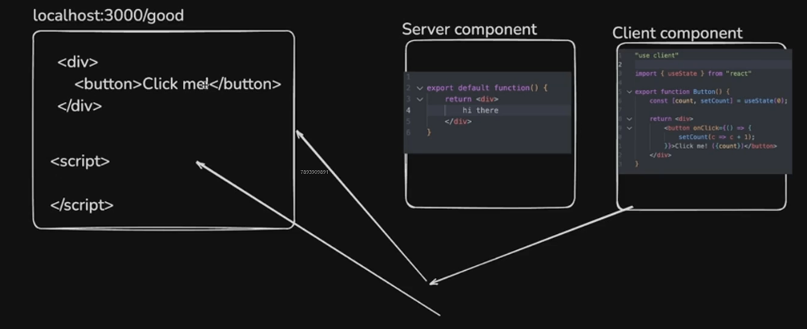

## Hydration

### What is Hydration in Next.js?


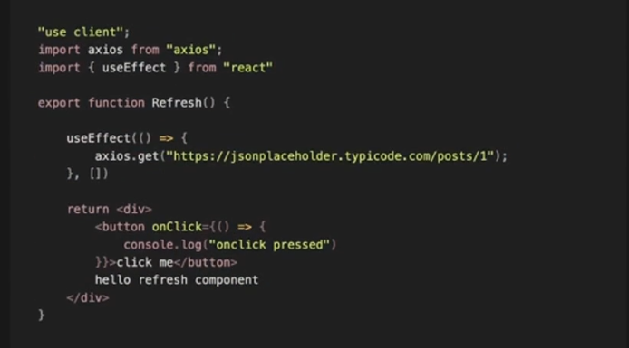


- **Hydration code**

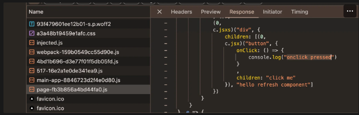

And after hydration, the page is rerendered  on the client side and it is checked whether the server side rendered DOM tree state, and the client side rendered DOM tree state match or not. If not, it causes the most common **Hydration Error**.


## Middlewares in Nextjs

Middleware in Next.js lets you run **custom logic before a request is completed** — great for auth, redirects, geolocation, logging, etc.

Runs in the **Edge Runtime** = server-side, ultra-low latency, near user.

---

### 📁 Where is Middleware Defined?

Create a `middleware.ts` or `middleware.js` in the root of `app` or `pages` directory.

### ✅ What Middleware Can Do

- Redirect requests  
- Rewrite paths  
- Set headers/cookies  
- Block/allow access to routes  
- Inject localization or variants

---

### 🧠 Middleware Example

```ts
import { NextResponse } from 'next/server'
import type { NextRequest } from 'next/server'

export function middleware(request: NextRequest) {
  const loggedIn = request.cookies.get('auth-token')
  
  if (!loggedIn) {
    return NextResponse.redirect(new URL('/login', request.url))
  }

  return NextResponse.next()
}
```

### Matching Specific paths

Use matcher to control which routes invoke middleware:

```Typescript
export const config = {
  matcher: ['/dashboard/:path*', '/settings/:path*'],
}
```

This runs the middleware only for /dashboard/*
and /settings/*.
