# NextAuth

## What is next auth?

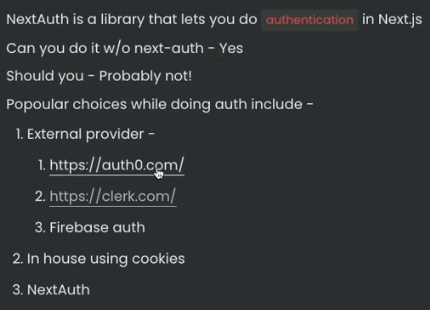

## Why not use JWT + localstorage?

**For react + node + express app:**

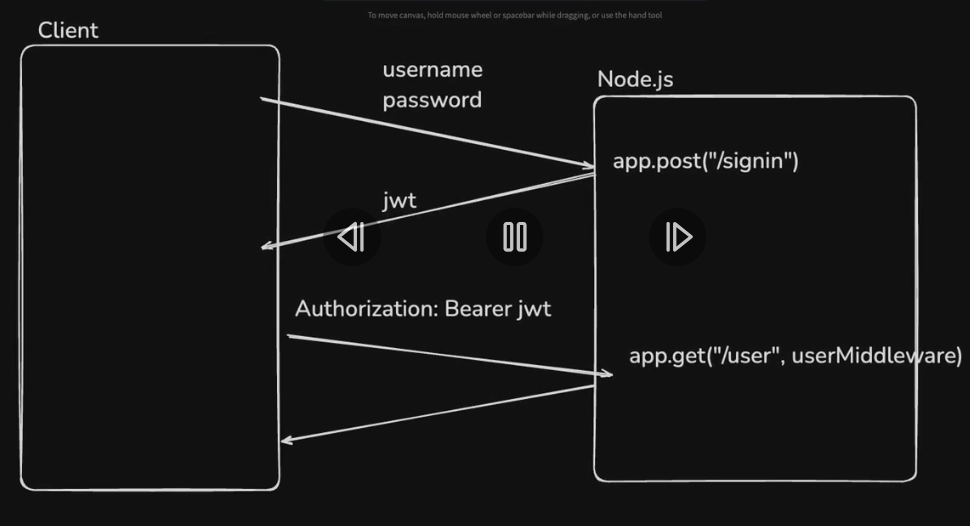

**In case of Nextjs app:**

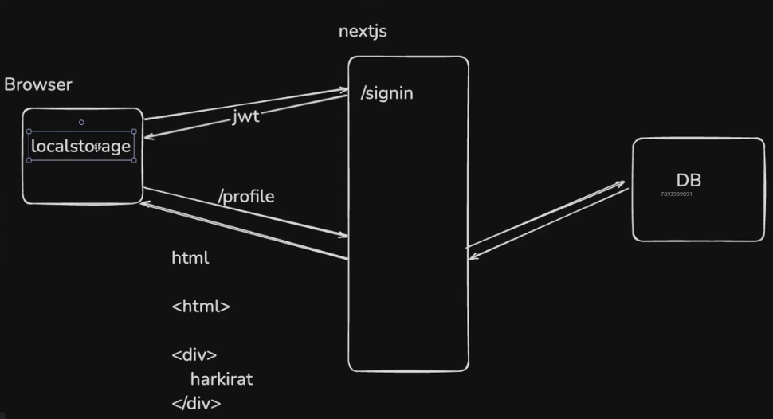

Let's say the browser requested for an authenticated route which contains information that needs to be fetched from the database,

Since, the database requests also happen from the nextjs server during the first request itself (thanks to server side rendering) and totally separated from the client,  its not possible to send the jwt from local storage in the request headers. (thus it returns just a empty html bundle.)

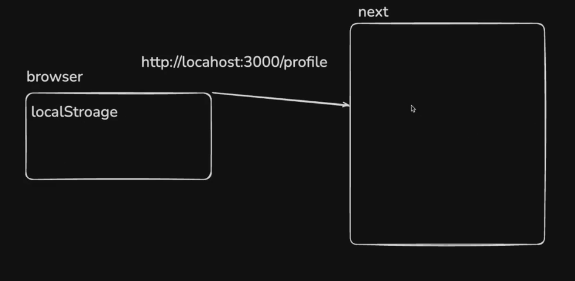

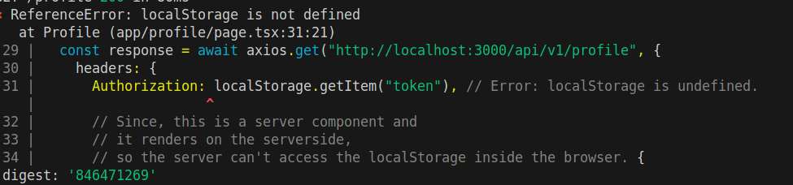

And the jwt from localStorage can't be shoved into the first request, since it is happening directly from the browser rather than the javascript of the webpage.

UseEffect can be used to make the requests with jwt from localstorage after the first render (leading to client side rendering), but the first request made to the server still won't be able to read the token from the local storage. (which leads to the waterfalling problem and conflicts the purpose of nextjs to do server side rendering.)

But, **in case of react**, the first request doesn't need to be authenticated since, the rendering happens on the client side anyway (first request only fetches the html and js bundles), thus depending on the subsequent requests for authentication by reading the localstorage. (all of this happens during the first render itself.)

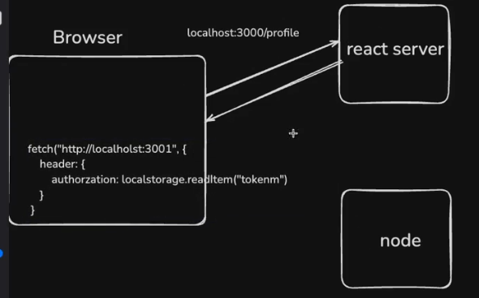

Hence, local storage cannot be used for authentication in nextjs due to its inability to read the token from the browser in the first request itself.

## Authentication using NextAuth

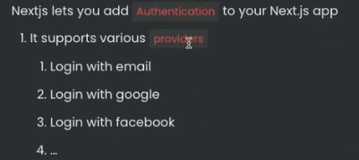

Nextauth is a generic library that supports various providers that expose their OAuth implementation.

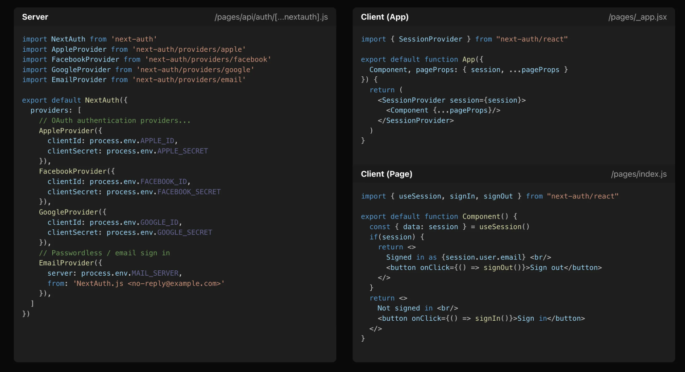

## Give NextAuth access to a catch-all

[Reference](https://next-auth.js.org/configuration/initialization#route-handlers-app)

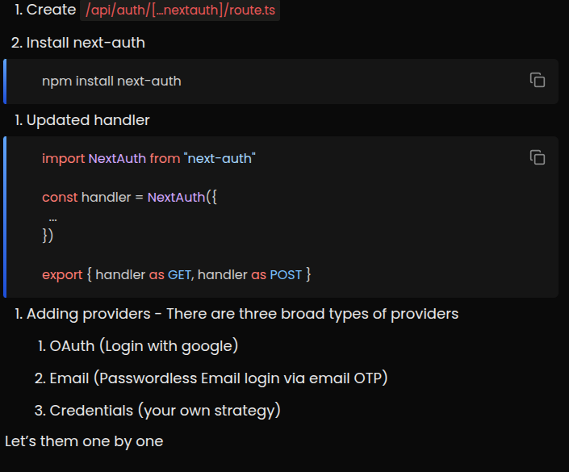

## Credentials Provider

This lets you create your own authentication strategy
For example

- Email + Password

- Phone number

- Login with Metamask

### Steps to follow

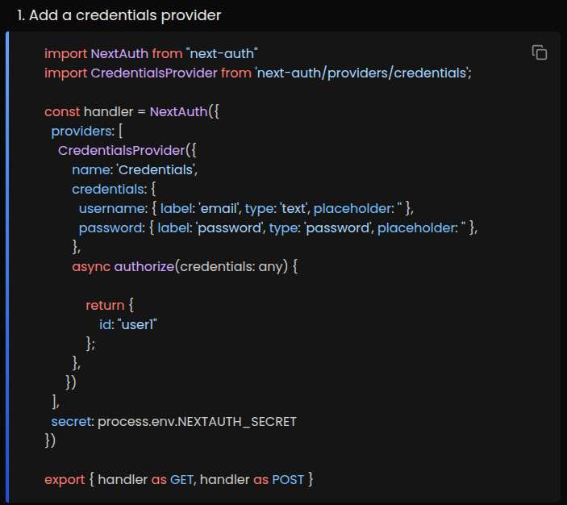

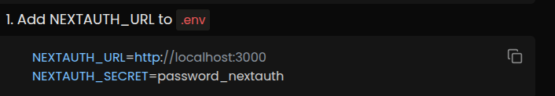

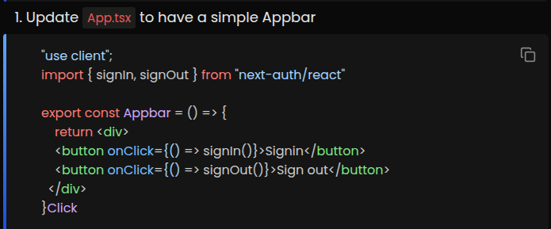

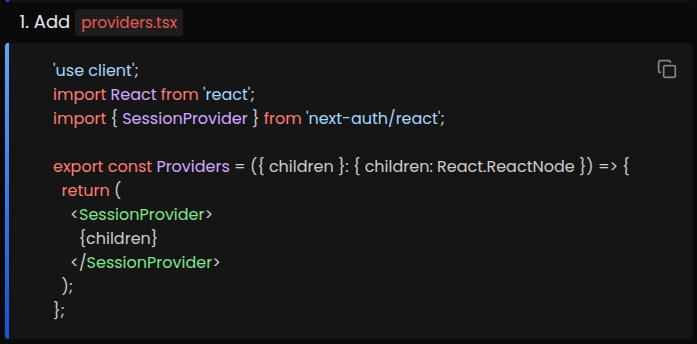

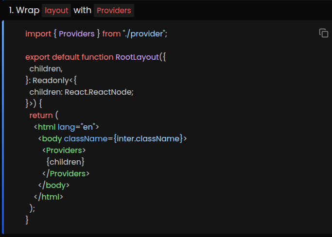

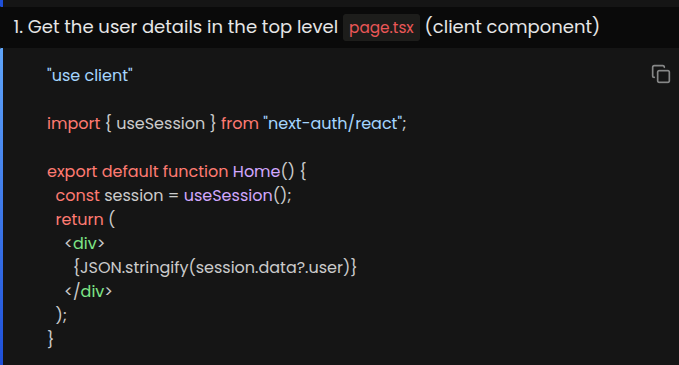

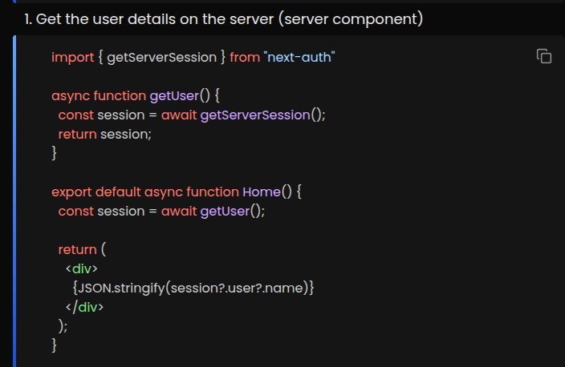

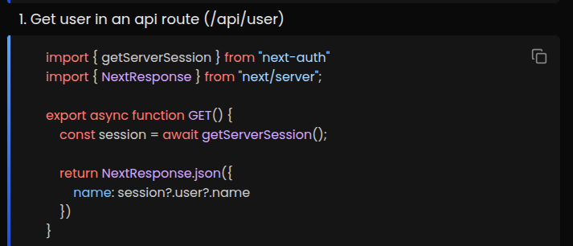

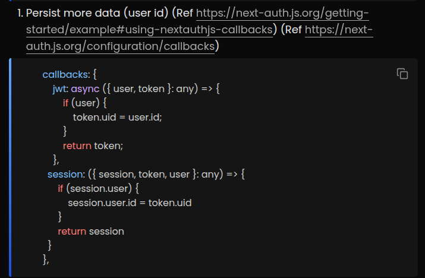

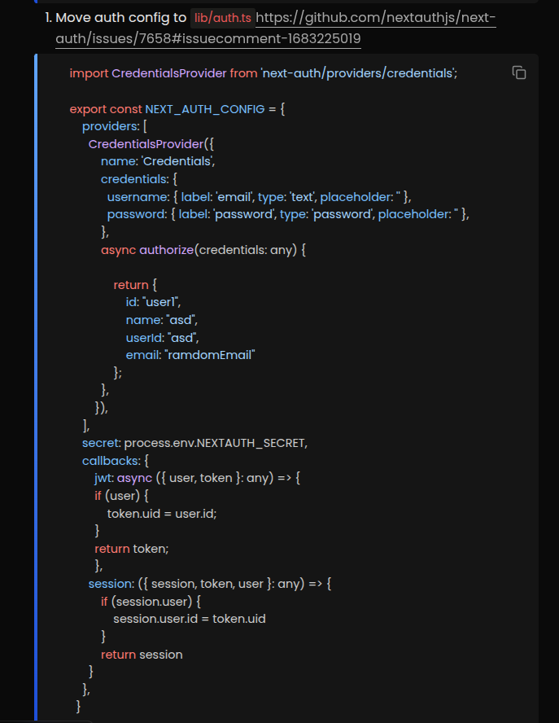

Todo:

Callbacks,
how to add DB here,
prisma-adapter,
providers.tsx
