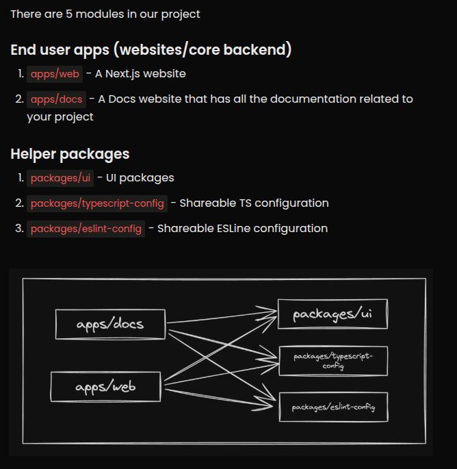
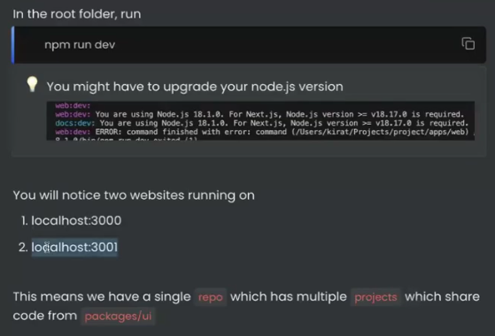
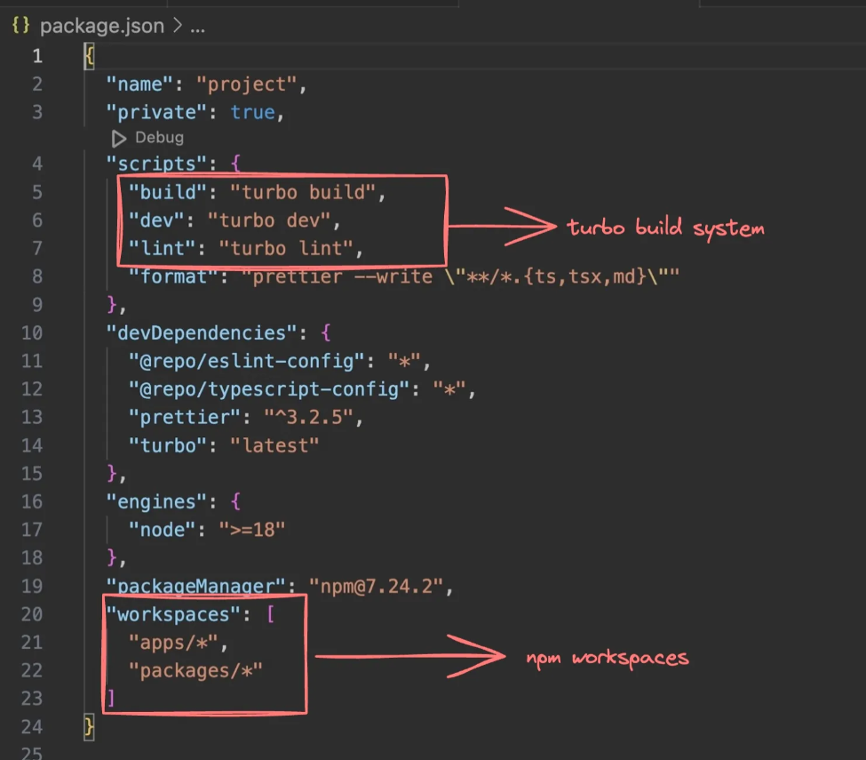

# Monorepos and Turborepo

## What are Monorepos?

A Single Repository that holds multiple packages like your frontend, backend, devops code etc.

Few Examples where monorepos are used:

## Why Monorepos?

### When to use Monorepos?

1. **Shared Code Reuse.**

    

    Eg. Zod Types b/w frontend and backend.

2. **Enhanced Collaboration** (b/w teams working on different parts of the code repository.)

3. **Optimised Builds and CI/CD pipelines.**

    - Build can become complicated if they have interdependent packages.

    - Tools like Turborepo offer smart caching and task execution strategies that can significantly reduce build and testing times.

    

4. **Centralized Tooling and Configuration.**

    - Managing *build tools*, *linters*, *formatters*, and other configurations is simpler in a monorepo because you can have
    a single set of tools for the entire project.

## Common Monorepo frameworks in Node.js

## Build system vs Build system orchestrator vs Monorepo framework

### Build system

### Build System Orchestrator

### Monorepo Framework

## Turborepo as a build system orchestrator

>Cloud builds is a benefit from orchestrator like turborepo, where the build images are stored on the cloud, which can be pulled by the CI/CD pipelines when they are needed to be reused in case of build caching.

- Parallelization can be acheived even by using just build systems with scripts that run them parallely.

- But something that's not possible with traditional build systems is **Dependency Graph Awareness**. In this case, the shared reusable code is considered as a different package itself.

- **Turborepo will be aware of this dependency graph**. Such that turborepo prioritises the build processes of different packages on the basis of their dependency on other packages.

>Using an EC2 machine for the build process of a nextjs app can crash the server itself. (Very heavy process.)

## Turborepo folder structure

> Turborepo is known for its faster build times. It builds only the apps that have code changes and caches builds for other apps in the repo (which have no changes inside them). But when packages are updated, since all the apps might be using them, all of them are build again leaving aside the cache.

## Running the project

## Exploring root package.json

